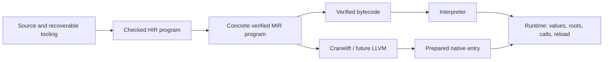

# Compiler and execution architecture review — 2026-10-03

## Scope and conclusion

**Keep the current compiler/runtime layering. Fix specific contract violations and
repeated work before broadening native coverage.** The reviewed dependency graph
does not justify a compiler rewrite, another IR, or a new LLVM abstraction layer.
The strongest performance evidence points to runtime initialization and interface
dispatch allocation, while native expansion needs a concrete call/root ABI.

This is a review of committed baseline
`9581f5ad2a754911d1edb92eb35e957a18d7b5df`, isolated in the managed worktree
`/Users/mikai/.codex/worktrees/architecture-review/kagari` on branch
`codex/architecture-review-2026-10-03`. The user's active workspace was not edited.
Uncommitted shared generic-interface work, identified in the task context as FA01,
is excluded. Missing capabilities being developed there are not counted as defects.
All source line references below refer to the baseline, not the active workspace.

The review covers source analysis, specialization, portable verification,
interpreter/frame/GC boundaries, native registration, SDK preparation, Cranelift,
and the contracts needed for later LLVM support. It combines source inspection,
515 passing focused tests, dependency/structure checks and fresh microbenchmarks.
It is not an exhaustive soundness proof, release qualification, or production
throughput study. No production implementation was changed. The companion probes
are standalone review tools; recommendations are not a new execution plan.

| Priority | Finding | Evidence and consequence |
| --- | --- | --- |
| P1 | R1. Unchecked conversion in a public safe syntax API | Source-confirmed Rust soundness defect; invalid enum construction is reachable through a safe API |
| P2 | R2. Disabled JIT policy does not govern prepared execution | Source/spec mismatch and actual native execution under the default disabled context |
| P2 | R3. Interface dispatch copies whole method tables | Source-confirmed; 1,000 calls allocate 75,099 times at width 1 and 820,246 times at width 32 |
| P2 | R4. Runtime construction rebuilds broad checked catalogs | Fresh construction median about 239 ms versus 0.66 ms for subsequent linking; substantial per-runtime retained heap |
| P2 | R5. Trait queries discard caller cancellation and bounds | Source-confirmed propagation problem; runtime impact not reproduced |
| P2 | R6. Preparation repeats equivalent bytecode verification | Four validation passes on the native-enabled route; already documented debt |
| P2 | R7. Specialization repeatedly lowers the whole program | Confirmed fixed-point work shape; scaling impact not benchmarked |
| P2 | R8. Cache equality mixes semantics with source revision/location | Correct but excessive invalidation; magnitude not benchmarked |

P1 means repair the concrete safety issue promptly. P2 means a bounded next-work
candidate selected by affected workloads and product priorities. These priorities
do not imply that every recommendation must precede continued language development.

## Boundaries worth retaining

The intended and substantially implemented flow is:



- Recoverable HIR supports diagnostics and incomplete programs. A private checked
  analysis seal gates source lowering. Source arena identities do not become
  executable runtime contracts.
- Specialization and language decisions belong before code generation. MIR is
  concrete, verified and backend-independent. A backend should not solve trait
  bounds, resolve source names or rediscover language semantics.
- Runtime/VM/bytecode have no production dependency on source analysis or MIR;
  backends do not depend on the runtime, compiler, bytecode or SDK. The dependency
  audit passed, including ABI's normal/build graph.
- Deserialization reconstructs validation seals; serialized claims are not trusted.
  Native-input correspondence checks canonical bytecode contents, not just a hash.
- Native code ownership is retained with prepared products. Installed entries pin
  the exact program and dependency generations. No stale-code lifetime defect was
  found in the audited paths. Unsupported operations fall back before entry;
  partial native execution never restarts in the interpreter.
- Native scalar/sequence access can borrow already rooted arguments. Compact scalar
  storage, scoped native borrows, callback reentry controls and prepared mutation
  commits are useful foundations for both execution tiers.

These are stronger architectural assets than merely having many crates. Maintain
them while reducing repeated validation and allocation inside the boundaries.

## Findings

### R1 — P1: public safe raw-kind conversion can construct an invalid enum

**Evidence:** [syntax_node.rs](../crates/kagari-syntax/src/syntax_node.rs), lines
10–17, exposes `KagariLanguage` and implements Rowan's safe `kind_from_raw` with
unchecked `mem::transmute::<u16, SyntaxKind>(raw.0)`. The module is public, and
`syntax_node_from_green` also accepts externally constructed green trees.
The finite enum in [kind.rs](../crates/kagari-syntax/src/kind.rs) does not cover all
`u16` values. The safety comment assumes all raw kinds came from this enum; the
public API does not establish that premise.

A safe Rust caller can supply an invalid discriminant. Producing an invalid enum
value is itself undefined behavior under the
[Rust validity rules](https://doc.rust-lang.org/reference/behavior-considered-undefined.html#invalid-values).
No invalid value was executed during this review. This is not a claim that ordinary
Kagari parser output violates its internal kind invariant.

**Recommendation:** validate before conversion, using an exhaustive mapping or a
checked range with an enforced contiguous-discriminant invariant. Return an error
kind or panic on invalid input. Documenting an unchecked precondition on a safe
trait implementation does not repair soundness.

**Acceptance:** valid-kind round trips and rejection of invalid raw kinds through
the public API and external green-tree route, after the conversion has been fixed.
No parser/IR redesign is necessary.

### R2 — P2: `JitPolicy::Disabled` does not disable prepared native execution

**Evidence:** [context.rs](../crates/kagari-embed/src/context.rs), lines 10–45,
defaults to `Disabled`, but drops that policy when constructing runtime options.
[runtime.rs](../crates/kagari-embed/src/runtime.rs), lines 128–153, forwards
`execute_prepared` without consulting it. Preparation's execution-allowed check
also does not test this flag. The [JIT specification](spec/jit.md), lines 62–68,
says disabled policy selects pre-entry interpreter fallback.

The existing architecture benchmark creates a default context and asserts actual
`Native` execution; all three fresh runs passed. Existing tests encode the same
behavior. Particularly misleading is
`jit_policy_disablement_falls_back_before_native_entry` in
[VM JIT tests](../crates/kagari-vm/src/tests/jit.rs), lines 252–280: it neither
disables JIT nor asserts fallback; it asserts `Native`.

**Impact:** the SDK's documented execution control cannot be used to force the
interpreter for an installed prepared entry. This is a host API/specification
problem, not a script security permission bypass. Ordinary `execute` separately
rejects non-disabled policies as unimplemented, so the two entrypoints have
inconsistent policy behavior.

**Recommendation:** make policy authoritative at SDK tier selection, or deliberately
remove/rename the conflicting control if explicit prepared execution is intended
to override it. Preserve version checks and no fallback after entry.

**Acceptance:** an actual Cranelift product executed with enabled and disabled
contexts, asserting the execution report and identical observable results. Keep
automatic compile-on-load/threshold scheduling separate; those remain deferred.

### R3 — P2: one interface call deep-copies all method metadata twice

**Evidence:** [objects.rs](../crates/kagari-runtime/src/objects.rs), lines 494–530,
obtains a snapshot for the interface-type check, then another during slot
resolution, then clones the selected binding.
[gc.rs](../crates/kagari-runtime/src/gc.rs), lines 748–755, returns
`(**snapshot).clone()`. The derived clone in
[interfaces.rs](../crates/kagari-runtime/src/gc/interfaces.rs), lines 7–29, copies
the method vector, parameter/result types, declaration identities and other owned
metadata. This is a deep descriptor copy, unlike the neighboring shared closure
snapshot operation.

An ordinal lookup therefore performs work proportional to the entire interface.
The measured width experiment below confirms large allocation growth while the
same single method is called 1,000 times. Wide `List`/`MutableList` interfaces make
this mechanism relevant to ordinary collection use; their exact production
workload cost was not measured here.

**Recommendation:** retain a shared immutable interface descriptor/table and
select the checked ordinal while keeping the receiver rooted. Preserve owner,
generation, expected-interface, signature and result-adapter validation, and the
implementation's retained program. Preparing/sharing tables at link time is a
separate possible follow-up; it is not required to stop these per-call copies.

**Acceptance:** rerun the width probe and interface lifetime/forgery/trap tests.
Per-call table-copy allocations should no longer grow with unused method count.
Keep construction and execution costs distinguishable. No speculative speedup is
claimed for an implementation that has not yet been made.

### R4 — P2: runtime initialization rebuilds and retains broad native catalogs

**Measured:** creating a fresh default runtime takes approximately 239 ms in the
split probe; linking the shared scalar program then takes about 0.66 ms. The
existing retained-heap experiment adds exactly 7,689,994 requested live Rust heap
bytes per additional runtime for this workload. That is not an RSS measurement
or a proof that every byte belongs to one catalog.

**Mechanism:** [runtime lib.rs](../crates/kagari-runtime/src/lib.rs), lines 181–184,
calls `foundation::module()` for each runtime.
[foundation.rs](../crates/kagari-runtime/src/native/foundation.rs), lines 22–24
and 113–118, builds declarations and checks a fresh module.
[native/module.rs](../crates/kagari-runtime/src/native/module.rs), lines 34–87,
validates declarations, implementations, proof catalogs and bindings. Crucially,
each binding constructs its own required catalog seeded with **all module traits**
(lines 79–80). [catalog/dependencies.rs](../crates/kagari-runtime/src/native/catalog/dependencies.rs),
lines 161–272, traverses broad declaration/implementation closure and clones
records into fresh maps. These separately built catalogs survive through retained
binding registrations. Installation performs further checks and proof construction.

This source path is a concrete repeated-work/ownership target. No allocation
profile was obtained that attributes an exact percentage of construction time or
retained memory to an individual function.

**Recommendation:** share an immutable checked registration blueprint and
declaration pool at the supported engine/host-thread lifetime. Keep per-binding
required identity sets or intern equal subsets. Separate authoring validation from
installation checks; retain dependency, owner, duplicate, storage, codec, atomic
publication and runtime-local link checks. Native handlers use `Rc`; a global
`OnceLock` must not be enabled by unsound `Send`/`Sync` assertions.

Shared bytecode itself is working: [module.rs](../crates/kagari-runtime/src/module.rs),
lines 471–475, clones `Arc<BytecodeModule>` handles. Runtime registration state is a
different ownership cost. Do not label the measured retained memory as duplicated
bytecode or undo the existing shared-program design.

**Related artifact granularity:** the scalar program contains two modules and
roughly 505.5 kB of artifact data. The foundation module has zero script functions
but 118 native declarations, 141 public items, 95 interface records and 53 native
imports. Implicit prelude imports make the foundation reachable; ABI collection
retains its declarations. [lower/mod.rs](../crates/kagari-compiler/src/source/lower/mod.rs),
lines 111–114, eagerly records nongeneric implementations, and
[instances/native.rs](../crates/kagari-compiler/src/source/lower/instances/native.rs),
lines 18–78, materializes their native methods. Thus the 53 imports really are
linked, although the root arithmetic does not call them. Optional `std::collections`
is not a module in this artifact.

Contract/interface reachability pruning is a separate optimization from sharing
registration state. Preserve public ABI, selected callable/layout demands and
transitive proof/coherence facts needed for source-free verification. Deleting
apparently unused declarations without that closure would weaken correctness.

**Acceptance:** repeat construction/link/retention measurements with multiple
fresh runtimes; preserve independent heaps, host state, generation checks, changed
registration rejection, atomic installation and source-free forged-contract tests.

### R5 — P2: trait-selection wrappers replace caller cancellation and limits

**Evidence:** [implementations.rs](../crates/kagari-hir/src/aggregates/implementations.rs),
lines 504–517 and 600–608, creates fresh cancellation tokens and effectively
unbounded search limits in `implementation_method` and `implementation_count`.
The underlying recursive machinery already supports bounded/cancellable searches
(lines 654–807). Ordinary type checking and lowering call the wrappers, including
[body/calls.rs](../crates/kagari-hir/src/typeck/body/calls.rs), lines 393–407, and
[lower/expr/calls.rs](../crates/kagari-compiler/src/source/lower/expr/calls.rs),
lines 222–225.

Caller cancellation cannot be observed inside these queries through the replaced
token. Exact-key cycle detection also does not establish a bound for changing
type arguments. No source-level hang, stack overflow or cancellation latency was
reproduced; the finding is the control-propagation defect visible in the code.
Frontend analysis limits are separate from the deliberately removed execution
charging model.

**Recommendation:** pass one caller-owned fallible search context through these
queries. Reuse the existing bounded solver, and preserve distinct cancellation,
limit-exhaustion, no-match and ambiguous outcomes.

**Acceptance:** small deterministic tests using a pre-cancelled context and tiny
candidate/depth limits on analysis and lowering paths. There is no need for an
unbounded stress test to establish that caller controls are honored.

### R6 — P2: native-enabled preparation verifies bytecode four times

This is already recorded in [performance-baseline.md](performance-baseline.md),
lines 200–214, and remains present in the reviewed source:

1. Artifact loader validation from `PreparedProgram::from_artifact`.
2. Bytecode validation in [native_input.rs](../crates/kagari-compiler/src/native_input.rs), line 50.
3. Validation of canonical bytecode produced from decoded MIR in
   [bytecode.rs](../crates/kagari-compiler/src/bytecode.rs), line 999.
4. `VerifiedProgram::new` validation in
   [module.rs](../crates/kagari-runtime/src/module.rs), line 119.

Canonical correspondence additionally materializes two byte vectors. The fresh
decode/native-verification median is about 209 ms for the scalar artifact, but
that aggregate interval does not isolate the cost of these four passes.

**Recommendation:** carry an immutable checked bytecode value through the ownership
boundary, avoiding equivalent validation of the same sealed input. Still validate
the independently produced MIR-derived bytecode and preserve correspondence,
bounded decoding, malformed-input rejection and runtime-specific linking.

**Acceptance:** keep source-free/forgery coverage; instrument verifier invocation
counts and benchmark small and multi-module artifacts. Do not cache a success
against mutable open input or use fixture shortcuts as a production trust boundary.

### R7 — P2: cross-module specialization repeatedly lowers every module

**Evidence:** [source/program.rs](../crates/kagari-compiler/src/source/program.rs),
lines 39–60, creates a new module vector and lowers all checked modules each
iteration. New external instance requests are discovered only after the pass
(lines 126–157), causing another complete pass. Each module recreates its instance
planner and performs verification/optional optimization. Output budgets reset each
iteration; they bound the final product, not cumulative work.

A chain that reveals one further generic instance per round can cause a linear
number of whole-program passes and quadratic aggregate rebuilding. This is a
source-derived scaling risk, not a measured asymptotic or latency result.

**Recommendation:** make instance discovery a program-owned work queue using the
existing concrete definition/argument keys. Lower each newly demanded instance
once, then finalize and verify the linked program. An incremental module cache by
request set and immutable inputs is a smaller possible first change. Preserve
private implementation selection, foreign default bodies and dependency pinning.

**Acceptance:** a short cross-module generic chain/fan-out with counts of lowered
instances, plus the existing foreign-generic/default-method/witness/limit cases
in [source_programs.rs](../crates/kagari-compiler/tests/source_programs.rs).

### R8 — P2: semantic cache equality includes source revisions and locations

**Evidence:** body reuse in [analysis/mod.rs](../crates/kagari-hir/src/analysis/mod.rs),
lines 823–831, compares imported functions and aggregate contracts.
[imports/functions.rs](../crates/kagari-hir/src/imports/functions.rs), lines 19–37
and 125–137, carries the dependency source revision in derived equality.
[imports/mod.rs](../crates/kagari-hir/src/imports/mod.rs), lines 44–52 and 86–102,
does likewise for binding identity.
[aggregates/mod.rs](../crates/kagari-hir/src/aggregates/mod.rs), lines 45–52 and
483–488, compares inherent methods including revision/location fields.

Contract-preserving dependency edits therefore invalidate consumers, and an
unrelated body edit in a file with inherent methods can invalidate other bodies.
This is conservative and correct; no stale semantic result was found. The existing
33-function single-file benchmark proves useful local reuse, not fine-grained
cross-module or inherent-method reuse.

**Recommendation:** separate semantic contract keys from snapshot navigation and
arena/source handles. Reuse facts only while rebinding them to current identities;
simply deleting revisions from equality would risk stale references. Extend the
explicit location-insensitive contract comparisons already used elsewhere.

**Acceptance:** body-only and trivia-only dependency edits, unrelated body changes
beside inherent methods, and actual signature/visibility/implementation changes.
Check reuse, current navigation/revision identities and equality with fresh
analysis, while preserving immutable old snapshots.

## Additional interpreter work to measure

These mechanisms were inspected but not independently timed in this review. They
are a finite profiling shortlist, not additional proven throughput regressions.

| Mechanism | Evidence | Bounded experiment / direction |
| --- | --- | --- |
| Owned instruction cloning | [frame.rs](../crates/kagari-runtime/src/frame.rs), 451–457, clones instructions including owned call operand vectors | Whole-loop 0/1/3-argument call allocation measurements; share immutable operand payloads without keeping a frame borrow across reentry |
| Repeated frame/session access | [executor/mod.rs](../crates/kagari-vm/src/executor/mod.rs), 65–90, and [dispatch.rs](../crates/kagari-vm/src/executor/dispatch.rs), 185–189, repeatedly reacquire a validated frame | Profile arithmetic loops; one narrow validated read/compute/write operation, reacquiring at calls, observers and safepoints |
| Root registry scans and snapshots | [gc.rs](../crates/kagari-runtime/src/gc.rs), 768–814, scans retained roots on registration and clones root values during collection | Vary retained host roots independently from calls; compare strings/tuples with few GC edges; amortize registration and trace edges without copying entire values |
| Scratch allocation for a single handle | [gc.rs](../crates/kagari-runtime/src/gc.rs), 863–906, builds `vec![value]` for non-scalar validation | Measure handle moves versus tuples; direct owner/generation/tag validation for leaf handles, bounded worklist for aggregates |
| Callback execution always interpreted | [executor/native.rs](../crates/kagari-vm/src/executor/native.rs), 11–29, always enters `Executor` | Later route generation-pinned callbacks through common tier selection; keep the current synchronous call/cleanup contract |

The existing prepared-native zero-allocation test starts below instruction fetch
with a frame and operands already prepared. It does not establish zero-allocation
whole-VM calls. Historical callback-sort measurements in
[native-provider-refactor.md](native-provider-refactor.md), lines 1632–1661, likewise
identify script frame/result costs; they were not rerun or presented as fresh data.

Do not remove owner/generation checks or suspended-session validation to reduce
cost. Do not hold `RefCell` frame/heap borrows across native code, observers or
script reentry. Root-map optimization must account for tuple and host-path argument
edges, not only obvious heap-valued registers. Changing safepoint frequency also
changes cancellation/debug guarantees and needs separate evidence.

The accepted indivisible primitive-sort operation is not a cancellation defect.
This review does not recommend restoring execution quotas or per-comparison charging.

## Native expansion gates for Cranelift and LLVM

The current narrow scalar backend is intentional and passed its focused tests.
The following gates apply when adding calls, GC-bearing values, compiled callbacks
or optimizations that depend on callee/memory facts. Wider scalar arithmetic and
scalar locals/control flow can progress independently with appropriate trap and
polling semantics. These are not bugs caused merely by lacking a larger backend.

| Gate | Current boundary | Required decision and evidence |
| --- | --- | --- |
| General calls and values | [native_call.rs](../crates/kagari-abi/src/native_call.rs), 38–46, transports runtime/result/status for zero arguments and Unit/Bool/i32 results | Define argument/result representation, helper calls, error propagation and cleanup once for both native backends |
| Native GC roots | [native.rs](../crates/kagari-abi/src/native.rs), 75–85, records logical Register/Local locations; no runtime physical map reader was found | Choose a shadow-root protocol or real physical frame/PC/location maps; prove objects survive collecting helpers, returned allocation, reentry and traps |
| Verified cross-module calls | [codegen/lib.rs](../crates/kagari-codegen/src/lib.rs), 12–45, accepts a module seal; full binding proofs live in `VerifiedMirProgram` | Pass program-scoped verified target bindings or a typed runtime trampoline; backends must not redo name/type resolution |
| Effect interpretation | Script calls carry `calls`/`may_trap`, not transitive allocation/write facts | Treat calls as conservative memory/GC barriers or compute conservative graph summaries before emitting LLVM `readonly`/`readnone`-style assumptions |
| Tier-neutral callbacks | Synchronous `ScriptInvoker` currently selects the interpreter | Preserve pinned generation, captures, argument/result checks, shared call depth/cancellation, observers and trap origins when selecting compiled callbacks |
| Code lifetime and hot reload | Installed handles retain exact versions and their dependency closure | Extend dependency assumptions to direct calls, inlining and module/SCC compilation units; reclaim code only when its owners and retained dependencies permit it |

The current poll helper records a logical offset and invokes ordinary registered-root
GC; it does not publish native stack roots. Cranelift correctly rejects heap-bearing
slots and emits empty root maps for its accepted subset. Do not mistake the logical
metadata schema for completed GC integration.

Effect caution is similarly forward-looking. In
[instruction.rs](../crates/kagari-mir/src/instruction.rs), lines 397–406, script calls
use `EffectSet::call`; [effects.rs](../crates/kagari-abi/src/effects.rs), lines
124–129, sets only `calls` and `may_trap`. A callee can still allocate and mutate.
Current constant propagation treats calls as barriers and dead-code elimination
requires an empty effect set, so no present miscompile was demonstrated. Individual
false effect bits must not become absence proofs in a future optimizer.

Recommended order: establish calls/roots and tier-neutral runtime services with
Cranelift, grow the semantic conformance matrix, then implement LLVM against the
same checked contract. Keep LLVM lowering and optimization local to that backend.
MIR need not become LLVM IR, and an additional SSA IR is justified only by concrete
optimization requirements. Simple baseline native compilation and optimizing
compilation may use different strategies without duplicating language semantics.

For each newly accepted native feature, use the same semantic cases through source,
serialized artifact, interpreter and **asserted actual native execution**. Tests
that successfully fall back do not establish native coverage. The important rows
are checked overflow/trap order; left-to-right once-only effects; nested calls and
call-depth failure; objects live across collection/reentry; cleanup after traps and
cancellation; old callbacks/interfaces surviving reload; and observer-triggered
pre-entry fallback. Add differential generated-program testing only within the
supported subset, with reproducible seeds and finite bounds.

## Maintainability and language-model implications

The queued `kagari-abi` → `kagari-contract` cleanup in
[architecture.md](architecture.md), lines 161–235, is justified as ownership work.
Portable contracts, language catalogs, proof machinery, native authoring/rendering
and `common`'s source/host schemas need explicit owners. A rename alone does not
resolve those responsibilities. This review does not activate that queued migration
or recommend empty crates and forwarding facades.

Keep HIR recovery/inference types distinct from concrete executable types.
Likewise, restricted host boundary schemas are not redundant merely because some
variants resemble the general value type. Share actual contracts through deliberate
conversions and ownership, not by forcing every phase to use one giant type enum.

Kagari's GC/shared-reference semantics also constrain optimization. A readonly
`List` view does not prove immutable storage or absence of mutation through another
alias. Consequently it cannot by itself justify load hoisting across calls,
`noalias` assumptions or a frozen native buffer borrow. `List`/`MutableList` is a
reasonable language boundary for these semantics; using Rust's concrete `Vec`
model would not supply Rust's ownership guarantees. In this baseline `[T]` already
denotes `List`; it should not silently acquire Rust slice lifetime/layout promises.

Preserve once-only left-to-right evaluation, trap order, mutation commit semantics,
generation-pinned calls and already-completed effects across all tiers. These are
the semantic tests that matter more than resemblance to Rust syntax.

Additional frontend candidates, after R5/R7/R8, are whole-snapshot environment
preparation for one body query, whole-module expression scans for each function
instance, and eager parsing of native declaration presentation. Native declarations
already enter HIR structurally; making their tooling CST lazy could reduce setup
cost without moving syntax into the executable boundary. These were not timed.

## Measurements

### Environment and method

- Baseline above; Apple M1 Max / MacBookPro18,2, 32 GiB RAM, 10 logical CPUs,
  macOS 26.6.2 (25G83), `aarch64-apple-darwin`.
- Rust 1.98.1 (`48a229cea`, LLVM 22.1.8), Cargo 1.98.1; Cranelift 0.132.0 from
  the baseline lockfile. Workspace dev/test O1 profiles with debug information,
  default target directory and Cargo parallelism; default SDK source/native features.
- The isolated worktree initially needed compilation. Timed runs then used warm
  prebuilt executables, serially, with compilation excluded. The desktop was not
  reserved from user/OS activity. One brief standalone frontend harness compilation
  may overlap the first baseline process; it was never executed. New probe runs
  had no competing review build/test jobs.
- Three independent processes per original benchmark/probe. Table centers labeled
  median-of-medians summarize the three within-process medians, not confidence
  intervals. Foundation call means and single edit timings are stated separately.
  Ranges below expose variability rather than silently discarding slow runs.
- `architecture_baseline` uses an atomic counting allocator; the interface probe
  uses a thread-local counting allocator. Both perturb timings. The startup split
  and foundation baseline use ordinary allocation. Never subtract differently
  instrumented/scoped timings as an exact cost decomposition.
- No successful sampling profile was captured during this review. Code inspection
  identifies mechanisms, but does not provide per-function CPU percentages. No
  release-mode, cross-machine or historical-regression claim is made.

### Existing architecture baseline: `fn main() -> i32 { 40 + 2 }`

| Interval | Samples per process | Median of process medians | Range of process medians |
| --- | ---: | ---: | ---: |
| Fresh engine + source-to-artifact | 21 | 432.671 ms | 427.760–439.009 ms |
| Decode + native-input preparation/verification | 101 | 208.602 ms | 207.840–210.570 ms |
| Fresh runtime + shared-program link + disposal | 101 | 247.197 ms | 241.197–254.334 ms |
| Native compilation | 21 | 97.750 µs | 97.167–100.292 µs |
| Cached native preparation and installation | 101 | 1.750 µs | 1.709–1.833 µs |
| SDK interpreter call | 10,001 | 1.500 µs | 1.500–1.583 µs |
| SDK native call, actual `Native` asserted | 10,001 | 1.834 µs | 1.833–1.917 µs |

The tiny native entry does less useful work than its entry machinery; these numbers
do not predict loop or application speedups. Compilation/preparation and execution
are distinct intervals. Fresh-engine compilation is cold with respect to that
engine's analysis state, not a cold OS/registry cache.

Artifact bytes: **505,550**, with **267,717** for the bytecode-only artifact and
**237,805** in portable MIR. The remaining difference includes envelope metadata.
The startup probe uses a different source filename and therefore reports **505,536**
total bytes and **237,799** MIR bytes; source identities affect encoded size.

| Live runtimes | Shared prepared program: retained requested Rust heap bytes | Independently prepared programs: retained bytes |
| ---: | ---: | ---: |
| 1 | 11,782,678 | 11,782,678 |
| 8 | 65,612,636 | 94,261,424 |
| 32 | 250,172,492 | 377,045,696 |

These include retained prepared programs, runtimes and links. They exclude RSS,
allocator overhead and executable page mappings. The result demonstrates useful
program sharing and substantial independent per-runtime cost at the same time.

### Construction versus linking: separate System-allocator probe

One warmup and eleven samples per process; fresh runtime each sample, shared
prepared program. Engine creation, compilation, preparation, validation execution
and all drops are outside both timers.

| Interval | Run 1 median | Run 2 median | Run 3 median |
| --- | ---: | ---: | ---: |
| `engine.runtime(default_context)` | 239.872 ms | 239.077 ms | 234.404 ms |
| `runtime.load_program(shared_program)` | 0.658 ms | 0.656 ms | 0.643 ms |

The root module has one function/four instructions and no native imports of its own.
The foundation module carries the 53 imports described in R4. All are linked;
linking remains small beside construction in this workload.

### Interface width: identical selected method, 1,000 interpreted calls

Five warmups and 21 samples per width/process. Each sample includes SDK execution,
one interface construction, 1,000 calls and return-report creation; preparation,
linking and report destruction are excluded. Every result is checked as `1,000`,
and bytecode is checked to retain dynamic interface dispatch.

| Methods in interface | Allocation calls per sample, excluding realloc | Median cumulative requested bytes, same median in all runs | Median of process medians | Range of process medians |
| ---: | ---: | ---: | ---: | ---: |
| 1 | 75,099 | 3,931,475 | 6.181 ms | 6.021–11.254 ms |
| 8 | 243,358 | 13,718,643 | 12.060 ms | 11.952–15.805 ms |
| 32 | 820,246 | 47,460,629 | 31.936 ms | 31.906–58.759 ms |

Allocation counts are stable across processes; this column counts `alloc` and
`alloc_zeroed`. Additional reallocations vary from 1–2, 9–10 and 35–36 per sample
for widths 1, 8 and 32 respectively; their requested sizes are included in bytes.
The table reports byte medians, not identical byte counts for every sample.
Timings show appreciable variability on an unreserved desktop; a width
32 process had a 102.6 ms maximum sample. Allocation counts and the inspected clone
path are the stronger evidence. Bytes are cumulative requests, not retained/peak
memory. The test includes one width-dependent construction, so it is not an exact
per-instruction allocation attribution or a before/after optimization comparison.

### Existing foundation baseline

Three independent runs of the 33-function workload reported initial compilation
medians of 182.091 / 180.849 / 180.754 ms. A one-body edit took 16.550 / 16.935 /
16.863 ms and consistently reused 32 bodies while checking one. Warm root plus
internal-call means were 1.689 / 1.632 / 1.683 µs over 10,000 calls after 100 warmups.
This validates useful local reuse; R8 concerns cases outside that workload.

## Reproduction and validation

Durable probe sources and detailed timing scopes are in
[review-support/architecture-2026-10-03](review-support/architecture-2026-10-03/README.md).
They build independently against the reviewed crates and preserve generated
workloads/logs under ignored `target/architecture-review/`.

Existing baseline reproduction, from the isolated repository root:

```sh
cargo build --locked -p kagari-embed --example architecture_baseline --example foundation_baseline
target/debug/examples/architecture_baseline
target/debug/examples/foundation_baseline
```

Run prebuilt binaries serially in three separate processes. Original logs were
saved as `architecture_baseline-{1,2,3}.log`, `foundation_baseline-{1,2,3}.log`,
`kagari-interface-review-probe-{1,2,3}.log` and `startup_probe-{1,2,3}.log` under
`target/architecture-review/`. Raw logs are disposable; this report preserves the
baseline, environment, numerical results, scope and reproduction sources.

| Performed check | Result |
| --- | --- |
| `uv run --locked scripts/check_structure.py` | Baseline: 613 Rust files; final: 615; zero violations/exceptions |
| `cargo fmt --all -- --check` | Passed |
| Production dependency audit using `scripts.check_features.check_crate_boundaries` | Eight boundaries and ABI normal/build independence passed |
| `cargo test -p kagari-codegen-cranelift -p kagari-vm --lib` | 6 + 97 passed |
| `cargo test --locked -p kagari-hir --lib` | 399 passed |
| `cargo test --locked -p kagari-embed --test cranelift_preparation --test native_preparation --test native_artifacts` | 3 + 2 + 8 passed |
| Existing baseline examples and standalone probes | Built and executed successfully; moved companion probes also built/executed |
| Companion source formatting, local report links, `git diff --check` | Checked at report completion |

The focused test total is **515**. Full `cargo test --workspace`, workspace clippy
and the full feature/consumer matrix were **not run**. This is a review/documentation
checkpoint, not final acceptance of an implementation migration. No test proves the
absence of all semantic or memory-safety defects; R1 was found by inspecting a
public safe API not exercised with invalid input by these tests.

## Mature compiler references and their relevance

| Primary reference | Design lesson applicable to Kagari |
| --- | --- |
| [rustc compiler overview](https://rustc-dev-guide.rust-lang.org/overview.html) | Give each representation a distinct purpose; keep frontend checking, concrete code generation and queries separate. Do not import borrow-checking machinery without Kagari semantics requiring it. |
| [Swift compiler architecture](https://www.swift.org/documentation/swift-compiler/) | A language-aware middle representation can carry semantic optimization before LLVM lowering. Kagari's MIR role is reasonable without duplicating Swift's full pipeline. |
| [Roslyn compiler API model](https://learn.microsoft.com/en-us/dotnet/csharp/roslyn-sdk/compiler-api-model) and [rust-analyzer architecture](https://rust-analyzer.github.io/book/contributing/architecture.html) | Immutable source snapshots, recoverable syntax and semantic facts support tooling. Snapshot/navigation identity and semantic reuse require deliberately different contracts. |
| [V8 Sparkplug](https://v8.dev/blog/sparkplug) | A baseline native tier can target interpreter decode/dispatch overhead with low compilation latency. It does not imply Kagari should abandon its verified MIR or add speculative deoptimization now. |
| [LLVM ORCv2](https://llvm.org/docs/ORCv2.html) | JIT integration includes symbol/link dependencies and code-resource lifetime, beyond emitting instructions. Adapt resource ownership to Kagari's pinned module generations. |
| [LLVM statepoints](https://llvm.org/docs/Statepoints.html) | GC integration requires a concrete root/safepoint contract; moving collectors additionally need relocation semantics. Kagari need not choose moving GC to make today's roots explicit. |

These are architectural comparisons, not claims that Kagari should copy each
system's implementation. Rust/Swift ownership, JVM-style object models and V8
speculation solve different language/runtime constraints.

## Bounded follow-up order

1. Repair R1 and settle R2's public contract, with focused regression coverage.
2. Remove whole-interface descriptor copies (R3); measure the allocation slope
   and preserve interface generation/GC/trap behavior.
3. Share checked native registration ownership (R4), then optimize repeated sealed
   input verification (R6). Keep artifact reachability pruning a separate change.
4. Propagate finite trait-search controls (R5). Address R7/R8 according to real
   multi-module compilation/editing workloads, with operation counts before timing.
5. Profile the finite interpreter shortlist. Implement native call/root and
   checked-target gates before accepting the features that need them. Scalar/CFG
   coverage can grow independently; reuse the resulting contracts for LLVM.

The existing roadmap and active plan remain the owners of implementation order and
acceptance. The contract/common ownership cleanup, incremental database queue,
known preparation debt and interpreted callback limitation are pre-existing work;
this report supplies specific evidence and measurements rather than a competing
progress ledger. Historical JIT wording about execution charging should be aligned
with the completed execution-policy design when that document is next edited.
