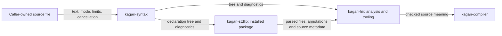
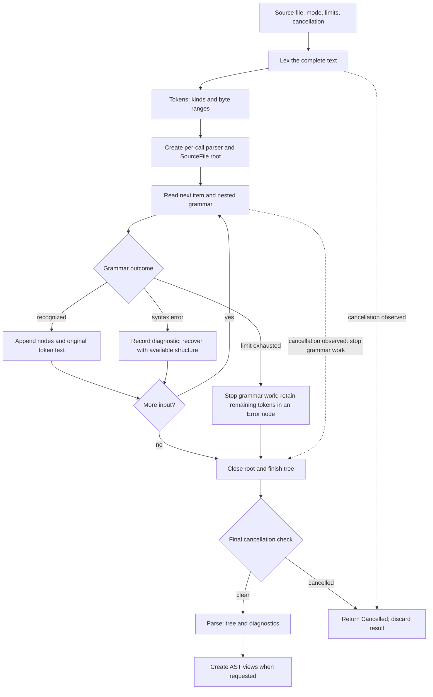
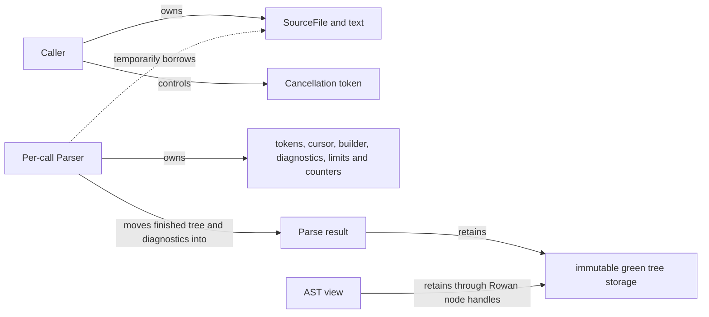

# Syntax Architecture

This document describes the responsibilities, data contracts, processing flow
and ownership model of `kagari-syntax`. It covers the current implementation and
the constraints its callers must observe.

The [workspace architecture](../architecture.md) defines crate boundaries.
The [syntax specification](../spec/syntax.md) and [grammar](../kagari.ebnf) define
language behavior and take precedence over implementation descriptions. Syntax
coverage and its verification limits are recorded in the
[coverage audit](../syntax-coverage.md).

## 1. Purpose and place in the system

`kagari-syntax` converts one source file into a tree that preserves its text,
together with syntax diagnostics. It also provides structured views for reading
declarations, expressions, statements and type spellings from that tree.

Its output answers **what was written and how it is grouped**. HIR subsequently
determines what names mean, whether types agree and whether the program can be
compiled. A diagnostic-free syntax tree is not permission to execute code.



Arrows show data flow, not Cargo dependencies. The analysis owner prepares and
caches the installed package; executable runtime contracts do not invoke the parser.

| Owned here | Owned elsewhere |
| --- | --- |
| Recognizing tokens and their byte ranges | Reading files, source identity and revisions |
| Grammar, grouping and operator precedence | Module discovery, import resolution and name binding |
| Preserving whitespace, comments and erroneous text | Type checking, generic solving and constant evaluation |
| Syntax diagnostics, recovery and parser limits | Deciding whether analysis is valid for code generation |
| Structured access to syntax nodes | MIR, bytecode, execution, GC and hot reload |

The crate has three direct production dependencies:

| Dependency | Responsibility |
| --- | --- |
| `kagari-common` | Source files, byte spans, diagnostics, cancellation and literal decoding |
| `rowan` | Syntax tree construction, immutable green storage and traversable node handles |
| `smallvec` | Inline storage for small token and diagnostic buffers, with heap growth when needed |

There is no production dependency on HIR, compiler, bytecode or runtime. Grammar
recognition must remain independent of name resolution and executable state.

## 2. Inputs and outputs

The caller supplies a `kagari_common::SourceFile`. Its text is already valid UTF-8
because it is a Rust string. No grammar or semantic validity is assumed.
Token and diagnostic spans use byte offsets into that text. Syntax does not
attach file/revision identities to its result; the caller keeps that association.

| Input | Meaning |
| --- | --- |
| Source text | One complete file per parse, including unfinished or malformed source |
| Mode | Ordinary source, or offline declarations with additional declaration forms |
| `ParseLimits` | Diagnostic, recursive grammar nesting and completed tree depth limits |
| `CancellationToken` | A caller-controlled request to abandon work |

| Output | Guarantee and limitation |
| --- | --- |
| Token buffer | Token kinds and source ranges, including trivia, unknown tokens and EOF; no name or type facts |
| `Parse` | Owns a Rowan green tree and diagnostics; can represent erroneous or limit-exhausted input |
| AST view | Structured access to the same tree; optional children may be missing after recovery |
| `Cancelled` | No parse result is published by the controlled parse entrypoint |

The token buffer is the lexer output and parser input; it is not retained as a
separate field of `Parse`. The green tree stores node kinds and token text.
Rowan node handles add navigable tree structure and text ranges, and AST views
give those handles grammar-specific accessors.

The public entrypoints express different acceptance policies:

| Entrypoint | Result policy |
| --- | --- |
| `lex` / `lex_with_cancellation` | Tokenize only; the controlled version can return `Cancelled` |
| `parse` | Ordinary source with default limits and a fresh cancellation token; returns tree plus diagnostics |
| `parse_with_cancellation` / `parse_with_limits` | Ordinary source with caller cancellation, optionally caller limits |
| `parse_declarations` | Same parser with declaration mode enabled, caller limits and cancellation |
| `parse_module` | Convenience wrapper: returns the AST only when diagnostics are empty; otherwise returns diagnostics |

`parse_module` applies a strict syntax acceptance policy. Module loading and
linking remain outside this crate. This entrypoint uses default limits and does
not accept caller cancellation.

Declaration mode accepts forms such as `pub fn len<T>(value: [T]) -> usize;`
and opaque top-level type declarations used by the standard library. It shares
the lexer, tree model and recovery machinery with ordinary source parsing.
Its result still carries no executable validation seal.

### Consumer contract

Callers must keep each parse associated with its source identity and revision.
Tooling may inspect a tree with diagnostics, but must handle absent AST children.
Compilation must carry syntax diagnostics into the semantic acceptance gate;
constructing an AST view or receiving `Ok(Parse)` does not establish validity.

The `Parse` representation does not record whether ordinary or declaration mode
produced it. The caller owns that distinction. Offline declaration acceptance
must not be used to bypass the ordinary executable-source checks.

## 3. Internal responsibilities

The implementation has four working parts and a shared syntax vocabulary.

| Part | Responsibility | Handoff |
| --- | --- | --- |
| Lexer | Scan characters, recognize literals/comments and track interpolation modes | Ordered token buffer |
| Parser core | Own cursor, tree builder, diagnostics, limits and recovery primitives | Controlled operations for grammar handlers |
| Grammar handlers | Recognize items, types, statements and expressions; construct their grouping | Nodes and tokens written directly into the tree builder |
| AST views | Expose accessors such as function name, parameters and body | Optional children and iterators over syntax nodes |
| Token/tree vocabulary | Define lexical kinds, tree kinds and their mapping | Shared representation used by the other parts |

The parser uses recursive descent with expression precedence levels and iterative
operator/postfix chains. It builds the concrete syntax tree (CST) directly; there
is no separate parser-event replay stage. The CST includes punctuation, comments,
whitespace and error nodes. The abstract syntax tree (AST) API is a set of views
over that CST, not a second independently allocated semantic tree.

Two decisions illustrate why the lexer and parser have separate responsibilities:

- String interpolation needs lexical modes for text and expression holes; the
  lexer keeps those modes on an explicit stack.
- Adjacent angle tokens can mean a shift in an expression or generic delimiters
  in a type. Expression parsing joins the relevant adjacent tokens; type parsing
  keeps delimiters separate. Neither requires resolving a type or a name.

## 4. Main flow



Solid arrows show the normal and recoverable flow. Dashed arrows summarize
cancellation: lexing can exit early, while parsing stops grammar work and closes
its builder before the entrypoint rejects the result. Limits retain a lossless
suffix; cancellation does not promise a partial tree to the caller.

For example, consider:

```kagari
fn total() -> i32 {
    1 + 2 * 3
}
```

1. Lexing identifies keywords, identifiers, numbers, punctuation and trivia,
   retaining their source ranges.
2. Item parsing recognizes the function, return type spelling and body.
3. Expression parsing groups the body as `1 + (2 * 3)` according to precedence.
4. The returned tree still reproduces the original spacing and line breaks.
5. AST accessors expose the function and its expression structure to HIR.

Syntax does not compute `7`, prove that `i32` is valid or check the return type.
If the final `}` is missing, parsing can still return the function structure and
an expected-block-end diagnostic. Tolerant analysis can inspect that partial
structure; a strict caller must reject its diagnostics.

## 5. State, ownership and lifetime



Arrows here mean ownership or retention, not control flow. Parser mutation is
local to a call and uses `&mut Parser`. Its token buffer, cursor and builder are
not shared with callers. Parsing invokes no host callbacks and has no execution
reentry boundary. The handwritten parser state uses neither `Rc` nor `RefCell`;
Rowan owns the sharing mechanism for tree storage and node handles.

The result does not borrow the input string. AST views can remain alive after
the `Parse` wrapper or original `SourceFile` is dropped. File identity and
revision bookkeeping still require caller-owned information. Dropping temporary
parser state or the final retained tree releases ordinary Rust-owned resources;
there are no script roots, external registrations or commit/rollback actions.

Syntax itself keeps no cross-call cache and exposes no incremental reparse
operation. HIR's analysis database owns reuse decisions and can reuse a prior
parse for an unchanged file revision. A newly parsed file goes through full
lexing and parsing.

## 6. Failure and resource boundaries

| Condition | Observable behavior | Caller responsibility |
| --- | --- | --- |
| Unknown token or malformed grammar | Diagnostics and recoverable structure; unknown input can appear in error nodes | Preserve diagnostics; tolerate missing children in tooling |
| Diagnostic budget exhausted | Stop recovery and preserve the unparsed suffix; add a limit diagnostic | Treat this as incomplete analysis |
| Nesting or tree depth exhausted | Stop further grammar growth, record the limit and preserve remaining text | Reject executable use; adjust policy only deliberately |
| Cancellation observed | Controlled entrypoint returns `Err(Cancelled)` | Discard the attempt rather than publish it as a successful analysis |
| Internal parser invariant violation | Some paths use `expect` and can panic if their assumptions fail | Syntax diagnostics describe source errors, not arbitrary implementation faults |
| Invalid raw tree kind | The Rowan adapter uses an unchecked conversion that assumes a valid Kagari kind | Raw tree construction must preserve the kind invariant; malformed source recovery does not validate arbitrary raw trees |

Defaults are 256 ordinary diagnostics, 64 simultaneously active recursive
grammar entries and a completed CST depth threshold of 128. A limit diagnostic
is additional to the ordinary diagnostic budget. A zero diagnostic budget still
allows valid source. Tree depth is checked when nodes complete, so the threshold
is a stop condition, not a promise that every returned recovery tree fits that
exact depth.

These limits are not a total memory or CPU budget. Lexing materializes the entire
token buffer before parser limits apply, and retaining an unparsed suffix still
requires storage proportional to that input. Raising recursion limits can also
weaken stack protection. Source-size admission policy belongs at the caller
boundary; this crate currently has no explicit source-byte or token-count limit.

## 7. Design rationale and current limitations

| Design | Benefit | Constraint |
| --- | --- | --- |
| Lossless CST with AST views | Tooling and analysis read one representation while retaining exact source text | Consumers must distinguish recovered structure from valid syntax |
| Per-call mutable parser state | Cursor, builder and recovery state have one owner and a bounded lifetime | Each new parse scans the complete file; reuse belongs to the analysis database |
| Shared parser with explicit declaration mode | Standard declarations reuse grammar, source locations and recovery | Callers must preserve mode provenance outside `Parse` |
| Syntax independent of semantic analysis | Parsing can operate on unfinished source without a symbol table or runtime | HIR must resolve names, validate types and establish checked facts afterward |
| Separate nesting and tree-depth limits | Both recursive grammar and iteratively built deep expressions have stop conditions | These limits do not bound total input size, token storage or execution time |

The public surface includes tokens, syntax kinds and Rowan node construction in
addition to parsing and AST access. This makes the tree representation part of
the current integration boundary. In particular, the raw-kind conversion assumes
its input was created from a valid `SyntaxKind`; it does not perform validation
for arbitrary externally constructed green trees.

Recovery policy is distributed among grammar handlers. Extending a handler must
preserve progress on erroneous input, original token text and balanced tree
construction. The existing tests exercise these properties for selected inputs;
they do not constitute a complete panic or soundness proof.

Incremental subtree reparsing, total parser memory accounting and validated
import of arbitrary raw trees are not provided by the current API. These
limitations must remain distinct from guarantees supplied by an upstream caller.

## 8. Implementation map and verification

The following locations own the contracts described above.

| Contract | Evidence |
| --- | --- |
| Entrypoints, modes, limits and result ownership | [Parser facade](../../crates/kagari-syntax/src/parser/mod.rs) |
| Tokenization and interpolation state | [Lexer](../../crates/kagari-syntax/src/lexer.rs) |
| Recovery, cancellation polling and depth accounting | [Parser core](../../crates/kagari-syntax/src/parser/core.rs) |
| Syntax views and Rowan bridge | [AST views](../../crates/kagari-syntax/src/ast/mod.rs), [node adapter](../../crates/kagari-syntax/src/syntax_node.rs) |
| Partial trees and syntax diagnostics | [Error tests](../../crates/kagari-syntax/src/tests/parser/errors.rs) |
| Lossless limits and cancellation | [Limit tests](../../crates/kagari-syntax/src/tests/limits.rs), [cancellation tests](../../crates/kagari-syntax/src/tests/cancellation.rs) |
| Offline declarations | [Declaration tests](../../crates/kagari-syntax/src/tests/declarations.rs); current native ingestion is described in [architecture](../architecture.md#language-contracts-and-native-implementations) |
| Caller-owned parse reuse and HIR lowering | [Analysis queries](../../crates/kagari-hir/src/analysis/declaration_queries.rs) |
| Grammar coverage and its limits | [Coverage audit](../syntax-coverage.md) |

Changes to this crate must preserve:

- Lossless text reconstruction for completed ordinary and recovered parses,
  including Unicode, comments, line endings and limit-exhausted suffixes.
- Grammar grouping, operator precedence and the distinction between ordinary
  source and offline declarations.
- Diagnostics and usable partial structure for malformed input.
- Cancellation returning an error rather than publishing a partial success.
- Nesting, tree-depth and diagnostic limit behavior.
- Caller ownership of source identity, revision tracking and parse reuse.

Run `cargo test -p kagari-syntax` for syntax behavior changes. Grammar changes
also require the [coverage workflow](../syntax-coverage.md), including updates
to the specification and affected inventories. Changes to syntax contracts used
by HIR or installed package preparation require the corresponding consumer checks.
Documentation-only updates require link, content and diff checks.
