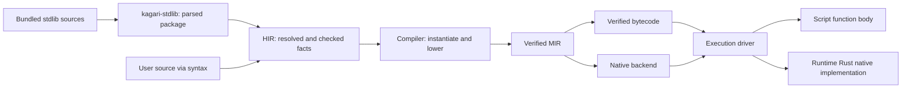

# Standard Library and HIR Integration Plan

Status: proposed; implementation has not started.

This plan defines the next standard-library architecture migration. It follows
the completed [crate refactor](mir-architecture-refactor.md) and is indexed by
the [implementation roadmap](implementation-roadmap.md). Current behavior remains
defined by the language specifications until the corresponding migration phase
updates the implementation and documentation together.

## Objective

Introduce `kagari-stdlib` as the owner of the bundled standard-library source
package. It parses and prepares that package for HIR. HIR resolves declarations,
checks implementations and retains enough metadata for compilation and tooling.
After this boundary, compilation consumes checked HIR facts and execution consumes
the portable contracts derived from those facts.

Keep standard-library implementations in Rust where they are already native.
This migration does not rewrite Rust algorithms in Kagari. Script implementations
use the ordinary script compilation path; native implementations use a checked
native binding and the runtime's Rust implementation.

"Information comes from HIR" describes its semantic origin. It does not authorize
runtime, bytecode, MIR or native backends to depend on HIR or query it at execution
time. Artifact-only execution must remain independent of source processing.

## Current problem and migration inputs

The current implementation shares a syntax parser but has a separate standard
declaration interpretation path:

```text
stdlib/*.kgr
  -> ABI build script + declaration parser
  -> generated ApiType / ApiTrait / ApiFunction / standard tables
  -> HIR-specific interpretation and special standard call targets
  -> compiler-specific expansion, bytecode validation and runtime lookups
```

The following are concrete migration inputs, not target boundaries:

| Current owner | Current behavior | Required change |
| --- | --- | --- |
| [ABI build generator](../crates/kagari-abi/build/main.rs) and its helpers | Parse SDK files; interpret selected generic bounds, receiver shapes and implementations; emit source/API tables | Move package ownership out of ABI; move semantic interpretation into HIR |
| [ABI declaration descriptors](../crates/kagari-abi/src/standard/declarations.rs) and surface tables | Mix docs, source locations, type expressions, default-method classification and execution identities | Separate source input from checked semantic facts and native execution contracts |
| [HIR standard integration](../crates/kagari-hir/src/builtin/declarations.rs) | Convert generated standard descriptors into types, declarations and candidates | Import into the regular HIR declaration and checking model |
| [HIR call facts](../crates/kagari-hir/src/typeck/table.rs) | Distinguish `StandardIntrinsic` from ordinary function targets | Record resolved callable identity, implementation and checked application facts |
| [Compiler standard lowering](../crates/kagari-compiler/src/source/lower/expr/standard.rs) and neighboring collection/iterator modules | Implement some library algorithms by expanding calls into MIR control flow | Replace library-specific expansions with native calls and explicit callback contracts |
| [Runtime standard dispatch](../crates/kagari-runtime/src/builtin/standard.rs) | Execute some methods in Rust; reject others because they require compiler expansion | Own all native library behavior, including resumable callback operations |
| [Bytecode verifier](../crates/kagari-bytecode/src/verifier.rs) and portable type proofs | Consult standard declaration catalogs | Validate carried executable facts against trusted engine contracts without source catalogs |

This is larger than relocating a build script. For example, sorting, prepared
retention and several iterator/Option/Result operations currently contain behavior
in compiler lowering. Calling all of them native methods requires moving that
behavior to the native execution side without changing observable semantics.

## Scope and non-goals

This track owns the new crate, standard declaration import, checked HIR metadata,
portable native-call contracts, native dispatch and removal of downstream source
catalog dependencies. It preserves all existing standard-library capabilities.

It does not redesign every ABI module, split `kagari-common`, replace GC, eliminate
all `Rc`/`RefCell`, expand Cranelift coverage or change the public language to expose
arbitrary native binding attributes. Existing host registration and typed-path
authority remain intact. No extra placeholder crates are introduced.

## Target ownership and dependencies

| Owner | Responsibility | Excluded responsibility |
| --- | --- | --- |
| `kagari-stdlib` | Bundled sources, package manifest, syntax parsing, structural declaration index and source provenance | Name/type resolution, trait solving, executable layouts, runtime state or Rust function dispatch |
| `kagari-hir` | Unified declarations, resolved signatures, trait/impl facts, implementation classification, checked call applications and tool metadata | Runtime addresses or execution state |
| Compiler source frontend | Consume checked HIR, instantiate generics, materialize witnesses and lower resolved calls/types | Reopen SDK declarations or implement public standard methods by name |
| ABI | Portable native binding IDs, physical call contracts, execution type/layout contracts and version rules | SDK source text, docs, `ApiType` trees or public standard API catalogs |
| MIR and bytecode | Carry and verify lowered call targets, signatures, witnesses, effects and logical charges | Resolve source spellings or reinterpret standard declarations |
| Runtime | Native binding registry, existing Rust implementations, callback continuations, GC/root/budget integration | Parse SDK sources, query HIR or solve source types |
| VM and native backends | Drive verified calls using the shared execution contracts | Select behavior by standard method names |



Arrows above are processing handoffs. The important Cargo constraints are:

- `stdlib -> syntax, common`; it does not depend on HIR, compiler or runtime.
- `hir -> stdlib`; HIR may still use narrowly scoped ABI binding/representation
  identities while the unrelated ABI reorganization remains deferred.
- Compiler with `source` enabled reaches stdlib through HIR. Compiler without
  `source`, MIR, bytecode, ABI, runtime, VM and native backends must not reach
  stdlib, syntax or HIR through production dependencies.
- ABI has no stdlib parsing build script and no build dependency on syntax.
- Runtime Rust implementations remain in runtime modules, not in the source
  package crate. This prevents a runtime-to-frontend dependency cycle.

The exit workspace has fourteen crates. Update dependency audits to include
`kagari-stdlib` among source-processing crates and distinguish normal, build and
test edges. A build-only source dependency must not conceal a new ABI generator.

## Standard-library package boundary

The initial design bundles exact source text and a deterministic file manifest,
then lets `kagari-stdlib` parse the installed package on demand for source analysis.
The result is an immutable parsed package retained by the analysis owner and
reused across compatible snapshots. Cancellation or invalid installation never
publishes a partial successful package. No user import triggers filesystem
discovery of replacement standard modules.

This avoids maintaining a second generated type-expression language. Existing
Rust source generation is an implementation detail, not a required contract: it
may bundle text/manifest data, but must not reproduce resolution, generic-bound
interpretation or method-selection logic. Build-time checking of the package can
use the same preparation entrypoint. A future preprocessed cache must preserve
this boundary and is outside the initial migration.

The proposed `ParsedStdlibPackage` contains:

- Package identity and content fingerprint, exact files and source locations.
- Parse trees and diagnostics, with declaration/body locations indexed for HIR.
- Explicit native declaration markers and their written binding names.
- Source implementation bodies where present, retained through the same syntax
  representation rather than translated into another expression language.

Structural preparation can reject malformed or duplicate binding annotations and
invalid package structure. It cannot decide whether `T: Hash`, an associated
projection or a method application is valid. Those are HIR responsibilities.

Trust comes from the installed package path selected by the engine, not its URI,
extension, module spelling or an attribute supplied by user code. Parsing a
native marker alone grants no permission to bind an engine operation.

## HIR as the semantic boundary

The standard importer produces ordinary HIR declarations before resolution and
checking. It must not publish a second `StandardApiType` solver or retain global
standard tables as a fallback when regular resolution fails. Standard items retain
their installed origin, but use the same identity, scope, generic, trait and
visibility mechanisms as other declarations.

Use existing HIR facilities where possible; the following describe required facts,
not mandatory new Rust type names:

| HIR fact | Required information |
| --- | --- |
| Declaration identity and provenance | Package/module/member identity, source file/revision/span, docs and installed origin |
| Resolved signature | Receiver, ordered parameters, result, method/owner binders, visibility and access constraints |
| Type and protocol facts | Nominal identity, representation category where engine-defined, enum variants, parents, associated types/constants, resolved bounds and equalities |
| Implementation selection | Script body identity or checked engine-native binding; abstract trait requirements are declarations awaiting implementation |
| Trait implementation | Impl identity, applied arguments, associated outputs, selected/default method targets and override policy |
| Resolved call | Selected callable, receiver evaluation order, substitutions, result type, required implementation witnesses and callback signatures |
| Execution obligations | Engine contract reference, conservative effects, native callback capability, required roots/permissions and logical charging policy |

Every executable method ultimately selects one of two implementation kinds:

```text
Script { body identity }
EngineNative { binding identity, checked contract application }
```

Trait declarations may have no implementation; calls to them select an impl
statically or use a checked interface slot dynamically. They are not a third
executable implementation kind. Host functions continue to use their existing
checked host-import boundary. "EngineNative" means a Rust implementation, not
JIT-compiled script code; a script method remains Script even if JIT executes it.

HIR retains generic facts until compiler instantiation makes them concrete.
Existing implicit behavior such as associated-output selection, collection
weakening, built-in enum recognition, native defaults and non-overridable standard
operations must become explicit checked facts. Public API signatures and trait
semantics are not reconstructed from binding names during lowering.

Source locations and documentation remain available to snapshots and tooling.
Only needed source/debug provenance crosses into execution products. Packaging
metadata is not a mandatory runtime source catalog.

## Portable handoff and native binding safety

The compiler lowers each checked callable application into an ordinary script
target or an engine-native target with a concrete executable signature. Generic
native operations receive the required concrete type/layout references and
resolved callable witnesses. For example, a generic collection operation must
receive its selected hash/equality or iterator method targets; runtime must not
resolve those protocols from standard source descriptions.

The portable native import record must carry binding identity/version, concrete
parameter/result contracts, witness requirements and necessary type references.
Effects, root behavior and logical charges are constrained by the trusted engine
contract, not freely asserted by the artifact. Bindings are resolved to process
functions during runtime linking; raw Rust addresses are never serialized.

Two different contracts remain necessary:

- The public generic API is defined by `.kgr` and checked by HIR.
- The low-level native operation has a trusted implementation contract: accepted
  representations, required witnesses, effects, permissions and result behavior.
  It lives with the narrow ABI/native boundary and runtime implementation, without
  documentation, source-name resolution or another copy of the public API catalog.

HIR checks that an installed declaration can bind to that native contract.
MIR/bytecode verification checks the lowered application and portable type facts.
Runtime linking checks the binding and engine version against its registry.
Runtime entry keeps value, heap owner/generation and authority checks.

Serialized "checked" flags, claimed package names and arbitrary declaration IDs
are not trust proofs. Unknown bindings, mismatched signatures, forged native
implementations, missing witnesses and weakened effect/permission claims must be
rejected before entry. Portable validators may check carried type constraints;
they may not recover source semantics by consulting the SDK declaration catalog.

Primitive language operations, such as checked arithmetic and field access, can
retain dedicated instructions. A public library method must not select a hidden
compiler-side algorithm through its SDK name or `NativeDefaultMethod` table.

## Native methods that invoke script code

Straight-line Rust helpers can keep their existing implementations behind the new
binding interface. Callback-bearing methods need an explicit suspension protocol,
because a native implementation may call a script closure, a user trait method,
or another selected callable and then continue its own algorithm.

The target is a runtime-owned native invocation state with bounded steps:

```text
enter native method
  -> finish with value or failure
  -> or request a checked callable invocation and retain continuation state
driver executes the requested call on the shared execution stack
  -> resume the native continuation with its outcome
```

The execution driver handles invocation and resumption generically. Sorting,
iterator traversal and collection-specific policy remain in focused runtime
native modules. Do not move an enormous standard-method switch into the generic
VM instruction loop or recursively create a new VM for every callback.

Continuation state must explicitly retain values, temporary roots, mutation and
iteration guards, pinned module versions and required resource accounting. Release
all mutable heap/frame/table borrows before invoking external script or host code.
Resume only through validated session/frame ownership. Cleanup on trap,
cancellation, budget exhaustion and quarantine must release the native suffix
without invoking arbitrary user code or consuming script fuel.

Preserve left-to-right once-only argument evaluation, short-circuit behavior,
stable ordering, original Result error traces, already-completed side effects and
prepare-before-commit guarantees. Native loops must charge and poll at documented
logical work points; moving a loop out of MIR must not create unbudgeted work.
Record current logical charges and callback-visible failure points before moving
each family. Preserve them in this migration rather than silently charging one
unit for an entire previously budgeted traversal.

Lazy iterator state can outlive an individual call. Its captures, witnesses and
versions must remain traceable and pinned, and early closure/resumption must retain
the existing guard behavior. This track does not remove runtime ownership checks
or promise that unrelated shared-mutable-state problems have been solved.

## Migration phases

Implementation begins only on a subsequent implementation request. All phases
below are pending. They are ordered, cohesive checkpoints rather than one-file
tasks; several commits may belong to a phase.

### ST00 — Baseline and behavior inventory

- [ ] Run the full acceptance commands below on the starting revision.
- [ ] Measure source-analysis startup, clean/warm build costs and representative
  native/callback execution workloads; record toolchain, machine, profile,
  features, parallelism and cache state separately from test execution time.
- [ ] Inventory every standard function/default/constructor and classify its
  current behavior: direct Rust helper, compiler-expanded algorithm, lazy state
  machine, or core language primitive. Record its target owner in this plan.
- [ ] Record current guards, logical charges, callback order, diagnostic identity,
  type constraints and version retention for the families being migrated.
- [ ] Map all `standard::{surface,declarations,application,implementation}` consumers,
  including portable proof/validation code and tooling, to replacement facts.

Exit: a clean baseline and an exhaustive ownership/behavior map. Existing failures
must be resolved before migration; historical test counts are not a fresh baseline.

### ST01 — Package ownership and HIR import

- [ ] Add the functional `kagari-stdlib` crate and package preparation API.
- [ ] Move source/package ownership from ABI, preserving paths, source text,
  declaration locations and deterministic identities.
- [ ] Import standard declarations and bodies into HIR; map native markers only
  for engine-installed provenance. Reuse ordinary resolution and signature checks.
- [ ] Delete ABI source generation and its syntax build dependency. Migrate tool
  source/docs access to the HIR-owned standard package.

Exit: ABI no longer owns or builds source descriptors; standard input has one
import path. Downstream users of removed catalogs may remain broken until ST02/ST03.

### ST02 — Complete checked HIR facts

- [ ] Unify standard function/method/trait/impl participation with ordinary HIR
  declarations; preserve builtin representation hooks as explicit semantic facts.
- [ ] Record Script/EngineNative implementation, generic applications, witnesses,
  defaults/overrides and all call metadata required by compilation.
- [ ] Migrate name resolution, inference, completion, definition navigation and
  documentation queries from generated-table lookups to semantic identities.
- [ ] Test mixed native and script methods, associated outputs, native defaults,
  ordinary overrides, shadowing and invalid native provenance/signatures.

Exit: compiler source lowering can obtain every required standard fact from
checked HIR. There is no fallback standard signature or trait solver.

### ST03 — Portable call contracts and validation

- [ ] Introduce the checked engine-native call/import representation in ABI, MIR
  and bytecode; lower it from HIR and link it against runtime-owned bindings.
- [ ] Replace source-catalog queries in executable validators with carried type,
  layout and witness facts plus trusted native contract validation.
- [ ] Preserve ordinary script, closure, interface and host-call integration.
- [ ] Version affected bytecode/artifact, portable MIR, runtime and helper contracts
  as required; reject superseded products without compatibility readers.
- [ ] Pass forged-artifact rejection tests and a vertical direct-native-call test.

Exit: direct Rust helpers work on source and serialized-artifact paths; runtime
requires no source catalog. Callback-heavy families remain owned by ST04/ST05.

### ST04 — Resumable native invocation

- [ ] Add runtime-owned native continuation state and generic driver integration.
- [ ] Integrate GC roots, frame/session cleanup, budgets, debugger origins,
  synchronous host reentry and generation-pinned callable witnesses.
- [ ] Migrate a representative callback method through success, nested calls,
  ordinary trap, cancellation and budget failure before expanding coverage.

Exit: a native method can call Script or EngineNative targets and resume without
holding dynamic borrows across the call or growing an unbounded Rust call chain.

### ST05 — Migrate all standard execution families

- [ ] Migrate Option/Result combinators and preserve original error provenance.
- [ ] Migrate iterator defaults, terminal operations, custom destinations and
  lazy adapters, including generic/user protocol witnesses.
- [ ] Migrate collection queries, custom keys, prepared mutation, sort/retain/dedup,
  map updates and lazy windows/chunks with their existing observable contracts.
- [ ] Remove corresponding compiler algorithm expansions and standard source
  lookups from MIR, bytecode, VM and runtime.
- [ ] Reuse existing Rust helpers; translate compiler-owned behavior into focused
  Rust native implementations without adding Kagari copies of those algorithms.

Exit: every ST00 entry has its final implementation owner. There is no residual
"requires static lowering" route for a public method classified EngineNative.
Core language primitives are documented separately from public library behavior.

### ST06 — Integration, documentation and final acceptance

- [ ] Complete the feature/behavior matrix and all acceptance commands below.
- [ ] Update dependency audits, feature consumers and encoded artifact fixtures.
- [ ] Update current architecture, syntax/stdlib docs, standard declaration and
  execution specifications; remove obsolete descriptor APIs and parallel dispatch.
- [ ] Audit module ownership, public surface, imports and effective LOC. Record
  any narrowly justified exception under the existing structure policy.
- [ ] Measure source startup/build and representative execution effects under
  the same toolchain/profile/workload conditions as ST00; make no unmeasured claims.

Exit: all errors are resolved, source-free execution passes, and this plan's final
ownership/behavior map describes the actual implementation.

## Intermediate build and commit policy

ST00 must pass before code migration. ST01–ST05 may have explicitly recorded
intermediate build failures while obsolete cross-crate types are removed. This
does not authorize compatibility aliases, forwarding crates, duplicate semantic
paths, disabled checks or fake successful results to maintain compilation.

At every checkpoint, run applicable focused tests, structure checks and
`git diff --check`. Record a failing command, representative diagnostic, cause
and owning follow-up phase in the ledger. Do not repeatedly run an unchanged
known failure before its owner phase. ST06 cannot close with carried errors.

Use Conventional Commits with `Stdlib-Step: STxx` trailers on implementation
checkpoints. Mark breaking API/format changes with `!` and describe their impact.
Keep this plan's checklist and ledger current; do not create parallel progress
queues. This proposal does not amend or reopen completed historical phase ledgers.

## Acceptance matrix

| Boundary | Required behavioral evidence |
| --- | --- |
| Package → HIR | Exact sources/spans/docs; cancellation; invalid declarations; deterministic identity; normal shadowing and visibility |
| HIR → compiler | Generic methods, associated outputs, trait inheritance/defaults/overrides, native/script implementations and cross-module calls use checked facts |
| Compiler → executable contracts | No SDK `ApiType`/surface access; complete signature/layout/witness metadata; no public-method algorithm expansion |
| Artifact → runtime | Source-free load/execute; reject forged native IDs, signatures, representations, authority, witnesses and versions |
| Native → script → native | Once-only order, explicit roots, bounded stack/budget behavior, same-session reentry, complete cleanup |
| Collections and lazy state | Atomic commit guarantees, stable ordering, alias guards, early closure/resumption and GC at allocation threshold one |
| Errors and reload | Original error traces, preserved completed effects, sticky cancellation, pinned old dependencies and callable versions |
| Tooling | Definitions, completions, signatures and docs derive from HIR metadata for both native and script declarations |
| Backend/feature routes | Source, encoded artifacts, JIT-enabled fallback and existing supported direct JIT cases; all SDK feature combinations |

Reuse relevant existing suites, including `standard_declarations`,
`standard_traits`, `collection_interfaces`, `iteration_traits`, `lazy_iterators`,
`prepared_collections`, `callable_traits`, `error_traces`, runtime sessions/scopes,
and artifact/native integration tests. Add focused tests for genuinely new
boundaries rather than mirroring new struct layouts.

Final acceptance commands:

```text
uv run --locked scripts/check_structure.py
cargo fmt --all -- --check
cargo clippy --workspace --all-targets -- -D warnings
cargo test --workspace
cargo test -p kagari-cli --features jit
uv run python scripts/check_features.py
git diff --check
```

Extend `check_features.py` so artifact-only/native-only consumers exclude stdlib,
syntax and HIR, while source consumers include the new crate. Also audit ABI build
edges; the CLI retains `jit` as its native-feature spelling. Use workspace
profiles, default Cargo parallelism and the default target
directory; store temporary logs and measurement output under ignored `target/`.

## Progress ledger

- Proposal prepared from clean revision `6fafe34`. No implementation phase started.
- Inspected the ABI generator/descriptors, HIR standard catalogs and call facts,
  compiler standard expansions, runtime helpers, executable validation and SDK
  feature audits. Confirmed that callback-heavy library behavior currently spans
  both compiler and runtime; ST04/ST05 are required work, not optional cleanup.
- Selected a parsed source-package boundary instead of relocating the generated
  `ApiType` semantic model unchanged. Existing Rust implementations remain Rust.
- Proposal validation: local documentation links, content review and diff checks.
  No new workspace test or performance baseline is claimed; ST00 owns those runs.
