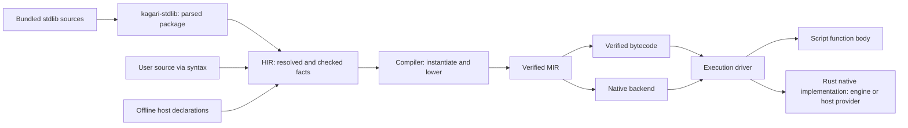

# Standard Library and HIR Integration Plan

Status: active; ST00 complete, ST01 implementation scope complete, ST02 checked
callable facts in progress. Integration remains broken with carried ABI errors.

This plan defines the next standard-library architecture migration. It follows
the completed [crate refactor](mir-architecture-refactor.md) and is indexed by
the [implementation roadmap](implementation-roadmap.md). Current behavior remains
defined by the language specifications until the corresponding migration phase
updates the implementation and documentation together.

## Objective

Introduce `kagari-stdlib` as the owner of the bundled standard-library source
package. It parses and prepares that package for HIR. HIR resolves declarations,
checks implementations and retains enough metadata for compilation and tooling.
After this boundary, compilation consumes checked HIR facts and execution consumes
the portable contracts derived from those facts.

Keep standard-library implementations in Rust where they are already native.
This migration does not rewrite Rust algorithms in Kagari. Script implementations
use the ordinary script compilation path; native implementations use a checked
native binding and its provider's Rust implementation. Engine standard functions
and user-registered host functions share this semantic model while retaining
distinct authority, representation and resource contracts.

"Information comes from HIR" describes its semantic origin. It does not authorize
runtime, bytecode, MIR or native backends to depend on HIR or query it at execution
time. Artifact-only execution must remain independent of source processing.

## Current problem and migration inputs

At the ST00 baseline, the implementation shared a syntax parser but had a separate
standard declaration interpretation path. The ledger records migration away from it:

```text
stdlib/*.kgr
  -> ABI build script + declaration parser
  -> generated ApiType / ApiTrait / ApiFunction / standard tables
  -> HIR-specific interpretation and special standard call targets
  -> compiler-specific expansion, bytecode validation and runtime lookups
```

The following are concrete migration inputs, not target boundaries:

| Current owner | Current behavior | Required change |
| --- | --- | --- |
| Former ABI `build/{main,api,implementations}.rs` (removed in ST01) | Parsed SDK files; interpreted selected generic bounds, receiver shapes and implementations; emitted source/API tables | [Installed package preparation](../crates/kagari-stdlib/src/package.rs) owns sources; ordinary HIR owns semantics |
| Former ABI `standard/declarations.rs` and generated surface tables (removed in ST01) | Mixed docs, source locations, type expressions, default-method classification and execution identities | Separate source input from checked semantic facts and native execution contracts |
| Former HIR `builtin/declarations.rs` (removed during ST01) | Converted generated descriptors into types, declarations and candidates | [Checked implementation selection](../crates/kagari-hir/src/aggregates/native.rs) consumes ordinary HIR facts and installed provenance |
| [HIR call facts](../crates/kagari-hir/src/typeck/table.rs) | Distinguish `StandardIntrinsic` from ordinary function targets | Record resolved callable identity, implementation and checked application facts |
| [Compiler standard lowering](../crates/kagari-compiler/src/source/lower/expr/standard.rs) and neighboring collection/iterator modules | Implement some library algorithms by expanding calls into MIR control flow | Replace library-specific expansions with native calls and explicit callback contracts |
| [Runtime standard dispatch](../crates/kagari-runtime/src/builtin/standard.rs) | Execute some methods in Rust; reject others because they require compiler expansion | Own all native library behavior, including resumable callback operations |
| [Bytecode verifier](../crates/kagari-bytecode/src/verifier.rs) and portable type proofs | Consult standard declaration catalogs | Validate carried executable facts against trusted engine contracts without source catalogs |

This is larger than relocating a build script. For example, sorting, prepared
retention and several iterator/Option/Result operations currently contain behavior
in compiler lowering. Calling all of them native methods requires moving that
behavior to the native execution side without changing observable semantics.

## Scope and non-goals

This track owns the new crate, standard declaration import, checked HIR metadata,
portable native-call contracts, native dispatch and removal of downstream source
catalog dependencies. It preserves all existing standard-library capabilities.

It does not redesign every ABI module, split `kagari-common`, replace GC, eliminate
all `Rc`/`RefCell`, expand Cranelift coverage or change the public language to expose
arbitrary native binding attributes. Existing host registration and typed-path
authority remain intact. HIR/native-call metadata must accommodate both engine
and host providers; a new Rust registration macro, generated host declaration
documents and LSP transport are later integrations. No extra placeholder crates
are introduced.

## Target ownership and dependencies

| Owner | Responsibility | Excluded responsibility |
| --- | --- | --- |
| `kagari-stdlib` | Bundled sources, package manifest, syntax parsing, structural declaration index and source provenance | Name/type resolution, trait solving, executable layouts, runtime state or Rust function dispatch |
| `kagari-hir` | Unified declarations, resolved signatures, trait/impl facts, implementation classification, checked call applications and tool metadata | Runtime addresses or execution state |
| Compiler source frontend | Consume checked HIR, instantiate generics, materialize witnesses and lower resolved calls/types | Reopen SDK declarations or implement public standard methods by name |
| ABI | Portable native binding IDs, physical call contracts, execution type/layout contracts and version rules | SDK source text, docs, `ApiType` trees or public standard API catalogs |
| MIR and bytecode | Carry and verify lowered call targets, signatures, witnesses, effects and logical charges | Resolve source spellings or reinterpret standard declarations |
| Runtime | Engine/host binding resolution, existing Rust implementations, callback continuations, provider-specific authority and GC/root/budget integration | Parse SDK sources, query HIR or solve source types |
| VM and native backends | Drive verified calls using the shared execution contracts | Select behavior by standard method names |



Arrows above are processing handoffs. The important Cargo constraints are:

- `stdlib -> syntax, common`; it does not depend on HIR, compiler or runtime.
- `hir -> stdlib`; HIR may still use narrowly scoped ABI binding/representation
  identities while the unrelated ABI reorganization remains deferred.
- Compiler with `source` enabled reaches stdlib through HIR. Compiler without
  `source`, MIR, bytecode, ABI, runtime, VM and native backends must not reach
  stdlib, syntax or HIR through production dependencies.
- ABI has no stdlib parsing build script and no build dependency on syntax.
- Runtime Rust implementations remain in runtime modules, not in the source
  package crate. This prevents a runtime-to-frontend dependency cycle.

The exit workspace has fourteen crates. Update dependency audits to include
`kagari-stdlib` among source-processing crates and distinguish normal, build and
test edges. A build-only source dependency must not conceal a new ABI generator.

## Standard-library package boundary

The initial design bundles exact source text and a deterministic file manifest,
then lets `kagari-stdlib` parse the installed package on demand for source analysis.
The result is an immutable parsed package retained by the analysis owner and
reused across compatible snapshots. Cancellation or invalid installation never
publishes a partial successful package. No user import triggers filesystem
discovery of replacement standard modules.

This avoids maintaining a second generated type-expression language. Existing
Rust source generation is an implementation detail, not a required contract: it
may bundle text/manifest data, but must not reproduce resolution, generic-bound
interpretation or method-selection logic. Build-time checking of the package can
use the same preparation entrypoint. A future preprocessed cache must preserve
this boundary and is outside the initial migration.

The proposed `ParsedStdlibPackage` contains:

- Package identity and content fingerprint, exact files and source locations.
- Parse trees and diagnostics, with declaration/body locations indexed for HIR.
- Explicit native declaration markers and their written binding names.
- Source implementation bodies where present, retained through the same syntax
  representation rather than translated into another expression language.

Structural preparation can reject malformed or duplicate binding annotations and
invalid package structure. It cannot decide whether `T: Hash`, an associated
projection or a method application is valid. Those are HIR responsibilities.

Trust comes from the installed package path selected by the engine, not its URI,
extension, module spelling or an attribute supplied by user code. Parsing a
native marker alone grants no permission to bind an engine operation.

## Shared native model for standard and host functions

The [existing host API](../crates/kagari-runtime/src/host.rs) already separates
declaration from implementation: `HostFunction::new(declaration, callback)` binds
a `HostFunctionDeclaration` to Rust code. The same declaration can enter an offline
`HostInterface` and [HIR host input](../crates/kagari-hir/src/host.rs)
without constructing a runtime or invoking the callback. Reuse this separation;
do not make user registration depend on the bundled standard source package.

Standard and host inputs have different origins but converge on the same HIR
callable model:

```text
stdlib .kgr declarations -> syntax/package importer --+
                                                     +-> HIR callable facts
host registration metadata -> offline interface -----+
```

A Native implementation records provider kind (Engine or Host), declaration and
binding identity, signature, effects and applicable resource/authority contracts.
Provider is explicit metadata, never inferred from a `std` prefix or a generated
document URI. HIR checking and subsequent lowering share the callable machinery;
provider-specific linking and invocation adapters preserve the actual guarantees.

| Shared contract | Provider-specific requirement |
| --- | --- |
| Declaration identity, parameter/result types and callable selection | Engine bindings use a closed operation registry; host bindings resolve within the installed host registry |
| Effects, resource obligations and failure propagation | Host capability requirements, call accounting and candidate-initialization restrictions remain enforced |
| Argument/result validation and retained values | Host passing styles, opaque nominal handles, scoped leases and no-escape rules remain enforced |
| Callback/reentry integration with the execution session | Existing synchronous host callbacks retain their call scope; engine resumable methods may use runtime-owned continuation state |

Sharing this model does not require identical Rust callback signatures or grant
host code access to engine internals. It does not make arbitrary Rust types,
lifetimes, generics or async functions automatically script-callable. Registration
adapters must express supported representations explicitly and validate them.

HIR exposes the shared checked signature through
[`CallableSignature`](../crates/kagari-hir/src/callable.rs). Source functions retain
their parameter arena IDs and generic bounds. Installed
[`HostCallable`](../crates/kagari-hir/src/host/callable.rs) views pair imported HIR
types with the immutable provider contract; they do not fabricate source bindings.
Call checking and signature queries consume this same interface. Host types are
converted during interface installation, including methods expanded from host
type declarations. `NativeBinding::Host` identifies that installation and is not
a portable runtime registry slot; ST03 owns the executable binding contract.

### Later declaration documents and LSP integration

One registration description should supply runtime binding, offline checking and
tooling metadata. A later export/macro facility can produce a readonly Kagari
declaration document from that description, including names, signatures, docs and
stable declaration IDs. The document is a view of the same contract, not another
handwritten source of signatures. Generated text alone cannot grant binding
authority or encode away passing styles, capabilities and other non-syntax facts.

HIR should accept optional declaration origin metadata now: a virtual document
URI/range, and an optional Rust source origin supplied by registration tooling.
LSP navigation can target the generated declaration by default and the Rust origin
when it is available and valid. Rust source locations cannot be recovered from an
arbitrary function pointer; signature introspection is not provided by ordinary
runtime registration either.

Offline tooling reads exported interface data without invoking application
callbacks or starting host services. If generated text is parsed for presentation,
associate it with the same declaration IDs rather than importing duplicate
definitions. Cache invalidation follows declaration revisions; documentation and
navigation changes remain separate from executable contract compatibility.
Missing or incompatible runtime bindings still fail at link time even when the
editor has a valid offline declaration.

## HIR as the semantic boundary

The standard importer produces ordinary HIR declarations before resolution and
checking. It must not publish a second `StandardApiType` solver or retain global
standard tables as a fallback when regular resolution fails. Standard items retain
their installed origin, but use the same identity, scope, generic, trait and
visibility mechanisms as other declarations.

Use existing HIR facilities where possible; the following describe required facts,
not mandatory new Rust type names:

| HIR fact | Required information |
| --- | --- |
| Declaration identity and provenance | Package/module/member identity, source file/revision/span, docs, installed origin and optional host declaration/Rust origins |
| Resolved signature | Receiver, ordered parameters, result, method/owner binders, visibility and access constraints |
| Type and protocol facts | Nominal identity, representation category where engine-defined, enum variants, parents, associated types/constants, resolved bounds and equalities |
| Implementation selection | Script body identity or checked native binding with Engine/Host provider; abstract trait requirements are declarations awaiting implementation |
| Trait implementation | Impl identity, applied arguments, associated outputs, selected/default method targets and override policy |
| Resolved call | Selected callable, receiver evaluation order, substitutions, result type, required implementation witnesses and callback signatures |
| Execution obligations | Provider contract reference, conservative effects, native callback capability, required roots/permissions, host passing styles and logical charging policy |

Every executable method ultimately selects one of two implementation kinds:

```text
Script { body identity }
Native { provider: Engine | Host, binding identity, checked contract application }
```

Trait declarations may have no implementation; calls to them select an impl
statically or use a checked interface slot dynamically. They are not a third
executable implementation kind. Host providers continue to enforce the existing
checked host-import boundary within the shared native-call model. "Native" means
a Rust implementation, not JIT-compiled script code; a script method remains
Script even if JIT executes it.

HIR retains generic facts until compiler instantiation makes them concrete.
Existing implicit behavior such as associated-output selection, collection
weakening, built-in enum recognition, native defaults and non-overridable standard
operations must become explicit checked facts. Public API signatures and trait
semantics are not reconstructed from binding names during lowering.

Source locations and documentation remain available to snapshots and tooling.
Only needed source/debug provenance crosses into execution products. Packaging
metadata is not a mandatory runtime source catalog.

## Portable handoff and native binding safety

The compiler lowers each checked callable application into an ordinary script
target or a provider-qualified native target with a concrete executable signature.
Generic native operations receive the required concrete type/layout references and
resolved callable witnesses. For example, a generic collection operation must
receive its selected hash/equality or iterator method targets; runtime must not
resolve those protocols from standard source descriptions.

The portable native import record must carry provider and binding identity/version,
concrete parameter/result contracts, witness requirements and necessary type references.
Effects, root behavior and logical charges are constrained by the trusted engine
contract, not freely asserted by the artifact. Bindings are resolved to process
functions during runtime linking; raw Rust addresses are never serialized.

Two different contracts remain necessary:

- The public generic API is defined by `.kgr` and checked by HIR.
- The low-level native operation has a trusted implementation contract: accepted
  representations, required witnesses, effects, permissions and result behavior.
  It lives with the narrow ABI/native boundary and runtime implementation, without
  documentation, source-name resolution or another copy of the public API catalog.

For host providers, the public declaration and binding contract originate in the
offline host interface/registration pair. Reuse its full contract comparison,
including passing styles, effects, capabilities and costs. A shared native target
must not let an artifact substitute an Engine provider for a Host provider or
resolve a same-named function from a different registry.

HIR checks that an installed declaration can bind to that native contract.
MIR/bytecode verification checks the lowered application and portable type facts.
Runtime linking checks the binding and engine version against its registry.
Runtime entry keeps value, heap owner/generation and authority checks.

Serialized "checked" flags, claimed package names and arbitrary declaration IDs
are not trust proofs. Unknown bindings, mismatched signatures, forged native
implementations, missing witnesses and weakened effect/permission claims must be
rejected before entry. Portable validators may check carried type constraints;
they may not recover source semantics by consulting the SDK declaration catalog.

Primitive language operations, such as checked arithmetic and field access, can
retain dedicated instructions. A public library method must not select a hidden
compiler-side algorithm through its SDK name or `NativeDefaultMethod` table.

## Native methods that invoke script code

Straight-line Rust helpers can keep their existing implementations behind the new
binding interface. Callback-bearing methods need an explicit suspension protocol,
because a native implementation may call a script closure, a user trait method,
or another selected callable and then continue its own algorithm.

The target is a runtime-owned native invocation state with bounded steps:

```text
enter native method
  -> finish with value or failure
  -> or request a checked callable invocation and retain continuation state
driver executes the requested call on the shared execution stack
  -> resume the native continuation with its outcome
```

The execution driver handles invocation and resumption generically. Sorting,
iterator traversal and collection-specific policy remain in focused runtime
native modules. Do not move an enormous standard-method switch into the generic
VM instruction loop or recursively create a new VM for every callback.

Continuation state must explicitly retain values, temporary roots, mutation and
iteration guards, pinned module versions and required resource accounting. Release
all mutable heap/frame/table borrows before invoking external script or host code.
Resume only through validated session/frame ownership. Cleanup on trap,
cancellation, budget exhaustion and quarantine must release the native suffix
without invoking arbitrary user code or consuming script fuel.

Preserve left-to-right once-only argument evaluation, short-circuit behavior,
stable ordering, original Result error traces, already-completed side effects and
prepare-before-commit guarantees. Native loops must charge and poll at documented
logical work points; moving a loop out of MIR must not create unbudgeted work.
Record current logical charges and callback-visible failure points before moving
each family. Preserve them in this migration rather than silently charging one
unit for an entire previously budgeted traversal.

Lazy iterator state can outlive an individual call. Its captures, witnesses and
versions must remain traceable and pinned, and early closure/resumption must retain
the existing guard behavior. This track does not remove runtime ownership checks
or promise that unrelated shared-mutable-state problems have been solved.

## Migration phases

Implementation is authorized. Work proceeds through the ordered checkpoints
below; several coherent commits may belong to a phase.

### ST00 — Baseline and behavior inventory

- [x] Run the full acceptance commands below on the starting revision.
- [x] Measure source-analysis startup, clean/warm build costs and representative
  native/callback execution workloads; record toolchain, machine, profile,
  features, parallelism and cache state separately from test execution time.
- [x] Inventory every standard function/default/constructor and classify its
  current behavior: direct Rust helper, compiler-expanded algorithm, lazy state
  machine, or core language primitive. Record its target owner in this plan.
- [x] Record current guards, logical charges, callback order, diagnostic identity,
  type constraints and version retention for the families being migrated.
- [x] Map all `standard::{surface,declarations,application,implementation}` consumers,
  including portable proof/validation code and tooling, to replacement facts.

Exit: a clean baseline and an exhaustive ownership/behavior map. Existing failures
must be resolved before migration; historical test counts are not a fresh baseline.

### ST01 — Package ownership and HIR import

- [x] Add the functional `kagari-stdlib` crate and package preparation API.
- [x] Cache installed parses in the analysis owner and retain opaque type
  declarations, their generic syntax and source provenance in ordinary HIR.
- [x] Move source/package ownership from ABI, preserving paths, source text,
  declaration locations and deterministic identities.
- [x] Import standard declarations and bodies into HIR; map native markers only
  for engine-installed provenance. Reuse ordinary resolution and signature checks.
- [x] Delete ABI source generation and its syntax build dependency.
- [x] Migrate tool source/docs access to the HIR-owned standard package.

Exit: ABI no longer owns or builds source descriptors; standard input has one
import path. Downstream users of removed catalogs may remain broken until ST02/ST03.

### ST02 — Complete checked HIR facts

- [ ] Unify standard function/method/trait/impl participation with ordinary HIR
  declarations; preserve builtin representation hooks as explicit semantic facts.
- [ ] Record Script/Native implementation, explicit Engine/Host provider, generic
  applications, witnesses, defaults/overrides and all required call metadata.
- [ ] Import existing offline host declarations into this shared callable model,
  retaining provider contracts and optional declaration origin metadata.
- [ ] Migrate name resolution, inference, completion, definition navigation and
  documentation queries from generated-table lookups to semantic identities.
- [ ] Test mixed native and script methods, associated outputs, native defaults,
  ordinary overrides, shadowing and invalid native provenance/signatures.

Exit: compiler source lowering can obtain every required standard fact from
checked HIR. There is no fallback standard signature or trait solver.

### ST03 — Portable call contracts and validation

- [ ] Introduce the checked provider-qualified native call/import representation
  in ABI, MIR and bytecode; lower it from HIR and link it against runtime bindings.
- [ ] Replace source-catalog queries in executable validators with carried type,
  layout and witness facts plus trusted native contract validation.
- [ ] Preserve ordinary script, closure, interface and host-call integration;
  reject provider substitution and missing/mismatched host contracts.
- [ ] Version affected bytecode/artifact, portable MIR, runtime and helper contracts
  as required; reject superseded products without compatibility readers.
- [ ] Pass forged-artifact rejection tests and a vertical direct-native-call test.

Exit: direct Rust helpers work on source and serialized-artifact paths; runtime
requires no source catalog. Callback-heavy families remain owned by ST04/ST05.

### ST04 — Resumable native invocation

- [ ] Add runtime-owned native continuation state and generic driver integration.
- [ ] Integrate GC roots, frame/session cleanup, budgets, debugger origins,
  synchronous host reentry and generation-pinned callable witnesses.
- [ ] Migrate a representative callback method through success, nested calls,
  ordinary trap, cancellation and budget failure before expanding coverage.

Exit: a native method can call Script or Native targets and resume without
holding dynamic borrows across the call or growing an unbounded Rust call chain.

### ST05 — Migrate all standard execution families

- [ ] Migrate Option/Result combinators and preserve original error provenance.
- [ ] Migrate iterator defaults, terminal operations, custom destinations and
  lazy adapters, including generic/user protocol witnesses.
- [ ] Migrate collection queries, custom keys, prepared mutation, sort/retain/dedup,
  map updates and lazy windows/chunks with their existing observable contracts.
- [ ] Remove corresponding compiler algorithm expansions and standard source
  lookups from MIR, bytecode, VM and runtime.
- [ ] Reuse existing Rust helpers; translate compiler-owned behavior into focused
  Rust native implementations without adding Kagari copies of those algorithms.

Exit: every ST00 entry has its final implementation owner. There is no residual
"requires static lowering" route for a public engine-native method.
Core language primitives are documented separately from public library behavior.

### ST06 — Integration, documentation and final acceptance

- [ ] Complete the feature/behavior matrix and all acceptance commands below.
- [ ] Update dependency audits, feature consumers and encoded artifact fixtures.
- [ ] Update current architecture, syntax/stdlib docs, standard declaration and
  execution specifications; remove obsolete descriptor APIs and parallel dispatch.
- [ ] Audit module ownership, public surface, imports and effective LOC. Record
  any narrowly justified exception under the existing structure policy.
- [ ] Measure source startup/build and representative execution effects under
  the same toolchain/profile/workload conditions as ST00; make no unmeasured claims.

Exit: all errors are resolved, source-free execution passes, and this plan's final
ownership/behavior map describes the actual implementation.

## Intermediate build and commit policy

ST00 must pass before code migration. ST01–ST05 may have explicitly recorded
intermediate build failures while obsolete cross-crate types are removed. This
does not authorize compatibility aliases, forwarding crates, duplicate semantic
paths, disabled checks or fake successful results to maintain compilation.

At every checkpoint, run applicable focused tests, structure checks and
`git diff --check`. Record a failing command, representative diagnostic, cause
and owning follow-up phase in the ledger. Do not repeatedly run an unchanged
known failure before its owner phase. ST06 cannot close with carried errors.

Use Conventional Commits with `Stdlib-Step: STxx` trailers on implementation
checkpoints. Mark breaking API/format changes with `!` and describe their impact.
Keep this plan's checklist and ledger current; do not create parallel progress
queues. This proposal does not amend or reopen completed historical phase ledgers.

## Acceptance matrix

| Boundary | Required behavioral evidence |
| --- | --- |
| Package → HIR | Exact sources/spans/docs; cancellation; invalid declarations; deterministic identity; normal shadowing and visibility |
| Host declaration → HIR/linker | Offline checks without callbacks; shared callable facts; missing bindings and provider substitution rejected; passing styles, capabilities and costs preserved |
| HIR → compiler | Generic methods, associated outputs, trait inheritance/defaults/overrides, native/script implementations and cross-module calls use checked facts |
| Compiler → executable contracts | No SDK `ApiType`/surface access; complete signature/layout/witness metadata; no public-method algorithm expansion |
| Artifact → runtime | Source-free load/execute; reject forged native IDs, signatures, representations, authority, witnesses and versions |
| Native → script → native | Once-only order, explicit roots, bounded stack/budget behavior, same-session reentry, complete cleanup |
| Collections and lazy state | Atomic commit guarantees, stable ordering, alias guards, early closure/resumption and GC at allocation threshold one |
| Errors and reload | Original error traces, preserved completed effects, sticky cancellation, pinned old dependencies and callable versions |
| Tooling | Definitions, completions, signatures and docs derive from HIR metadata for both native and script declarations |
| Backend/feature routes | Source, encoded artifacts, JIT-enabled fallback and existing supported direct JIT cases; all SDK feature combinations |

Reuse relevant existing suites, including `standard_declarations`,
`standard_traits`, `collection_interfaces`, `iteration_traits`, `lazy_iterators`,
`prepared_collections`, `callable_traits`, `error_traces`, runtime sessions/scopes,
and artifact/native integration tests. Add focused tests for genuinely new
boundaries rather than mirroring new struct layouts.

Final acceptance commands:

```text
uv run --locked scripts/check_structure.py
cargo fmt --all -- --check
cargo clippy --workspace --all-targets -- -D warnings
cargo test --workspace
cargo test -p kagari-cli --features jit
uv run python scripts/check_features.py
git diff --check
```

Extend `check_features.py` so artifact-only/native-only consumers exclude stdlib,
syntax and HIR, while source consumers include the new crate. Also audit ABI build
edges; the CLI retains `jit` as its native-feature spelling. Use workspace
profiles, default Cargo parallelism and the default target
directory; store temporary logs and measurement output under ignored `target/`.

## ST00 ownership and behavior inventory

Snapshot: revision `402e089`, before migration, with the artifact fixture correction
recorded below. The generated surface contains 316 function entries, 281 receiver
method entries (alternate syntax for those functions), 116 trait methods including
56 native defaults, 38 explicit native impl blocks, 13 type constructors and seven
enum declarations. The enumeration below covers the public entries; internal
lowering helpers are tracked separately. No entry is implicitly deferred.

Classification: **D** = direct Rust helper; **E** = compiler-expanded algorithm or
protocol dispatch; **L** = lazy state machine (currently split between compiler
adapters and runtime iterator storage); **C** = core language representation or
operation. D/E denotes the primitive/custom-key split. All D entries stay in
runtime engine bindings; E entries move to runtime native implementations with
checked witnesses and resumable calls where required; L entries move to runtime
lazy native state. C retains generic MIR/runtime machinery fed by HIR facts.
The declaration/typechecking/tooling owner for every row becomes HIR.

### Functions and receiver methods

Each name is relative to its explicit owner. Receiver forms share the same row
and implementation binding; they are not an additional algorithm.

| Owner | Current class | Complete member set |
| --- | --- | --- |
| `std::array::ArrayList` | E | `remove_range`, `retain`, `sort`, `sort_by`, `sort_by_key`, `dedup`, `extend`, `from_fn`, `from`, `copy_from`, `copy_within` |
| `std::array::ArrayList` | D | `swap`, `reverse`, `truncate`, `swap_remove`, `len`, `is_empty`, `get`, `new`, `push`, `pop`, `insert`, `remove`, `clear`, `fill`, `join`, `with_capacity`, `capacity`, `reserve` |
| `std::map::LinkedHashMap` | E | `retain`, `get_or_insert_with`, `update`, `keys`, `values`, `entries`, `from` |
| `std::map::LinkedHashMap` | D | `len`, `is_empty`, `new`, `clear`, `with_capacity`, `capacity`, `reserve` |
| `std::map::LinkedHashMap` | D/E | `contains_key`, `get`, `insert`, `remove` |
| `std::set::LinkedHashSet` | E | `retain`, `from` |
| `std::set::LinkedHashSet` | D | `len`, `is_empty`, `to_array`, `new`, `clear`, `with_capacity`, `capacity`, `reserve` |
| `std::set::LinkedHashSet` | D/E | `contains`, `insert`, `remove` |
| `std::string::String` | E | `parse` |
| `std::string::String` | D | `replace`, `replacen`, `repeat`, `is_ascii`, `eq_ignore_ascii_case`, `to_ascii_lowercase`, `to_ascii_uppercase`, `to_lowercase`, `to_uppercase`, `is_char_boundary`, `split_once`, `rsplit_once`, `trim`, `trim_start`, `trim_end`, `find`, `rfind`, `strip_prefix`, `strip_suffix`, `len_bytes`, `len_chars`, `is_empty`, `concat`, `contains`, `starts_with`, `ends_with`, `slice` |
| `std::string::String` | L | `bytes`, `char_indices`, `split`, `splitn`, `split_whitespace`, `lines` |
| `std::option::Option` | E | `unwrap_or_else`, `or_else`, `map_or`, `map_or_else`, `filter`, `is_some_and`, `zip`, `map`, `and_then`, `ok_or`, `ok_or_else`, `flatten`, `transpose` |
| `std::option::Option` | D | `is_some`, `is_none`, `unwrap_or` |
| `std::result::Result` | E | `unwrap_or_else`, `or_else`, `map_or`, `map_or_else`, `ok`, `err`, `is_ok_and`, `is_err_and`, `map`, `map_err`, `and_then`, `flatten`, `transpose` |
| `std::result::Result` | D | `is_ok`, `is_err`, `unwrap_or` |
| `std::math` | D | `min`, `max`, `clamp`, `abs`, `floor`, `ceil`, `round`, `sqrt`, `sin`, `cos`, `tan` |
| `std::debug` | D | `print`, `assert`, `panic` |
| `std::debug` | E | `assert_eq` |

The remaining 175 function entries belong to `std::numeric`:

- Each of `i8`, `i16`, `i32`, `i64`, `isize`, `u8`, `u16`, `u32`, `u64`, `usize`
  has `wrapping_add`, `wrapping_sub`, `wrapping_mul`, `checked_add`, `checked_sub`,
  `checked_mul`, `checked_div`, `checked_rem`, `overflowing_add`, `overflowing_sub`,
  `overflowing_mul`, `saturating_add`, `saturating_sub`, `saturating_mul`,
  `rotate_left`, `rotate_right`, `from_str_radix`.
- Each unsigned type additionally has `wrapping_add_signed`.
- All are D, owned by runtime numeric/parsing helpers; `from_str_radix` is an
  associated function and the other 165 entries also have receiver forms.

### Trait methods and implementations

The following covers all 116 declared methods. Required methods have no default
algorithm: HIR must select their explicit script/native/host implementation.
Native defaults are E unless marked L below, and become runtime native bindings.

| Trait | Native defaults | Required methods |
| --- | --- | --- |
| `List` | `windows`, `chunks`, `first`, `last`, `contains`, `starts_with`, `ends_with`, `binary_search`, `join` | `len`, `is_empty`, `get` |
| `MutableList` | — | `swap`, `reverse`, `truncate`, `extend`, `push`, `pop`, `insert`, `remove`, `clear`, `set` |
| `Map` | `keys`, `values`, `entries` | `len`, `is_empty`, `contains_key`, `get` |
| `MutableMap` | — | `get_or_insert_with`, `update`, `insert`, `remove`, `clear` |
| `Set` | `union`, `intersection`, `difference`, `symmetric_difference`, `is_subset`, `is_superset`, `is_disjoint` | `len`, `is_empty`, `contains` |
| `MutableSet` | — | `insert`, `remove`, `clear` |
| `FromStr` | — | `from_str` |
| `Iterator` | `join`, `collect`, `map`, `filter`, `filter_map`, `take`, `skip`, `enumerate`, `zip`, `chain`, `find`, `any`, `all`, `count`, `fold`, `for_each`, `partition`, `group_by`, `take_while`, `skip_while`, `inspect`, `fuse`, `find_map`, `position`, `nth`, `last`, `reduce`, `min_by`, `max_by`, `min`, `max`, `min_by_key`, `max_by_key`, `flat_map`, `flatten`, `sum`, `product` | `next` |
| `Iterable` | — | `iter` |
| `FromIterator` | — | `from_iter` |
| `Sum` | — | `sum` |
| `Product` | — | `product` |
| `PartialEq` | — | `eq` |
| `PartialOrd` | — | `partial_cmp` |
| `Ord` | — | `cmp` |
| `Hash` | — | `hash` |
| `Debug` | — | `debug` |
| `Display` | — | `display` |
| `Add` | — | `add` |
| `Sub` | — | `sub` |
| `Mul` | — | `mul` |
| `Div` | — | `div` |
| `Rem` | — | `rem` |
| `Neg` | — | `neg` |
| `Not` | — | `not` |
| `Index` | — | `index` |
| `BitAnd` | — | `bitand` |
| `BitOr` | — | `bitor` |
| `BitXor` | — | `bitxor` |
| `Shl` | — | `shl` |
| `Shr` | — | `shr` |
| `RangeBounds` | — | `start_bound`, `end_bound` |
| `Fn` | — | `call` |
| `From` | — | `from` |
| `Into` | — | `into` |
| `TryFrom` | — | `try_from` |
| `TryInto` | — | `try_into` |

L defaults: `List::{windows,chunks}` and
`Iterator::{map,filter,filter_map,take,skip,enumerate,zip,chain,take_while,skip_while,
inspect,fuse,flat_map,flatten}`. Their creation and each resumption are distinct
operations. Map views are eager snapshots and set algebra constructs fresh sets;
these are E. E terminal defaults include protocol delegation (`collect`, `sum`,
`product`), not only traversal loops.

All 38 source-declared native impl blocks are covered by this map:

| Implemented for | Traits and methods | Current class / target |
| --- | --- | --- |
| `ArrayList<T>` | `Iterable::iter`, `FromIterator::from_iter`, `List::{len,is_empty,get}`, `MutableList::{swap,reverse,truncate,extend,push,pop,insert,remove,clear,set}` | L traversal, E construction/extend, D storage; runtime bindings/state |
| `LinkedHashMap<K,V>` | `Iterable::iter`, `FromIterator::from_iter`, `Map::{len,is_empty,contains_key,get}`, `MutableMap::{get_or_insert_with,update,insert,remove,clear}` | L traversal, E construction/update/custom keys, D primitive keys/storage; runtime bindings/state |
| `LinkedHashSet<T>` | `Iterable::iter`, `FromIterator::from_iter`, `Set::{len,is_empty,contains}`, `MutableSet::{insert,remove,clear}` | L traversal, E construction/custom keys, D primitive keys/storage; runtime bindings/state |
| `String` | `Iterable::iter` | L Unicode scalar traversal; runtime state |
| Ten integer types, `f32`, `f64`, `bool` | `FromStr::from_str` (13 impls) | D numeric/bool parsing; runtime helpers |
| `Option<C>`, `Result<C,E>` | `FromIterator::from_iter` (two impls) | E short-circuit collection and destination dispatch; runtime continuations |
| `Iter<T>` | `Iterator::next` | L native or compiler-generated closure resumption; runtime state |
| `Range<T>`, `RangeInclusive<T>`, `RangeFrom<T>` | `Iterable::iter` (three impls) | L checked integer traversal; runtime state |
| `Range<T>`, `RangeInclusive<T>`, `RangeFrom<T>`, `RangeTo<T>`, `RangeToInclusive<T>`, `RangeFull` | `RangeBounds::{start_bound,end_bound}` (six impls) | C range field interpretation; runtime primitive adapters |

Implicit built-in implementations currently supplied by the standard trait
catalog include scalar/operators, equality/order/hash/format, callable values,
conversion blankets and numeric sum/product. Their signatures, bounds and
selection become ordinary HIR checked impl facts; primitive arithmetic, numeric
conversion and closure invocation remain C. Public aggregate sum/product and
formatting entrypoints remain native library bindings, not compiler algorithms.

### Constructors and core hooks

All 13 type constructors are `ArrayList`, `LinkedHashMap`, `LinkedHashSet`, `Iter`,
`Option`, `Result`, `Bound`, `Range`, `RangeInclusive`, `RangeFrom`, `RangeTo`,
`RangeToInclusive`, `RangeFull`. HIR owns their identity, parameters and builtin
representation hook; portable contracts carry the resolved representation.
Associated `new`, `from`, `from_fn`, `with_capacity` functions are included above.

The seven enum declarations and all value constructors are:
`Option::{Some,None}`, `Result::{Ok,Err}`, `Ordering::{Less,Equal,Greater}`,
`Bound::{Included,Excluded,Unbounded}`,
`ParseError::{Empty,InvalidDigit,OutOfRange,InvalidRadix,InvalidSyntax}`,
`TryFromIntError::OutOfRange`, and uninhabited `Infallible`. Enum creation/testing,
field access and `?` propagation are C; native contracts must validate their
checked layouts without recovering declaration syntax at runtime.

Internal `CollectionMutationBegin/End`, prepared-storage commits, key lookup
phases, `IterResume`, enum operations and runtime allocation/helpers are not
public standard functions. Their guards and representations remain runtime
primitives; public algorithms must stop exposing a dependency on compiler
expansion through these helpers.

### Observable behavior to preserve

| Family | Existing contract and migration obligation |
| --- | --- |
| Every call | Evaluate receiver then arguments once, left to right. Dispatch after HIR selection, with invariant generic types and checked bounds. Preserve source call origin and native diagnostic identity. |
| Option/Result | Invoke only the selected callback branch; preserve eager argument evaluation. `map_err`, transpose/flatten, propagation and fallible collect keep the original error provenance. No callback or allocation on an unselected branch. |
| Iterators and terminals | Consume shared iterator progress in order, stop at the existing decisive element, retain state on partial consumption, and release/reopen structural guards under the existing revision checks. Custom Iterable/Iterator/destination calls use their selected witnesses. |
| Lazy adapters/windows | Creation retains captures without eagerly visiting items. `next` publishes each result before another safepoint. Windows/chunks copy shallow slots at yield time; guards last until closure/exhaustion. Captured values and source module generations stay pinned. |
| Prepared sort/retain/dedup | Hold mutation guards while preparing; stable merge ordering, once-per-element key extraction, adjacent dedup and visit order remain unchanged. Commit only after preparation succeeds. Callback side effects already completed survive later failure. |
| Map/set custom keys and updates | Keep Eq/Hash requirements, lookup guards, collision visit order and selected hash/equality calls. Lazy initializers run only when required; failed preparation does not partially publish a collection update. |
| Direct helpers | Preserve checked widths/overflow, UTF-8 boundaries, insertion order, allocation limits and native error context; retain existing internal work charges. |
| Host provider | Preserve passing styles, capability checks, typed paths, call costs, nominal ownership, scoped borrows, cancellation and synchronous same-session reentry. Engine provenance must not grant host authority or vice versa. |
| All suspended execution | Root temporary/captured values, retain exact callable/dependency generations, release dynamic borrows before callbacks, and unwind only the current session suffix on trap/cancellation/budget failure. |

Current logical budget rule: `kagari-mir/src/verify/analysis.rs` assigns one Step
before each MIR instruction and terminator; VM execution consumes it before the
operation. Compiler-expanded loop setup, branch, payload read, callback dispatch,
update, backedge and teardown each contribute their emitted steps. Callback
bodies additionally consume their own steps. Runtime helpers may add work units
(e.g. `gc/iter.rs::resume_iter` charges each visited dependency). A public native
call cannot replace this schedule with one undifferentiated charge. ST04/ST05
must preserve the per-family event sequence, including failing budget positions,
using the starting revision's lowering as the reference. The benchmark below
records total charges for four fixed execution paths; totals alone do not prove
failure-order equivalence.

Reference implementations for event order are compiler `expr/{calls,standard,
enum_extensions,iterators,terminals,adapters,prepared_collections,map_updates,
keys,list_queries,list_windows,set_queries,collections,operators}.rs`; lifetime
and cleanup references are runtime `frame.rs`, `session.rs`, `gc/{iter,string_iter}.rs`
and VM `executor/{mod,dispatch}.rs`. Existing tests named in the acceptance matrix
exercise these boundaries; phase-specific tests must add suspension/provider
rejection and preserve existing assertions rather than replace them with totals.

### Source-catalog consumer replacement map

| Existing consumers | Replacement facts / phase |
| --- | --- |
| ABI `build/{main,api,implementations}.rs`, `standard/{surface,declarations}.rs` | Installed parsed stdlib package and ordinary HIR import; ST01 removes generator/source descriptors |
| HIR `builtin/{surface,traits}`, `resolver`, `imports`, `aggregates`, `typeck` | Unified declarations, resolved types/bounds, checked implementations and call applications; ST01/ST02; former descriptor conversion module removed |
| HIR `analysis/{method_queries,signature_queries,declaration_queries,body_queries}`, declaration/docs/completion/navigation consumers | HIR identities and retained package provenance, same source metadata as checking; ST02 |
| Compiler `source/lower/{abi,instances,function,stmt,expr}` and `expr/*` standard/protocol lowering | Checked HIR signatures, implementation/provider, substitutions and witness choices; ST02/ST03; algorithms removed ST05 |
| ABI `standard/{application,implementation,resolve,contracts,traits,native}`, `contracts`, `host`, `types/{verify,proofs/*,wire}`, `layout`, `operations`, `numeric` | Carried portable declarations/layouts/witnesses plus trusted closed native operation contracts; ST03. General primitive classification may remain source-free. |
| MIR instruction effects and verifier/analysis, bytecode `verifier` and `verifier/*`, `trait_bounds`, `access` | Explicit call/effect/layout/proof facts, checked against executable native contracts; ST03 |
| Runtime `builtin/{mod,standard}`, `gc`, `objects`, `error_trace`, value/ABI matching and frame invocation | Provider bindings, trusted physical representations, carried origins and continuations; ST03–ST05 |
| VM `executor/{dispatch,aggregate_ops}`, codegen and Cranelift call/operation consumers | Verified executable calls and generic driver operations; ST03/ST04 |
| Embed/CLI source tools and offline host interfaces | HIR query facade for analysis; portable metadata for artifact-only execution; ST02/ST06 |
| Declaration/proof/compiler/runtime integration tests and SDK feature consumers | Update semantic fixtures and maintain rejection/behavior assertions; owning phase and ST06 |

This map includes transitive consumers: importing `StandardTrait`, `StandardEnum`
or an ABI proof helper currently reaches the source catalog even without spelling
`standard::surface`. Dependency audits therefore check crate graphs as well as
textual references; renaming an import is not removal of the dependency.

## Progress ledger

- ST02 shared callable checkpoint: replaced `EngineNative` with explicit
  `Native(Engine | Host)` implementation metadata and migrated checked source,
  compiler selection and SDK consumers. Host installations now retain imported
  HIR parameter/result types once, alongside their original validated contracts.
  `HostCallable` rejects IDs from another installation and retains capabilities,
  effects, cost hints, documentation and passing styles without manufacturing
  source `FunctionId`/`ParamId` values.
- ST02 shared checking: source functions and offline host functions/methods now
  use `CallableSignature` for inference, argument checks and signature help.
  Method arity diagnostics exclude the implicit receiver. The legacy `print`
  runtime helper retains its existing log-contract adapter; it is not an offline
  host declaration or a replacement standard-library solver. Provider-qualified
  executable calls, optional host origins and remaining engine contract metadata
  are still pending; this checkpoint does not close ST02.
- ST02 validation: added contract/installation identity regression coverage and
  extended existing host snapshot/method tests to check retained signatures,
  provider identity, borrow style and receiver omission even on invalid calls.
  These HIR tests remain unexecuted behind the unchanged ST03-owned ABI failure
  from `cargo check -p kagari-abi` (removed declaration catalogs; log
  `target/stdlib-st01-catalog-removal-abi.log`). The unchanged failure was not rerun.
  Structure review passes on 540 Rust files with zero violations/exceptions;
  `cargo fmt --all -- --check`, documentation link and `git diff --check` checks
  pass. HIR/compiler compilation and full acceptance remain outstanding.

- ST01 type-surface closure: deleted unused name-based standard type constructors.
  Option/Result propagation uses the existing native representation arity hook;
  enum diagnostic labels no longer require a source descriptor. Those labels do
  not resolve names or grant native authority. Migrated the remaining generated
  surface metadata test to installed HIR enum/type declarations, module identities,
  checked callable signatures, key bounds and native defaults. Array/string call
  and native annotation tests now install the package through normal analysis.
- ST01 implementation-scope audit: the 17-file manifest and exact source ownership
  reside in `kagari-stdlib`; ABI has no bundled Kagari sources, generator or syntax build
  dependency. The analysis owner retains installation/provenance and parsed source;
  ordinary declaration/import/signature/body machinery and snapshot-owned tooling
  consume it. Searches find no generated declaration table, `Api*` semantic adapter,
  standard name constructor or global stdlib source/semantic cache in HIR. The
  completed ST01 checklist records these implementation boundaries, not a passing
  HIR/compiler build. ST02 owns remaining callable/provider metadata and checked
  consumer integration; ST03 owns the recorded ABI build failure.
- ST01 closure validation: fresh `cargo test -p kagari-stdlib` passes all seven
  package tests (exact sources/spans/identity/docs, immutable preparation, malformed
  inputs, cancellation and fingerprints). Structure review checks 538 Rust files
  with zero violations/exceptions; format, local documentation links and diff
  checks pass. HIR/compiler tests remain unexecuted
  behind unchanged ABI errors; their regression tests and integration acceptance
  remain required. Full workspace acceptance and post-migration measurements are
  still pending ST06.

- ST01 native-implementation checkpoint: collection capabilities, range bounds,
  FromIterator selection and native iteration outputs now consume checked HIR impl
  patterns, bounds and associated types. A native selection requires retained
  installed provenance plus a unique implementation satisfying the current generic
  context; ordinary user impls do not acquire native dispatch from matching trait
  names. Compiler native-interface/collection helpers now receive that HIR catalog.
- Installed receiver matching preserves storage access: readonly views can reuse
  read and iteration capabilities but cannot satisfy mutable capability impls. The
  ordinary implementation search applies this same check. Lifted Option/Result
  collection obligations come from checked impl bounds; recursive searches retain
  their existing budget while projecting those obligations.
- Removed the final descriptor fallback from generic bound inference and deleted
  `builtin/declarations.rs`, including its duplicate `ApiType`, `ApiBound` and
  `ApiImplementation` semantic adapters. No such descriptor consumer remains in
  HIR production or tests. Migrated implementation/source-member and collection
  signature tests to HIR facts, and retained native signature/enum coverage in the
  native aggregate tests. Added absent-installation, readonly-capability, failed
  key-bound and ordinary-script iterator dispatch checks.
- Native-implementation validation: structure review checks 538 Rust files with
  zero violations/exceptions; format, local documentation links and diff checks
  pass. HIR/compiler behavioral tests remain unexecuted
  behind the unchanged ABI catalog-removal build errors, owned by ST03. Resume
  native aggregate, standard query, HIR and compiler suites after that migration.
  Remaining source-type constructor/name helpers still reference removed surface
  APIs; portable contracts, shared host metadata and runtime migration also remain
  open. This checkpoint does not claim ST01/ST02 acceptance or a working build.

- ST01 method-query checkpoint: replaced `standard_method_completions` and its
  `ApiItem` result with `method_completions`/`MethodCompletion`, projecting checked
  declaration IDs and names for both ordinary and native source methods. Receiver
  matching and trait interface enumeration are shared with body checking; removed
  the latter's direct generated collection-implementation fallback. Completion
  applies receiver access checks, known method bounds and source visibility while
  leaving unsupplied method generic arguments open. Explicit overrides navigate
  to their implementation declaration; inherited defaults retain trait origins.
- Deleted the process-global standard source/declaration caches and the old
  intrinsic-to-source-item query. Standard source query tests now live in a
  test-only module; completion tests use semantic identities and retain readonly,
  item-type, ordering, inherited-default, navigation and snapshot assertions.
  Added ordinary source-method, override and generic-bound completion regressions.
  Deeper `ApiType`/`ApiImplementation` solver consumers and their remaining legacy
  tests are still pending; this checkpoint does not claim a catalog-free solver.
- Method-query validation: structure review checks 537 Rust files with zero
  violations/exceptions; format and diff checks pass. Behavioral HIR tests remain unexecuted behind the
  unchanged ABI catalog-removal errors, owned by ST03. Resume HIR method-query,
  standard-query and full type-checking tests after consumer migration. ST01 and
  ST02 remain open; no full integration result is claimed.

- ST01 documentation inventory checkpoint: added snapshot-owned file enumeration
  and migrated SDK standard declaration/example tests away from ABI source tables.
  Receiver-shape metadata assertions inspect checked native function signatures;
  Markdown examples come from HIR declaration documentation. Existing direct and
  serialized execution, expected-trap, root-cleanup and example-coverage assertions
  remain. The coverage floor uses checked intrinsic identities and trait declarations.
- Inventory review found that trait/impl associated types retained semantic types
  and generic parameters but lacked independent entries in the declaration index.
  They now retain owner-specific declaration IDs and exact identifier ranges,
  supporting declaration-site navigation and documentation without checking bodies.
  Added tests for separate trait/impl documentation and complete installed named-site
  coverage, unique/stable identities across analysis owners, exact metadata and
  snapshot lifetime. This replaces the old generated-table location/identity test.
- These HIR/SDK tests remain unexecuted behind the unchanged ABI catalog-removal
  build failure, owned by ST03. Resume documentation query tests and
  `cargo test -p kagari-embed --test standard_declarations` after consumer migration.
  Completion and type/impl catalog consumers remain pending; this checkpoint does
  not claim their removal or ST01 acceptance.
- Documentation inventory validation: structure review checks 534 Rust files with
  zero violations/exceptions; format and diff checks pass. SDK example inventory
  no longer references the removed standard source/signature tables. No executable
  test result is claimed while the carried ABI build errors remain.

- ST01 callable consumer checkpoint: removed `ResolvedName::StandardFunction`,
  HIR `CallTarget::StandardIntrinsic` and the standard function/method catalog
  fallback. Calls now use ordinary checked function signatures, generic inference
  and declaration identities. Primitive associated functions are selected from
  visible checked inherent impl members; lexical bindings retain precedence.
- Compiler direct native calls now consume `FunctionImplementation::EngineNative`
  from the selected local/imported signature. Integer and radix operations retain
  their declared scalar owner. Receiver and argument evaluation remains once-only
  and left-to-right. Existing engine operation expansion moved into a focused
  lowering module; the physical MIR intrinsic target, protocol witness paths and
  callback algorithm expansion remain migration work for ST03 through ST05.
  This handoff does not establish the final portable provider contract.
- Added regressions for aliased native functions, integer methods, primitive
  associated calls, signature navigation and absent installed declarations.
  Updated the standard method test to inspect checked implementation bindings.
  Tests remain unexecuted behind the unchanged ABI catalog-removal build failure
  (`cargo check -p kagari-abi`, owner ST03); resume HIR and compiler tests after
  consumer migration. Structural review checks 534 Rust files with zero violations
  or exceptions; format and diff checks pass. Completion/declaration catalogs,
  remaining type/impl catalog consumers and shared host callable metadata remain
  open, and ST01 is not complete.

- ST01 callable signature checkpoint: `TypedFunction` now carries explicit
  Script/EngineNative/Required implementation facts. Installed binding identities
  are exposed as `EngineNativeBinding`; imported and inherent signatures retain
  them with their ordinary declaration IDs. Trait default classification now
  reads these checked signature facts instead of reopening lowering annotations.
  Signature reuse compares native binding/provenance inputs, preventing identical
  text from transferring installed implementation authority.
- Imported native generics reuse the ordinary function inference/bound machinery;
  the existing public script generic restriction remains. Inherent native calls
  use the checked member path before the residual catalog fallback. Candidate
  selection now requires a receiver parameter and verifies the applied impl owner;
  inference alone does not prove that a same-named method owns the receiver.
- Replaced `StandardSignature`/`standard_signature_at` with `CallSignature`/
  `call_signature_at`. The query reads local/imported signatures, HIR trait
  contracts or offline host declarations, applies recorded substitutions and
  preserves declared parameters for erroneous or incomplete calls. It no longer
  reads the global standard signature table or manufactures parameters from actual
  argument types. Updated the declaration specification and existing query users.
- Added regressions for script/native/required signatures, generic native calls
  and constraints, same-named method ownership, forged native annotations, cache
  authority changes and source/trait/host signature help after argument errors.
  Structure review checks 533 Rust files with zero violations/exceptions; format
  and diff checks pass. HIR/compiler tests remain unexecuted behind the unchanged
  ABI catalog-removal build failure (`cargo check -p kagari-abi`, owner ST03).
  Resume `cargo test -p kagari-hir` and compiler `--lib` after consumer migration.
- Remaining callable work includes removal of the legacy function resolver and
  method/type inference fallback, completion catalogs, shared host implementation
  metadata and executable native call lowering. Source targets now carry engine
  bindings, but compiler source-call consumers still need the ST03 native handoff;
  neither native execution nor ST01/ST02 acceptance is claimed by this checkpoint.

- ST01 enum handoff checkpoint: removed `ResolvedName::StandardModule`,
  `StandardTrait` and `StandardVariant`, including spelling-based module/trait/
  variant resolution and the duplicate native constructor/pattern checker.
  Installed modules, traits and variants now require ordinary declaration/import
  facts. Function/inherent-method catalog fallbacks remain pending ST02.
- Removed the standard constructor/pattern maps and their cache-rebase APIs from
  `TypeTable`. Compiler constructor and pattern lowering now consume ordinary HIR
  enum/variant identities, generic parameters and payload signatures; the installed
  native representation hook selects the existing physical enum instructions.
  Bare imported unit variants follow the same refutable pattern path, and variant
  ownership, argument/payload arity and native representation mismatches fail
  lowering. This completes the enum consumer handoff carried by the earlier source
  variant checkpoint, not ST03 executable contract validation.
- Added resolver coverage for absent installations and HIR/compiler regressions
  combining native aliases, user `Some`/`None` shadowing, generic payloads, unit
  patterns and navigation. Migrated the standard import/call test to an installed
  analysis snapshot and made affected constructor navigation tests select their
  source enum explicitly. These tests remain unexecuted behind the unchanged ABI
  source-catalog removal errors (`cargo check -p kagari-abi`, owner ST03); no green
  HIR/compiler result is claimed. Resume the HIR suite and compiler `--lib` suite
  after that consumer migration.
- Enum handoff structural review: no added production glob imports, deep parent
  paths, re-exports or compatibility APIs; structure checker, formatting and diff
  checks pass. ST01 and the overall migration remain open.

- ST01 compiler trait-handoff checkpoint: compiler protocol method selection now
  reads the supplied HIR aggregate catalog for callable adapters, iteration,
  conversions, range bounds, indexing, collection queries and structural value
  protocols. Missing contracts or method slots return a lowering error rather
  than loading a global signature. Named list/set members use the same checked
  contracts, and custom equality/hash detection propagates lookup failures.
  Existing logical charging and algorithm expansion are unchanged; moving these
  standard algorithms into runtime continuations remains ST04/ST05 work.
- Removed `StandardTraitSemantics::contract`, its process-global trait cache and
  `ApiTraitSemantics`, including the second trait signature/bound/member builder.
  Legacy standard name resolution no longer supplies a global trait declaration.
  Updated metadata/witness tests to obtain their trait contracts from an analysis
  snapshot while preserving their signature and coverage assertions. SDK artifact
  mutation/identity tests compare protocol IDs directly and no longer import HIR
  trait-contract construction just to obtain an identity. Remaining
  `ApiType`/native implementation and function catalogs are still migration inputs,
  not a compatibility implementation of the removed trait contract API.
- Compiler trait-handoff validation: structure review passes for 531 Rust files
  with zero violations/exceptions; format and diff checks pass. HIR/compiler
  tests remain unexecuted behind the carried ABI source-catalog removal failure.
  Resume `cargo test -p kagari-hir` and `cargo test -p kagari-compiler --lib` after
  the owning consumer migration, followed by SDK `operator_traits`,
  `standard_traits` and `enum_payloads` integration targets. All existing integration
  errors remain carried;
  this checkpoint does not complete native callable lowering or ST01 acceptance.

- ST01 trait-surface checkpoint: declaration generic parameters, associated member
  names/arities and inherited trait surfaces now come from local or imported HIR
  declarations. Removed the standard-ID branches that substituted process-global
  trait contracts. Implementation method maps use those same local/imported
  declarations. Interface iteration follows the provided aggregate catalog; an
  absent catalog no longer supplies an implicit global standard inheritance graph.
- Conversion calls and Result propagation take their method identities from the
  checked aggregate trait contract. Protocol identity comparisons use closed
  protocol IDs without loading source contracts. Removed the obsolete
  `TypeTarget::StandardTrait`, declaration-name fallback and standard declaration
  type constructor. Annotation navigation retains ordinary declaration targets.
  This removes direct global trait-contract queries from HIR type checking, but
  remaining legacy intrinsic/implementation solvers still require ST02 replacement.
- HIR now owns recognition of the existing `OrderedNumber` and `SignedNumber`
  sealed language predicates; ABI no longer provides the source-spelling lookup.
  Explicit names and generic binders still shadow them. Ordinary imported traits,
  including installed generic traits, require type arguments just like local
  generic traits; their declaration target remains available on an invalid bound.
- Added regression coverage for declaration metadata whose identity matches a
  standard protocol without installed provenance, imported/native trait argument
  requirements, inherited standard associated members through a user facade and
  numeric predicate shadowing. HIR tests remain unexecuted behind the unchanged
  ABI catalog-removal build errors. Resume with
  `cargo test -p kagari-hir trait_identity_alone` and
  `cargo test -p kagari-hir analysis::trait_reference_tests` after migration of the
  owning consumers. The global trait contract builder remains only for legacy
  name/tooling/compiler consumers and tests; it is not treated as a replacement
  for these source-owned surfaces.
- Trait-surface validation: structure review passes for 531 Rust files with zero
  violations/exceptions; format and diff checks pass. No blocked build/test was
  rerun and no historical HIR results are claimed as current validation. All
  carried integration errors remain; ST01/ST02 and later phases are still open.

- ST01 default-contract checkpoint: `MethodSignature` now retains an optional
  `MethodDefault::Script` or `MethodDefault::Native` with the installed binding
  and override policy. Required methods have no default. Aggregate collection
  reads installed native function metadata; contract comparison includes the
  default kind and policy. Implementation selection/materialization only creates
  script default bodies for script defaults. Missing-method and override checks
  consume these checked method facts instead of reopening ABI declarations.
  Compiler default selection and interface bridge construction now read the same
  HIR facts; their source-catalog default lookups are removed. Existing compiler
  algorithm expansion remains ST05 work, and executable contract migration remains
  ST03 work.
  The existing non-overridable traversal set is preserved. This is method-default
  metadata, not completion of the ST02 provider-qualified callable contract.
- Removed the implicit global standard-trait population from
  `AggregateCatalog::default`. Source modules and their reachable imports now
  populate the catalog, including installed standard declarations with snapshot
  locations. Removed native type-navigation fallback through the process-global
  API table; annotation navigation uses retained declaration targets.
- The public `analyze_source` convenience entrypoint now uses `AnalysisDatabase`
  and the installed package path instead of constructing an isolated second
  declaration/signature pipeline. `SourceSnapshot::single_file` preserves an
  existing file's identity, revision and module binding. No global parse cache or
  alternate standard signature interpreter was added. Low-level test fixtures
  that assemble a catalog without installed inputs must supply their actual
  declaration dependencies when migrated under ST02; no implicit standard
  catalog is retained for those callers.
- Added tests for source-owned native/script/required default metadata, native
  override policy/rejection, explicit script overrides, omission of synthetic script bodies
  for native defaults, default changes across snapshots and the single-source
  entrypoint's identity/native-declaration handoff. These HIR tests remain
  unexecuted behind the carried ABI build failure. Resume with
  `cargo test -p kagari-hir analysis::trait_catalog_tests` and
  `cargo test -p kagari-hir single_source_analysis`. Also corrected an unexecuted
  earlier alias-inference test to use the owned `TypeTable::expr_type` result.
- Default-contract validation: all 23 common tests and all-target common Clippy
  with warnings denied pass, including single-file snapshot revision/span checks.
  Structure review passes for 531 Rust files with zero violations/exceptions;
  format and diff checks pass. The
  previously recorded ABI, HIR navigation and compiler export integration errors
  remain carried. Remaining global standard call/trait/query catalogs still need
  migration; neither ST01 nor whole-workspace acceptance is complete.

- ST01 type-resolution checkpoint: named and applied standard types now resolve
  through ordinary local/imported declarations and their installed representation
  hooks. Removed type-checker fallbacks that constructed enums, ranges, traits or
  collection types from standard spellings. `String` resolves to its source
  declaration while primitive scalar spellings remain engine types. Native
  collection `from_iter` inference reads the resolved declaration's hook instead
  of the deleted ABI constructor and namespace tables.
- Qualified type resolution follows the ordinary bound module namespace, including
  re-exported modules and aliases. Imported type facts are indexed directly by
  resolved targets; internal namespaces no longer share facts through empty alias
  strings. Exact ambiguous/unresolved imports and non-namespace bindings block
  fallback. Existing host type resolution uses the same name lookup with its
  existing offline host fallback.
- Added annotation identity, native collection alias inference, standard type/root
  shadowing and nested same-name module type tests. Extended empty-application
  rejection to native declarations, including non-generic `String`/`RangeFull`.
  These HIR tests remain
  **unexecuted** behind the unchanged ABI source-catalog removal failure; resume
  with `cargo test -p kagari-hir analysis::type_application_tests` after its owning
  consumer migration. Legacy `builtin/declarations` descriptor conversion and
  other standard call/trait solvers still require ST01/ST02 replacement. This
  checkpoint does not restore the workspace build or complete ST01.
- Type-resolution validation: structure review passes for 531 Rust files with zero
  violations/exceptions; format and diff checks pass. The known ABI build failure,
  earlier HIR navigation failure and compiler opaque-export match failure remain
  carried under their existing owners. No unchanged blocked build was rerun and
  no previous passing HIR test count is claimed as current validation.

- ST01 enum-member checkpoint: source import targets now include arena-qualified
  enum variants. Associated paths and module globs use source member identities;
  Option/Result explicitly re-export their variants and the prelude imports
  Some/None/Ok/Err through those declarations. Enum aliases and module re-exports
  retain associated members. Module globs do not accidentally expose qualified
  members as unqualified names. Non-module glob targets remain invalid as required
  by the syntax specification.
- Imported variants retain ordinary declaration metadata. Native and script enum
  constructors consume the same checked payload signatures and generic arguments;
  `EnumSignature` carries the installed representation hook and includes it in
  cache contract comparison. Result types preserve native storage while constructor
  and pattern facts identify the actual enum/variant declarations. Pattern name
  resolution recognizes imported unit variants without creating local bindings;
  payload substitution is shared with ordinary enum pattern checking. Native unit
  variants still reject function-call parentheses.
- Added import identity/glob/prelude checks and a mixed native/script constructor
  and pattern test. HIR execution remains pending behind the unchanged ABI build
  failure. Resume with `cargo test -p kagari-hir enum_variants` and
  `cargo test -p kagari-hir native_and_script_variants` after consumer migration.
  Legacy standard-name fallbacks and constructor/pattern tables remain to be
  removed as ST02 consumers converge; ST03 must lower native enum representation
  from the ordinary HIR facts. No duplicate legacy constructor fact is emitted
  merely to satisfy the old compiler path. All carried integration errors remain.
- Enum-member validation: all seven stdlib tests and all-target stdlib Clippy with
  warnings denied pass; structure review passes for 531 Rust files with zero
  violations/exceptions. Format and diff checks pass. This is a source/HIR API
  checkpoint with unexecuted HIR tests, not a passing compiler or runtime claim.

- ST01 namespace checkpoint: added `stdlib/std.kgr` and `stdlib/prelude.kgr` to the
  installed manifest (now 17 files). Public namespaces and default type/protocol
  imports are ordinary source re-exports. HIR installs the `std` alias only when
  the graph contains the trusted installed root, and resolves its imports through
  the existing source graph, visibility, alias, glob and re-export machinery.
  Local declarations and existing explicit/glob bindings take precedence, including
  ambiguous imports that must not recover through the prelude.
- Removed all four standard-specific `ImportTarget` variants and their ABI catalog
  lookups. Standard imports now retain ordinary file/revision/item identities,
  including native functions, opaque types and traits. Native capability remains
  attached to installed HIR declarations; the namespace does not grant capability
  based on a URI or package spelling. Root and prelude re-exports do not introduce
  a second signature/type model.
- Added import-graph tests for qualified paths, aliases, globs, ordinary native
  type/trait targets, default imports, shadowing, ambiguity and counterfeit package
  identities. HIR tests remain unexecuted behind the unchanged ABI catalog-consumer
  compilation failure. Resume with `cargo test -p kagari-hir imports::stdlib`.
  Ordinary enum variant imports/prelude constructors, inherent member imports,
  removal of legacy `ResolvedName` standard classifications and checked native call
  typing remain ST01/ST02 work. Standard calls now arriving as source targets still
  need the Script/Native implementation handoff; no empty script body is supplied.
- Namespace checkpoint validation: all seven stdlib tests and all-target stdlib
  Clippy with warnings denied pass, including parsing the two new source modules.
  Structure checks pass for 529 Rust files with zero violations/exceptions; format
  and diff checks pass. ABI/HIR/workspace acceptance remains pending for the
  previously recorded consumer failures; dependency or syntax checks alone do not
  prove the new import-graph behavioral tests pass.

- ST01 source-query checkpoint: replaced `FileAnalysis::standard_api_at` with
  `AnalysisSnapshot::documentation_at` and the declaration-only
  `DeclarationSnapshot::documentation` query. Both use snapshot-owned declaration
  identities, source revisions and syntax; installed declarations read the prepared
  package's source metadata. Ordinary and standard source share the public query.
  Removed process-global source/declaration fallbacks from `AnalysisSnapshot`.
  No compatibility alias or alternate type interpretation was introduced.
- Migrated existing documentation/navigation assertions to the new query, including
  explicit verification that a user declaration with a standard-looking name keeps
  its own source identity. Added coverage for CRLF/Unicode/Markdown, unchanged old
  snapshots after edits, same-named declarations in inline modules, native types,
  variants and methods. These HIR tests are pending execution: the unchanged ABI
  catalog-consumer errors recorded below prevent compiling HIR. No new passing
  behavioral result is claimed. Resume with
  `cargo test -p kagari-hir analysis::documentation_queries` after consumer migration.
- Source-query structural validation: 527 Rust files, zero violations/exceptions;
  format and diff checks pass. The old standard signature, completion, type-navigation
  and trait consumers still depend on removed catalogs and remain ST01/ST02 work;
  their global caches are not treated as a valid source-query fallback. ST01's exit
  gate remains open, as do all carried ABI/compiler integration failures.

- ST01 source-catalog removal checkpoint: deleted ABI's three-file build generator,
  `Api*` declaration descriptors and generated source/signature/module/implementation
  tables. Removed the syntax build dependency and lockfile edge. Closed engine
  operation tags, scalar representation facts and native enum discriminants remain
  in ABI; no replacement source descriptor model or compatibility facade was added.
- Standard package preparation now retains declaration Markdown and exact written
  syntax alongside source/name/body spans. Tests cover Unicode, CRLF, fenced
  examples, variant and method documentation, and unresolved native signatures.
  The bundled documentation check replaces the deleted generator's documentation
  assertions. Semantic tool queries still require migration to analysis-owned
  declarations; these source records do not resolve or instantiate types.
- Carried build failure: `cargo check -p kagari-abi` reports 19 errors after catalog
  removal. Representative diagnostics are E0432 for removed `standard::declarations`
  and `STANDARD_IMPLEMENTATIONS`, E0425 for removed signature/enum/range lookups,
  and E0599 for `StandardEnum::spec` and `StandardTrait::declaration`. ABI application,
  implementation, native contract and type verification consumers must use checked
  executable facts and closed representation contracts (ST03). Their HIR source
  consumers migrate under ST01/ST02. Validation code and behavioral tests have not
  been disabled or replaced with permissive fallbacks. The earlier HIR navigation
  failure and compiler opaque-item export failure remain unresolved and are now
  masked by the ABI compilation failure.
- Validation for this checkpoint: all seven stdlib and 80 syntax tests pass;
  `cargo clippy -p kagari-stdlib -p kagari-syntax --all-targets -- -D warnings`
  passes. Structure review passes for 525 Rust files with zero violations or
  exceptions; format, local documentation link targets and diff checks pass.
  Eight production dependency graphs and the new ABI normal-plus-build graph check
  pass (run `check_crate_boundaries()` from `scripts.check_features` independently
  of its execution tests). Full feature execution and workspace acceptance
  remain unavailable until the carried ABI errors are resolved; historical green
  results below are not current acceptance. ST01 remains open for namespace and
  tool source ownership integration; ST02–ST06 remain required.

- ST01 native installation checkpoint: HIR maps installed function annotations
  to closed intrinsic, integer, radix-parser, protocol-implementation and
  trait-default operation identities. Unknown/misplaced bindings, a native
  declaration with a script body, and non-trait functions with neither a body
  nor a binding are rejected before the installation is published. Trait
  requirements retain no implementation; installed native defaults are recorded
  as defaults without fabricating a script block. Only successfully installed
  annotation spans are recognized by semantic attribute validation.
- Native enum declarations now retain ordinary enum identities while carrying
  explicit representation hooks for the seven engine enum families. Installation
  validates generic arity, variant order/names and payload slots. Local and
  imported type resolution apply the checked representation hook rather than
  constructing a second type-expression language.
- Ordinary constraint resolution now uses the function's trait/impl context for
  `Self` and `Self::Item` bounds. The trait's spelled name remains a type, not a
  substitute for its `Self` parameter. Installed engine ownership is retained in
  implementation facts so native storage can implement its protocols, while user
  code still needs a type it owns and host restrictions remain enforced. Native
  generic declarations are distinguished from unsupported generic script exports;
  user native-looking annotations cannot claim that exemption.
- Moved `NativeDefaultMethod` out of the generated declaration-descriptor module
  into the source-free `standard::bindings` operation-identity module, alongside
  the nine previously generator-specific protocol operation tags. Updated all
  consumers directly, with no compatibility re-export. These tags are not yet
  the provider-qualified executable import/contract; numeric receiver application,
  unified checked callables and native contract/link validation remain ST02/ST03.
- The native installation checkpoint resolves the two previously carried import
  signature test failures without changing their assertions. The remaining HIR
  integration failure is standard navigation comparing old process-global file
  locations with the analysis-owned installed package. ST02 still owns removal of
  that metadata path. The carried compiler `Item::OpaqueType` ABI export error is
  unchanged and remains owned by ST03. ABI source generation and legacy standard
  namespace/signature/trait catalogs are still active and must be removed; ST01
  is not complete.
- Native installation validation: `cargo test -p kagari-abi -p kagari-hir -p
  kagari-stdlib -p kagari-syntax --no-fail-fast` passes 38 ABI, 367 HIR, five
  stdlib and 80 syntax tests; the one HIR navigation failure above remains.
  Eight new tests cover native requirements/defaults, body conflicts, closed
  operation names, enum discriminants, forged attributes/URIs, and contextual
  `Self` bounds. Clippy/all-targets with warnings denied passes for all four
  crates. Structure checking passes for 529 Rust files with no violations or
  exceptions; format and diff checks pass. Workspace checking still reports the
  single existing compiler E0004 for `Item::OpaqueType`; workspace-wide test/JIT/
  feature acceptance remains pending rather than reusing earlier green results.
- Source API changes at this checkpoint move the native default operation type
  to `standard::bindings` and attach private engine-ownership provenance to
  implementation signatures. The new operation tags do not yet participate in
  executable serialization; no executable format change is claimed here.

- ST01 ordinary declaration import checkpoint: declaration-mode top-level `type`
  nodes now enter AST items and HIR as opaque declarations. Normal declaration
  collection retains visibility, exports, generic identities, bounds, optional
  alias syntax and exact source spans. Installed storage hooks validate the
  native binding and parameter count, then supply type representation facts to
  local/imported type resolution. Ordinary lowering, including a matching
  `kagari://std` URI and native-looking annotation, cannot install those hooks.
- The analysis database prepares the installed package once per compatible parser
  configuration and shares its immutable parse trees/lowered modules across user
  revisions and snapshots. All installed files enter the ordinary module graph
  and declaration/signature queries. The package object remains attached as
  installation provenance. Failed/cancelled preparation publishes neither a
  package nor a declaration snapshot; changing parser limits invalidates the
  package cache. Query errors now distinguish cancellation from an invalid
  installed package, and the SDK preserves that distinction.
- This is an intermediate integration checkpoint, not ST01 completion. Native
  callable binding/signature validation, ordinary `std` namespace/prelude
  resolution, enum representation hooks and removal of generated ABI catalogs
  remain open. Existing generated catalogs are still active in those consumers;
  no additional compatibility resolver was introduced.
- Carried workspace build error: `cargo check --workspace` reports E0004 in
  `crates/kagari-compiler/src/source/lower/abi.rs` because `Item::OpaqueType` has
  no portable public type contract yet. ST03 owns this export contract and its
  executable representation/version validation. Opaque names are explicitly
  rejected as local/value expressions; the ABI collector is intentionally not
  given an empty arm or a fabricated layout to conceal the missing contract.
- HIR integration failures at the ordinary import checkpoint: `cargo test -p kagari-hir` exposes the old
  process-global declaration locations conflicting with the new package-owned
  locations in `native_calls_types_and_variants_navigate_to_documented_source`.
  ST02 owns removal of that alternate metadata path. At that checkpoint the tests
  `imported_nominal_signatures_distinguish_same_named_types` and
  `exported_signatures_use_imported_types_before_callers_are_checked` now also
  observe standard-module diagnostics: `PublicGenericFunction`, native
  `UnknownAttribute`, and unresolved `Self` bounds, followed by further ordinary
  signature/implementation checks. ST01 native installation and ST02 checked
  callable/trait integration own these errors. Their assertions remain intact;
  diagnostics have not been filtered from snapshots to hide the failures.
- Ordinary import validation: `cargo test -p kagari-hir` passes 357 tests and
  fails the three recorded integration tests. The six declaration-query tests
  and four native-installation tests pass, including six new tests for metadata,
  provenance, storage arity, shared snapshots, cancellation and invalid package
  preparation. `cargo test -p kagari-stdlib -p kagari-syntax` passes 85 tests.
  Clippy/all-targets with warnings denied passes for HIR, stdlib and syntax.
  Structure review passes for 526 Rust files with zero violations/exceptions;
  format and diff checks pass. Workspace Clippy/test, CLI JIT and feature audits
  cannot provide a passing integration result until the recorded compiler
  export error is resolved; the prior green checkpoint is not current acceptance.
- Breaking source API at this checkpoint: AST/HIR/resolution item enums include
  opaque declarations; analysis database queries return `AnalysisError` rather
  than only `Cancelled`. The executable format has not changed yet. The SDK's
  changed error mapping is source-reviewed but remains downstream of the carried
  compiler build failure.

- ST01 HIR groundwork validation: workspace Clippy/all-targets with warnings
  denied, all 1,448 workspace tests, format and structure checks pass (522 Rust
  files, zero violations/exceptions). The optional-body API intentionally changes
  source-analysis consumers; examples/tests were migrated rather than keeping an
  empty-body compatibility path. No executable format version changes are needed
  for this checkpoint, and canonical artifact fixture tests still pass. All four
  standalone SDK feature combinations pass with the new stdlib dependency
  assertions. No carried build/test failures; ST01 semantic import is still open.

- ST01 HIR groundwork: `Function.body` now records absence explicitly instead of
  allocating an empty script block for a declaration. Body resolution, checking,
  body queries and signature/body cache projection skip declarations without a
  body; compiler script lowering rejects such a target. Updated SDK and HIR
  consumers preserve their existing assertions; a focused test distinguishes
  required/native declarations from an explicitly empty script implementation.
- ST01 source ownership: HIR source queries now read the stdlib manifest; removed
  `STANDARD_SOURCES` emission from ABI. The SDK feature audit excludes stdlib on
  artifact-only/native-only production paths and requires it on source paths.
  The remaining generated `Api*` catalogs and process-global semantic/source
  caches have not yet been replaced; installed-package import, analysis-owned
  caching and the ordinary declaration/signature integration remain ST01 work.

- Resolved ST01 groundwork gap: declaration mode represents top-level opaque
  `type` nodes as syntax `AssociatedType`; the ordinary item collector previously
  omitted them. The ordinary declaration import checkpoint above closes that gap
  without reconstructing generic syntax in an `ApiType` replacement. Native
  authority follows the installed package object, not a source URI or a
  `kagari-std` spelling.
- ST01 package checkpoint: added the functional `kagari-stdlib` crate with an
  explicit 15-file manifest, exact bundled text, stable package/module identities,
  content fingerprint, immutable parse trees and structural declaration/body/
  annotation coordinates. Preparation accepts only the installed manifest through
  its public API, rejects malformed/duplicate/conflicting native annotations, and
  returns no package on cancellation or syntax failure. It deliberately retains
  unresolved types and binding names for HIR. Sources remain at `stdlib/*.kgr`.
- ST01 package validation: five focused tests and crate/all-target Clippy with
  warnings denied pass; format, structure and diff checks pass. HIR import,
  analysis-owner caching, tool migration and deletion of the ABI generator are
  still pending in ST01; the old ABI catalog remains the active semantic path
  until that replacement. This checkpoint does not claim the phase exit gate.

- ST00: completed the fresh baseline and inventory above. Initial workspace tests
  failed in `portable_fixture_matches_source_emission`: the checked-in artifact
  described a 25-byte source while the current LF fixture has 24 bytes. Decoding
  the regenerated and checked-in MIR isolated the difference to `SourceOrigin.byte_len`
  (plus derived fingerprints). Regenerated the fixture from its exact current
  source; retained canonical-byte and interpreter/native execution assertions.
- ST00 acceptance after correction: structure and format pass, workspace Clippy
  with warnings denied passes, all 1,442 workspace tests pass, CLI `jit` tests pass
  (five tests), and all four standalone SDK feature routes pass. Structure checks
  also include the new baseline example: 517 Rust files, zero violations or
  documented exceptions. No carried build/test failures.
- ST00 measurements: Rust 1.98.1 (`48a229cea`, LLVM 22.1.8), Cargo 1.98.1,
  aarch64-apple-darwin, Apple M1 Max, 32 GiB RAM, ten logical CPUs, macOS 26.6.2;
  repository lockfile, O1 dev/test profiles, default Cargo parallelism and `target/`.
  Acceptance used existing caches; its wall times were structure 3.126 s, fmt
  1.426 s, Clippy 0.426 s, workspace tests 157.719 s, CLI JIT 2.586 s and feature
  audit 78.169 s. These are check wall times, not compile or runtime benchmarks.
- ST00 build measurement deliberately cleared the entire dev-profile build cache
  once with `cargo clean --profile dev` (26.900 s). Package download caches stayed
  warm. `cargo build --workspace --all-targets` then took 98.260 s; an identical
  no-change warm invocation took 0.235 s. Both include workspace default features,
  test/example targets and dependency compilation; neither is a source-analysis
  latency measurement. Ignored measurement files outside `target/debug` survived.
- ST00 repeatable runtime workload is
  [`stdlib_baseline.rs`](../crates/kagari-embed/examples/stdlib_baseline.rs).
  Build separately, then run `target/debug/examples/stdlib_baseline`: one warmup,
  21 fresh-engine source-to-artifact samples and 101 interpreter execution samples
  per workload. Process tables/pages are warm, compilation includes artifact
  disposal, execution uses one loaded program and includes ordinary call/session
  teardown; every result equals 42 and roots return to zero. SDK source/native
  features are compiled, but these four workloads execute in the interpreter.
  No JIT coverage or speedup is inferred from them.

  | Workload | Compile median (ns) | Execute median (ns) | Logical steps/call | Encoded bytes |
  | --- | ---: | ---: | ---: | ---: |
  | Direct string/math helpers | 1,838,791 | 4,500 | 12 | 5,654 |
  | Option callback | 3,555,709 | 5,334 | 17 | 8,497 |
  | Lazy map/filter/take/fold | 20,452,958 | 52,917 | 186 | 33,368 |
  | Prepared sort/retain | 10,842,625 | 81,250 | 400 | 33,513 |

- ST00 existing examples also ran after compilation. `foundation_baseline`:
  fresh-engine 33-function compilation median 3,877 µs; edit analysis 1,559 µs
  (one body checked, 32 reused); internal-call workload 1,861 ns mean across
  10,000 calls. `architecture_baseline`: fresh-engine scalar source-to-artifact
  median 3,034,291 ns; MIR verification 1,708 ns; decode/native verification
  67,375 ns; link 4,083 ns; native compile 99,583 ns; cached installation 1,791 ns;
  interpreter/native entry 1,583/2,000 ns. Workloads, sample counts and memory
  accounting remain as documented in [performance baseline](performance-baseline.md).
  These are starting observations, not comparisons with historical machines.
- Reproduction logs, environment, generated inventory and JSON timings are under
  ignored `target/stdlib-st00/`; this ledger and the inventory retain the durable
  results. ST01 is the next owner of migration changes.

- Execution started from clean revision `402e089`. ST00 is in progress; migration
  code changes wait for its clean baseline and behavior inventory exit gate.
- Proposal prepared from clean revision `6fafe34`. No implementation phase started.
- Inspected the ABI generator/descriptors, HIR standard catalogs and call facts,
  compiler standard expansions, runtime helpers, executable validation and SDK
  feature audits. Confirmed that callback-heavy library behavior currently spans
  both compiler and runtime; ST04/ST05 are required work, not optional cleanup.
- Selected a parsed source-package boundary instead of relocating the generated
  `ApiType` semantic model unchanged. Existing Rust implementations remain Rust.
- Refined the proposal after host-integration review: Script/Native is the common
  implementation model, with Engine/Host provider contracts retained explicitly.
  Existing `HostFunctionDeclaration`/`HostInterface` supplies offline host input;
  declaration-document export, Rust registration macros and LSP transport remain
  later work. ST02/ST03 cover shared facts and binding validation now.
- Proposal validation: local documentation links, content review and diff checks.
  No new workspace test or performance baseline is claimed; ST00 owns those runs.
