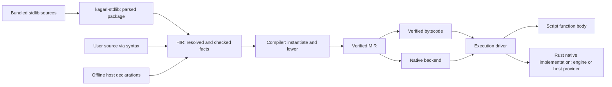

# Standard Library and HIR Integration Plan

Status: active; ST00 complete, ST01 package ownership and HIR import next.

This plan defines the next standard-library architecture migration. It follows
the completed [crate refactor](mir-architecture-refactor.md) and is indexed by
the [implementation roadmap](implementation-roadmap.md). Current behavior remains
defined by the language specifications until the corresponding migration phase
updates the implementation and documentation together.

## Objective

Introduce `kagari-stdlib` as the owner of the bundled standard-library source
package. It parses and prepares that package for HIR. HIR resolves declarations,
checks implementations and retains enough metadata for compilation and tooling.
After this boundary, compilation consumes checked HIR facts and execution consumes
the portable contracts derived from those facts.

Keep standard-library implementations in Rust where they are already native.
This migration does not rewrite Rust algorithms in Kagari. Script implementations
use the ordinary script compilation path; native implementations use a checked
native binding and its provider's Rust implementation. Engine standard functions
and user-registered host functions share this semantic model while retaining
distinct authority, representation and resource contracts.

"Information comes from HIR" describes its semantic origin. It does not authorize
runtime, bytecode, MIR or native backends to depend on HIR or query it at execution
time. Artifact-only execution must remain independent of source processing.

## Current problem and migration inputs

The current implementation shares a syntax parser but has a separate standard
declaration interpretation path:

```text
stdlib/*.kgr
  -> ABI build script + declaration parser
  -> generated ApiType / ApiTrait / ApiFunction / standard tables
  -> HIR-specific interpretation and special standard call targets
  -> compiler-specific expansion, bytecode validation and runtime lookups
```

The following are concrete migration inputs, not target boundaries:

| Current owner | Current behavior | Required change |
| --- | --- | --- |
| [ABI build generator](../crates/kagari-abi/build/main.rs) and its helpers | Parse SDK files; interpret selected generic bounds, receiver shapes and implementations; emit source/API tables | Move package ownership out of ABI; move semantic interpretation into HIR |
| [ABI declaration descriptors](../crates/kagari-abi/src/standard/declarations.rs) and surface tables | Mix docs, source locations, type expressions, default-method classification and execution identities | Separate source input from checked semantic facts and native execution contracts |
| [HIR standard integration](../crates/kagari-hir/src/builtin/declarations.rs) | Convert generated standard descriptors into types, declarations and candidates | Import into the regular HIR declaration and checking model |
| [HIR call facts](../crates/kagari-hir/src/typeck/table.rs) | Distinguish `StandardIntrinsic` from ordinary function targets | Record resolved callable identity, implementation and checked application facts |
| [Compiler standard lowering](../crates/kagari-compiler/src/source/lower/expr/standard.rs) and neighboring collection/iterator modules | Implement some library algorithms by expanding calls into MIR control flow | Replace library-specific expansions with native calls and explicit callback contracts |
| [Runtime standard dispatch](../crates/kagari-runtime/src/builtin/standard.rs) | Execute some methods in Rust; reject others because they require compiler expansion | Own all native library behavior, including resumable callback operations |
| [Bytecode verifier](../crates/kagari-bytecode/src/verifier.rs) and portable type proofs | Consult standard declaration catalogs | Validate carried executable facts against trusted engine contracts without source catalogs |

This is larger than relocating a build script. For example, sorting, prepared
retention and several iterator/Option/Result operations currently contain behavior
in compiler lowering. Calling all of them native methods requires moving that
behavior to the native execution side without changing observable semantics.

## Scope and non-goals

This track owns the new crate, standard declaration import, checked HIR metadata,
portable native-call contracts, native dispatch and removal of downstream source
catalog dependencies. It preserves all existing standard-library capabilities.

It does not redesign every ABI module, split `kagari-common`, replace GC, eliminate
all `Rc`/`RefCell`, expand Cranelift coverage or change the public language to expose
arbitrary native binding attributes. Existing host registration and typed-path
authority remain intact. HIR/native-call metadata must accommodate both engine
and host providers; a new Rust registration macro, generated host declaration
documents and LSP transport are later integrations. No extra placeholder crates
are introduced.

## Target ownership and dependencies

| Owner | Responsibility | Excluded responsibility |
| --- | --- | --- |
| `kagari-stdlib` | Bundled sources, package manifest, syntax parsing, structural declaration index and source provenance | Name/type resolution, trait solving, executable layouts, runtime state or Rust function dispatch |
| `kagari-hir` | Unified declarations, resolved signatures, trait/impl facts, implementation classification, checked call applications and tool metadata | Runtime addresses or execution state |
| Compiler source frontend | Consume checked HIR, instantiate generics, materialize witnesses and lower resolved calls/types | Reopen SDK declarations or implement public standard methods by name |
| ABI | Portable native binding IDs, physical call contracts, execution type/layout contracts and version rules | SDK source text, docs, `ApiType` trees or public standard API catalogs |
| MIR and bytecode | Carry and verify lowered call targets, signatures, witnesses, effects and logical charges | Resolve source spellings or reinterpret standard declarations |
| Runtime | Engine/host binding resolution, existing Rust implementations, callback continuations, provider-specific authority and GC/root/budget integration | Parse SDK sources, query HIR or solve source types |
| VM and native backends | Drive verified calls using the shared execution contracts | Select behavior by standard method names |



Arrows above are processing handoffs. The important Cargo constraints are:

- `stdlib -> syntax, common`; it does not depend on HIR, compiler or runtime.
- `hir -> stdlib`; HIR may still use narrowly scoped ABI binding/representation
  identities while the unrelated ABI reorganization remains deferred.
- Compiler with `source` enabled reaches stdlib through HIR. Compiler without
  `source`, MIR, bytecode, ABI, runtime, VM and native backends must not reach
  stdlib, syntax or HIR through production dependencies.
- ABI has no stdlib parsing build script and no build dependency on syntax.
- Runtime Rust implementations remain in runtime modules, not in the source
  package crate. This prevents a runtime-to-frontend dependency cycle.

The exit workspace has fourteen crates. Update dependency audits to include
`kagari-stdlib` among source-processing crates and distinguish normal, build and
test edges. A build-only source dependency must not conceal a new ABI generator.

## Standard-library package boundary

The initial design bundles exact source text and a deterministic file manifest,
then lets `kagari-stdlib` parse the installed package on demand for source analysis.
The result is an immutable parsed package retained by the analysis owner and
reused across compatible snapshots. Cancellation or invalid installation never
publishes a partial successful package. No user import triggers filesystem
discovery of replacement standard modules.

This avoids maintaining a second generated type-expression language. Existing
Rust source generation is an implementation detail, not a required contract: it
may bundle text/manifest data, but must not reproduce resolution, generic-bound
interpretation or method-selection logic. Build-time checking of the package can
use the same preparation entrypoint. A future preprocessed cache must preserve
this boundary and is outside the initial migration.

The proposed `ParsedStdlibPackage` contains:

- Package identity and content fingerprint, exact files and source locations.
- Parse trees and diagnostics, with declaration/body locations indexed for HIR.
- Explicit native declaration markers and their written binding names.
- Source implementation bodies where present, retained through the same syntax
  representation rather than translated into another expression language.

Structural preparation can reject malformed or duplicate binding annotations and
invalid package structure. It cannot decide whether `T: Hash`, an associated
projection or a method application is valid. Those are HIR responsibilities.

Trust comes from the installed package path selected by the engine, not its URI,
extension, module spelling or an attribute supplied by user code. Parsing a
native marker alone grants no permission to bind an engine operation.

## Shared native model for standard and host functions

The [existing host API](../crates/kagari-runtime/src/host.rs) already separates
declaration from implementation: `HostFunction::new(declaration, callback)` binds
a `HostFunctionDeclaration` to Rust code. The same declaration can enter an offline
`HostInterface` and [HIR host input](../crates/kagari-hir/src/host.rs)
without constructing a runtime or invoking the callback. Reuse this separation;
do not make user registration depend on the bundled standard source package.

Standard and host inputs have different origins but converge on the same HIR
callable model:

```text
stdlib .kgr declarations -> syntax/package importer --+
                                                     +-> HIR callable facts
host registration metadata -> offline interface -----+
```

A Native implementation records provider kind (Engine or Host), declaration and
binding identity, signature, effects and applicable resource/authority contracts.
Provider is explicit metadata, never inferred from a `std` prefix or a generated
document URI. HIR checking and subsequent lowering share the callable machinery;
provider-specific linking and invocation adapters preserve the actual guarantees.

| Shared contract | Provider-specific requirement |
| --- | --- |
| Declaration identity, parameter/result types and callable selection | Engine bindings use a closed operation registry; host bindings resolve within the installed host registry |
| Effects, resource obligations and failure propagation | Host capability requirements, call accounting and candidate-initialization restrictions remain enforced |
| Argument/result validation and retained values | Host passing styles, opaque nominal handles, scoped leases and no-escape rules remain enforced |
| Callback/reentry integration with the execution session | Existing synchronous host callbacks retain their call scope; engine resumable methods may use runtime-owned continuation state |

Sharing this model does not require identical Rust callback signatures or grant
host code access to engine internals. It does not make arbitrary Rust types,
lifetimes, generics or async functions automatically script-callable. Registration
adapters must express supported representations explicitly and validate them.

### Later declaration documents and LSP integration

One registration description should supply runtime binding, offline checking and
tooling metadata. A later export/macro facility can produce a readonly Kagari
declaration document from that description, including names, signatures, docs and
stable declaration IDs. The document is a view of the same contract, not another
handwritten source of signatures. Generated text alone cannot grant binding
authority or encode away passing styles, capabilities and other non-syntax facts.

HIR should accept optional declaration origin metadata now: a virtual document
URI/range, and an optional Rust source origin supplied by registration tooling.
LSP navigation can target the generated declaration by default and the Rust origin
when it is available and valid. Rust source locations cannot be recovered from an
arbitrary function pointer; signature introspection is not provided by ordinary
runtime registration either.

Offline tooling reads exported interface data without invoking application
callbacks or starting host services. If generated text is parsed for presentation,
associate it with the same declaration IDs rather than importing duplicate
definitions. Cache invalidation follows declaration revisions; documentation and
navigation changes remain separate from executable contract compatibility.
Missing or incompatible runtime bindings still fail at link time even when the
editor has a valid offline declaration.

## HIR as the semantic boundary

The standard importer produces ordinary HIR declarations before resolution and
checking. It must not publish a second `StandardApiType` solver or retain global
standard tables as a fallback when regular resolution fails. Standard items retain
their installed origin, but use the same identity, scope, generic, trait and
visibility mechanisms as other declarations.

Use existing HIR facilities where possible; the following describe required facts,
not mandatory new Rust type names:

| HIR fact | Required information |
| --- | --- |
| Declaration identity and provenance | Package/module/member identity, source file/revision/span, docs, installed origin and optional host declaration/Rust origins |
| Resolved signature | Receiver, ordered parameters, result, method/owner binders, visibility and access constraints |
| Type and protocol facts | Nominal identity, representation category where engine-defined, enum variants, parents, associated types/constants, resolved bounds and equalities |
| Implementation selection | Script body identity or checked native binding with Engine/Host provider; abstract trait requirements are declarations awaiting implementation |
| Trait implementation | Impl identity, applied arguments, associated outputs, selected/default method targets and override policy |
| Resolved call | Selected callable, receiver evaluation order, substitutions, result type, required implementation witnesses and callback signatures |
| Execution obligations | Provider contract reference, conservative effects, native callback capability, required roots/permissions, host passing styles and logical charging policy |

Every executable method ultimately selects one of two implementation kinds:

```text
Script { body identity }
Native { provider: Engine | Host, binding identity, checked contract application }
```

Trait declarations may have no implementation; calls to them select an impl
statically or use a checked interface slot dynamically. They are not a third
executable implementation kind. Host providers continue to enforce the existing
checked host-import boundary within the shared native-call model. "Native" means
a Rust implementation, not JIT-compiled script code; a script method remains
Script even if JIT executes it.

HIR retains generic facts until compiler instantiation makes them concrete.
Existing implicit behavior such as associated-output selection, collection
weakening, built-in enum recognition, native defaults and non-overridable standard
operations must become explicit checked facts. Public API signatures and trait
semantics are not reconstructed from binding names during lowering.

Source locations and documentation remain available to snapshots and tooling.
Only needed source/debug provenance crosses into execution products. Packaging
metadata is not a mandatory runtime source catalog.

## Portable handoff and native binding safety

The compiler lowers each checked callable application into an ordinary script
target or a provider-qualified native target with a concrete executable signature.
Generic native operations receive the required concrete type/layout references and
resolved callable witnesses. For example, a generic collection operation must
receive its selected hash/equality or iterator method targets; runtime must not
resolve those protocols from standard source descriptions.

The portable native import record must carry provider and binding identity/version,
concrete parameter/result contracts, witness requirements and necessary type references.
Effects, root behavior and logical charges are constrained by the trusted engine
contract, not freely asserted by the artifact. Bindings are resolved to process
functions during runtime linking; raw Rust addresses are never serialized.

Two different contracts remain necessary:

- The public generic API is defined by `.kgr` and checked by HIR.
- The low-level native operation has a trusted implementation contract: accepted
  representations, required witnesses, effects, permissions and result behavior.
  It lives with the narrow ABI/native boundary and runtime implementation, without
  documentation, source-name resolution or another copy of the public API catalog.

For host providers, the public declaration and binding contract originate in the
offline host interface/registration pair. Reuse its full contract comparison,
including passing styles, effects, capabilities and costs. A shared native target
must not let an artifact substitute an Engine provider for a Host provider or
resolve a same-named function from a different registry.

HIR checks that an installed declaration can bind to that native contract.
MIR/bytecode verification checks the lowered application and portable type facts.
Runtime linking checks the binding and engine version against its registry.
Runtime entry keeps value, heap owner/generation and authority checks.

Serialized "checked" flags, claimed package names and arbitrary declaration IDs
are not trust proofs. Unknown bindings, mismatched signatures, forged native
implementations, missing witnesses and weakened effect/permission claims must be
rejected before entry. Portable validators may check carried type constraints;
they may not recover source semantics by consulting the SDK declaration catalog.

Primitive language operations, such as checked arithmetic and field access, can
retain dedicated instructions. A public library method must not select a hidden
compiler-side algorithm through its SDK name or `NativeDefaultMethod` table.

## Native methods that invoke script code

Straight-line Rust helpers can keep their existing implementations behind the new
binding interface. Callback-bearing methods need an explicit suspension protocol,
because a native implementation may call a script closure, a user trait method,
or another selected callable and then continue its own algorithm.

The target is a runtime-owned native invocation state with bounded steps:

```text
enter native method
  -> finish with value or failure
  -> or request a checked callable invocation and retain continuation state
driver executes the requested call on the shared execution stack
  -> resume the native continuation with its outcome
```

The execution driver handles invocation and resumption generically. Sorting,
iterator traversal and collection-specific policy remain in focused runtime
native modules. Do not move an enormous standard-method switch into the generic
VM instruction loop or recursively create a new VM for every callback.

Continuation state must explicitly retain values, temporary roots, mutation and
iteration guards, pinned module versions and required resource accounting. Release
all mutable heap/frame/table borrows before invoking external script or host code.
Resume only through validated session/frame ownership. Cleanup on trap,
cancellation, budget exhaustion and quarantine must release the native suffix
without invoking arbitrary user code or consuming script fuel.

Preserve left-to-right once-only argument evaluation, short-circuit behavior,
stable ordering, original Result error traces, already-completed side effects and
prepare-before-commit guarantees. Native loops must charge and poll at documented
logical work points; moving a loop out of MIR must not create unbudgeted work.
Record current logical charges and callback-visible failure points before moving
each family. Preserve them in this migration rather than silently charging one
unit for an entire previously budgeted traversal.

Lazy iterator state can outlive an individual call. Its captures, witnesses and
versions must remain traceable and pinned, and early closure/resumption must retain
the existing guard behavior. This track does not remove runtime ownership checks
or promise that unrelated shared-mutable-state problems have been solved.

## Migration phases

Implementation is authorized. Work proceeds through the ordered checkpoints
below; several coherent commits may belong to a phase.

### ST00 — Baseline and behavior inventory

- [x] Run the full acceptance commands below on the starting revision.
- [x] Measure source-analysis startup, clean/warm build costs and representative
  native/callback execution workloads; record toolchain, machine, profile,
  features, parallelism and cache state separately from test execution time.
- [x] Inventory every standard function/default/constructor and classify its
  current behavior: direct Rust helper, compiler-expanded algorithm, lazy state
  machine, or core language primitive. Record its target owner in this plan.
- [x] Record current guards, logical charges, callback order, diagnostic identity,
  type constraints and version retention for the families being migrated.
- [x] Map all `standard::{surface,declarations,application,implementation}` consumers,
  including portable proof/validation code and tooling, to replacement facts.

Exit: a clean baseline and an exhaustive ownership/behavior map. Existing failures
must be resolved before migration; historical test counts are not a fresh baseline.

### ST01 — Package ownership and HIR import

- [ ] Add the functional `kagari-stdlib` crate and package preparation API.
- [ ] Move source/package ownership from ABI, preserving paths, source text,
  declaration locations and deterministic identities.
- [ ] Import standard declarations and bodies into HIR; map native markers only
  for engine-installed provenance. Reuse ordinary resolution and signature checks.
- [ ] Delete ABI source generation and its syntax build dependency. Migrate tool
  source/docs access to the HIR-owned standard package.

Exit: ABI no longer owns or builds source descriptors; standard input has one
import path. Downstream users of removed catalogs may remain broken until ST02/ST03.

### ST02 — Complete checked HIR facts

- [ ] Unify standard function/method/trait/impl participation with ordinary HIR
  declarations; preserve builtin representation hooks as explicit semantic facts.
- [ ] Record Script/Native implementation, explicit Engine/Host provider, generic
  applications, witnesses, defaults/overrides and all required call metadata.
- [ ] Import existing offline host declarations into this shared callable model,
  retaining provider contracts and optional declaration origin metadata.
- [ ] Migrate name resolution, inference, completion, definition navigation and
  documentation queries from generated-table lookups to semantic identities.
- [ ] Test mixed native and script methods, associated outputs, native defaults,
  ordinary overrides, shadowing and invalid native provenance/signatures.

Exit: compiler source lowering can obtain every required standard fact from
checked HIR. There is no fallback standard signature or trait solver.

### ST03 — Portable call contracts and validation

- [ ] Introduce the checked provider-qualified native call/import representation
  in ABI, MIR and bytecode; lower it from HIR and link it against runtime bindings.
- [ ] Replace source-catalog queries in executable validators with carried type,
  layout and witness facts plus trusted native contract validation.
- [ ] Preserve ordinary script, closure, interface and host-call integration;
  reject provider substitution and missing/mismatched host contracts.
- [ ] Version affected bytecode/artifact, portable MIR, runtime and helper contracts
  as required; reject superseded products without compatibility readers.
- [ ] Pass forged-artifact rejection tests and a vertical direct-native-call test.

Exit: direct Rust helpers work on source and serialized-artifact paths; runtime
requires no source catalog. Callback-heavy families remain owned by ST04/ST05.

### ST04 — Resumable native invocation

- [ ] Add runtime-owned native continuation state and generic driver integration.
- [ ] Integrate GC roots, frame/session cleanup, budgets, debugger origins,
  synchronous host reentry and generation-pinned callable witnesses.
- [ ] Migrate a representative callback method through success, nested calls,
  ordinary trap, cancellation and budget failure before expanding coverage.

Exit: a native method can call Script or Native targets and resume without
holding dynamic borrows across the call or growing an unbounded Rust call chain.

### ST05 — Migrate all standard execution families

- [ ] Migrate Option/Result combinators and preserve original error provenance.
- [ ] Migrate iterator defaults, terminal operations, custom destinations and
  lazy adapters, including generic/user protocol witnesses.
- [ ] Migrate collection queries, custom keys, prepared mutation, sort/retain/dedup,
  map updates and lazy windows/chunks with their existing observable contracts.
- [ ] Remove corresponding compiler algorithm expansions and standard source
  lookups from MIR, bytecode, VM and runtime.
- [ ] Reuse existing Rust helpers; translate compiler-owned behavior into focused
  Rust native implementations without adding Kagari copies of those algorithms.

Exit: every ST00 entry has its final implementation owner. There is no residual
"requires static lowering" route for a public engine-native method.
Core language primitives are documented separately from public library behavior.

### ST06 — Integration, documentation and final acceptance

- [ ] Complete the feature/behavior matrix and all acceptance commands below.
- [ ] Update dependency audits, feature consumers and encoded artifact fixtures.
- [ ] Update current architecture, syntax/stdlib docs, standard declaration and
  execution specifications; remove obsolete descriptor APIs and parallel dispatch.
- [ ] Audit module ownership, public surface, imports and effective LOC. Record
  any narrowly justified exception under the existing structure policy.
- [ ] Measure source startup/build and representative execution effects under
  the same toolchain/profile/workload conditions as ST00; make no unmeasured claims.

Exit: all errors are resolved, source-free execution passes, and this plan's final
ownership/behavior map describes the actual implementation.

## Intermediate build and commit policy

ST00 must pass before code migration. ST01–ST05 may have explicitly recorded
intermediate build failures while obsolete cross-crate types are removed. This
does not authorize compatibility aliases, forwarding crates, duplicate semantic
paths, disabled checks or fake successful results to maintain compilation.

At every checkpoint, run applicable focused tests, structure checks and
`git diff --check`. Record a failing command, representative diagnostic, cause
and owning follow-up phase in the ledger. Do not repeatedly run an unchanged
known failure before its owner phase. ST06 cannot close with carried errors.

Use Conventional Commits with `Stdlib-Step: STxx` trailers on implementation
checkpoints. Mark breaking API/format changes with `!` and describe their impact.
Keep this plan's checklist and ledger current; do not create parallel progress
queues. This proposal does not amend or reopen completed historical phase ledgers.

## Acceptance matrix

| Boundary | Required behavioral evidence |
| --- | --- |
| Package → HIR | Exact sources/spans/docs; cancellation; invalid declarations; deterministic identity; normal shadowing and visibility |
| Host declaration → HIR/linker | Offline checks without callbacks; shared callable facts; missing bindings and provider substitution rejected; passing styles, capabilities and costs preserved |
| HIR → compiler | Generic methods, associated outputs, trait inheritance/defaults/overrides, native/script implementations and cross-module calls use checked facts |
| Compiler → executable contracts | No SDK `ApiType`/surface access; complete signature/layout/witness metadata; no public-method algorithm expansion |
| Artifact → runtime | Source-free load/execute; reject forged native IDs, signatures, representations, authority, witnesses and versions |
| Native → script → native | Once-only order, explicit roots, bounded stack/budget behavior, same-session reentry, complete cleanup |
| Collections and lazy state | Atomic commit guarantees, stable ordering, alias guards, early closure/resumption and GC at allocation threshold one |
| Errors and reload | Original error traces, preserved completed effects, sticky cancellation, pinned old dependencies and callable versions |
| Tooling | Definitions, completions, signatures and docs derive from HIR metadata for both native and script declarations |
| Backend/feature routes | Source, encoded artifacts, JIT-enabled fallback and existing supported direct JIT cases; all SDK feature combinations |

Reuse relevant existing suites, including `standard_declarations`,
`standard_traits`, `collection_interfaces`, `iteration_traits`, `lazy_iterators`,
`prepared_collections`, `callable_traits`, `error_traces`, runtime sessions/scopes,
and artifact/native integration tests. Add focused tests for genuinely new
boundaries rather than mirroring new struct layouts.

Final acceptance commands:

```text
uv run --locked scripts/check_structure.py
cargo fmt --all -- --check
cargo clippy --workspace --all-targets -- -D warnings
cargo test --workspace
cargo test -p kagari-cli --features jit
uv run python scripts/check_features.py
git diff --check
```

Extend `check_features.py` so artifact-only/native-only consumers exclude stdlib,
syntax and HIR, while source consumers include the new crate. Also audit ABI build
edges; the CLI retains `jit` as its native-feature spelling. Use workspace
profiles, default Cargo parallelism and the default target
directory; store temporary logs and measurement output under ignored `target/`.

## ST00 ownership and behavior inventory

Snapshot: revision `402e089`, before migration, with the artifact fixture correction
recorded below. The generated surface contains 316 function entries, 281 receiver
method entries (alternate syntax for those functions), 116 trait methods including
56 native defaults, 38 explicit native impl blocks, 13 type constructors and seven
enum declarations. The enumeration below covers the public entries; internal
lowering helpers are tracked separately. No entry is implicitly deferred.

Classification: **D** = direct Rust helper; **E** = compiler-expanded algorithm or
protocol dispatch; **L** = lazy state machine (currently split between compiler
adapters and runtime iterator storage); **C** = core language representation or
operation. D/E denotes the primitive/custom-key split. All D entries stay in
runtime engine bindings; E entries move to runtime native implementations with
checked witnesses and resumable calls where required; L entries move to runtime
lazy native state. C retains generic MIR/runtime machinery fed by HIR facts.
The declaration/typechecking/tooling owner for every row becomes HIR.

### Functions and receiver methods

Each name is relative to its explicit owner. Receiver forms share the same row
and implementation binding; they are not an additional algorithm.

| Owner | Current class | Complete member set |
| --- | --- | --- |
| `std::array::ArrayList` | E | `remove_range`, `retain`, `sort`, `sort_by`, `sort_by_key`, `dedup`, `extend`, `from_fn`, `from`, `copy_from`, `copy_within` |
| `std::array::ArrayList` | D | `swap`, `reverse`, `truncate`, `swap_remove`, `len`, `is_empty`, `get`, `new`, `push`, `pop`, `insert`, `remove`, `clear`, `fill`, `join`, `with_capacity`, `capacity`, `reserve` |
| `std::map::LinkedHashMap` | E | `retain`, `get_or_insert_with`, `update`, `keys`, `values`, `entries`, `from` |
| `std::map::LinkedHashMap` | D | `len`, `is_empty`, `new`, `clear`, `with_capacity`, `capacity`, `reserve` |
| `std::map::LinkedHashMap` | D/E | `contains_key`, `get`, `insert`, `remove` |
| `std::set::LinkedHashSet` | E | `retain`, `from` |
| `std::set::LinkedHashSet` | D | `len`, `is_empty`, `to_array`, `new`, `clear`, `with_capacity`, `capacity`, `reserve` |
| `std::set::LinkedHashSet` | D/E | `contains`, `insert`, `remove` |
| `std::string::String` | E | `parse` |
| `std::string::String` | D | `replace`, `replacen`, `repeat`, `is_ascii`, `eq_ignore_ascii_case`, `to_ascii_lowercase`, `to_ascii_uppercase`, `to_lowercase`, `to_uppercase`, `is_char_boundary`, `split_once`, `rsplit_once`, `trim`, `trim_start`, `trim_end`, `find`, `rfind`, `strip_prefix`, `strip_suffix`, `len_bytes`, `len_chars`, `is_empty`, `concat`, `contains`, `starts_with`, `ends_with`, `slice` |
| `std::string::String` | L | `bytes`, `char_indices`, `split`, `splitn`, `split_whitespace`, `lines` |
| `std::option::Option` | E | `unwrap_or_else`, `or_else`, `map_or`, `map_or_else`, `filter`, `is_some_and`, `zip`, `map`, `and_then`, `ok_or`, `ok_or_else`, `flatten`, `transpose` |
| `std::option::Option` | D | `is_some`, `is_none`, `unwrap_or` |
| `std::result::Result` | E | `unwrap_or_else`, `or_else`, `map_or`, `map_or_else`, `ok`, `err`, `is_ok_and`, `is_err_and`, `map`, `map_err`, `and_then`, `flatten`, `transpose` |
| `std::result::Result` | D | `is_ok`, `is_err`, `unwrap_or` |
| `std::math` | D | `min`, `max`, `clamp`, `abs`, `floor`, `ceil`, `round`, `sqrt`, `sin`, `cos`, `tan` |
| `std::debug` | D | `print`, `assert`, `panic` |
| `std::debug` | E | `assert_eq` |

The remaining 175 function entries belong to `std::numeric`:

- Each of `i8`, `i16`, `i32`, `i64`, `isize`, `u8`, `u16`, `u32`, `u64`, `usize`
  has `wrapping_add`, `wrapping_sub`, `wrapping_mul`, `checked_add`, `checked_sub`,
  `checked_mul`, `checked_div`, `checked_rem`, `overflowing_add`, `overflowing_sub`,
  `overflowing_mul`, `saturating_add`, `saturating_sub`, `saturating_mul`,
  `rotate_left`, `rotate_right`, `from_str_radix`.
- Each unsigned type additionally has `wrapping_add_signed`.
- All are D, owned by runtime numeric/parsing helpers; `from_str_radix` is an
  associated function and the other 165 entries also have receiver forms.

### Trait methods and implementations

The following covers all 116 declared methods. Required methods have no default
algorithm: HIR must select their explicit script/native/host implementation.
Native defaults are E unless marked L below, and become runtime native bindings.

| Trait | Native defaults | Required methods |
| --- | --- | --- |
| `List` | `windows`, `chunks`, `first`, `last`, `contains`, `starts_with`, `ends_with`, `binary_search`, `join` | `len`, `is_empty`, `get` |
| `MutableList` | — | `swap`, `reverse`, `truncate`, `extend`, `push`, `pop`, `insert`, `remove`, `clear`, `set` |
| `Map` | `keys`, `values`, `entries` | `len`, `is_empty`, `contains_key`, `get` |
| `MutableMap` | — | `get_or_insert_with`, `update`, `insert`, `remove`, `clear` |
| `Set` | `union`, `intersection`, `difference`, `symmetric_difference`, `is_subset`, `is_superset`, `is_disjoint` | `len`, `is_empty`, `contains` |
| `MutableSet` | — | `insert`, `remove`, `clear` |
| `FromStr` | — | `from_str` |
| `Iterator` | `join`, `collect`, `map`, `filter`, `filter_map`, `take`, `skip`, `enumerate`, `zip`, `chain`, `find`, `any`, `all`, `count`, `fold`, `for_each`, `partition`, `group_by`, `take_while`, `skip_while`, `inspect`, `fuse`, `find_map`, `position`, `nth`, `last`, `reduce`, `min_by`, `max_by`, `min`, `max`, `min_by_key`, `max_by_key`, `flat_map`, `flatten`, `sum`, `product` | `next` |
| `Iterable` | — | `iter` |
| `FromIterator` | — | `from_iter` |
| `Sum` | — | `sum` |
| `Product` | — | `product` |
| `PartialEq` | — | `eq` |
| `PartialOrd` | — | `partial_cmp` |
| `Ord` | — | `cmp` |
| `Hash` | — | `hash` |
| `Debug` | — | `debug` |
| `Display` | — | `display` |
| `Add` | — | `add` |
| `Sub` | — | `sub` |
| `Mul` | — | `mul` |
| `Div` | — | `div` |
| `Rem` | — | `rem` |
| `Neg` | — | `neg` |
| `Not` | — | `not` |
| `Index` | — | `index` |
| `BitAnd` | — | `bitand` |
| `BitOr` | — | `bitor` |
| `BitXor` | — | `bitxor` |
| `Shl` | — | `shl` |
| `Shr` | — | `shr` |
| `RangeBounds` | — | `start_bound`, `end_bound` |
| `Fn` | — | `call` |
| `From` | — | `from` |
| `Into` | — | `into` |
| `TryFrom` | — | `try_from` |
| `TryInto` | — | `try_into` |

L defaults: `List::{windows,chunks}` and
`Iterator::{map,filter,filter_map,take,skip,enumerate,zip,chain,take_while,skip_while,
inspect,fuse,flat_map,flatten}`. Their creation and each resumption are distinct
operations. Map views are eager snapshots and set algebra constructs fresh sets;
these are E. E terminal defaults include protocol delegation (`collect`, `sum`,
`product`), not only traversal loops.

All 38 source-declared native impl blocks are covered by this map:

| Implemented for | Traits and methods | Current class / target |
| --- | --- | --- |
| `ArrayList<T>` | `Iterable::iter`, `FromIterator::from_iter`, `List::{len,is_empty,get}`, `MutableList::{swap,reverse,truncate,extend,push,pop,insert,remove,clear,set}` | L traversal, E construction/extend, D storage; runtime bindings/state |
| `LinkedHashMap<K,V>` | `Iterable::iter`, `FromIterator::from_iter`, `Map::{len,is_empty,contains_key,get}`, `MutableMap::{get_or_insert_with,update,insert,remove,clear}` | L traversal, E construction/update/custom keys, D primitive keys/storage; runtime bindings/state |
| `LinkedHashSet<T>` | `Iterable::iter`, `FromIterator::from_iter`, `Set::{len,is_empty,contains}`, `MutableSet::{insert,remove,clear}` | L traversal, E construction/custom keys, D primitive keys/storage; runtime bindings/state |
| `String` | `Iterable::iter` | L Unicode scalar traversal; runtime state |
| Ten integer types, `f32`, `f64`, `bool` | `FromStr::from_str` (13 impls) | D numeric/bool parsing; runtime helpers |
| `Option<C>`, `Result<C,E>` | `FromIterator::from_iter` (two impls) | E short-circuit collection and destination dispatch; runtime continuations |
| `Iter<T>` | `Iterator::next` | L native or compiler-generated closure resumption; runtime state |
| `Range<T>`, `RangeInclusive<T>`, `RangeFrom<T>` | `Iterable::iter` (three impls) | L checked integer traversal; runtime state |
| `Range<T>`, `RangeInclusive<T>`, `RangeFrom<T>`, `RangeTo<T>`, `RangeToInclusive<T>`, `RangeFull` | `RangeBounds::{start_bound,end_bound}` (six impls) | C range field interpretation; runtime primitive adapters |

Implicit built-in implementations currently supplied by the standard trait
catalog include scalar/operators, equality/order/hash/format, callable values,
conversion blankets and numeric sum/product. Their signatures, bounds and
selection become ordinary HIR checked impl facts; primitive arithmetic, numeric
conversion and closure invocation remain C. Public aggregate sum/product and
formatting entrypoints remain native library bindings, not compiler algorithms.

### Constructors and core hooks

All 13 type constructors are `ArrayList`, `LinkedHashMap`, `LinkedHashSet`, `Iter`,
`Option`, `Result`, `Bound`, `Range`, `RangeInclusive`, `RangeFrom`, `RangeTo`,
`RangeToInclusive`, `RangeFull`. HIR owns their identity, parameters and builtin
representation hook; portable contracts carry the resolved representation.
Associated `new`, `from`, `from_fn`, `with_capacity` functions are included above.

The seven enum declarations and all value constructors are:
`Option::{Some,None}`, `Result::{Ok,Err}`, `Ordering::{Less,Equal,Greater}`,
`Bound::{Included,Excluded,Unbounded}`,
`ParseError::{Empty,InvalidDigit,OutOfRange,InvalidRadix,InvalidSyntax}`,
`TryFromIntError::OutOfRange`, and uninhabited `Infallible`. Enum creation/testing,
field access and `?` propagation are C; native contracts must validate their
checked layouts without recovering declaration syntax at runtime.

Internal `CollectionMutationBegin/End`, prepared-storage commits, key lookup
phases, `IterResume`, enum operations and runtime allocation/helpers are not
public standard functions. Their guards and representations remain runtime
primitives; public algorithms must stop exposing a dependency on compiler
expansion through these helpers.

### Observable behavior to preserve

| Family | Existing contract and migration obligation |
| --- | --- |
| Every call | Evaluate receiver then arguments once, left to right. Dispatch after HIR selection, with invariant generic types and checked bounds. Preserve source call origin and native diagnostic identity. |
| Option/Result | Invoke only the selected callback branch; preserve eager argument evaluation. `map_err`, transpose/flatten, propagation and fallible collect keep the original error provenance. No callback or allocation on an unselected branch. |
| Iterators and terminals | Consume shared iterator progress in order, stop at the existing decisive element, retain state on partial consumption, and release/reopen structural guards under the existing revision checks. Custom Iterable/Iterator/destination calls use their selected witnesses. |
| Lazy adapters/windows | Creation retains captures without eagerly visiting items. `next` publishes each result before another safepoint. Windows/chunks copy shallow slots at yield time; guards last until closure/exhaustion. Captured values and source module generations stay pinned. |
| Prepared sort/retain/dedup | Hold mutation guards while preparing; stable merge ordering, once-per-element key extraction, adjacent dedup and visit order remain unchanged. Commit only after preparation succeeds. Callback side effects already completed survive later failure. |
| Map/set custom keys and updates | Keep Eq/Hash requirements, lookup guards, collision visit order and selected hash/equality calls. Lazy initializers run only when required; failed preparation does not partially publish a collection update. |
| Direct helpers | Preserve checked widths/overflow, UTF-8 boundaries, insertion order, allocation limits and native error context; retain existing internal work charges. |
| Host provider | Preserve passing styles, capability checks, typed paths, call costs, nominal ownership, scoped borrows, cancellation and synchronous same-session reentry. Engine provenance must not grant host authority or vice versa. |
| All suspended execution | Root temporary/captured values, retain exact callable/dependency generations, release dynamic borrows before callbacks, and unwind only the current session suffix on trap/cancellation/budget failure. |

Current logical budget rule: `kagari-mir/src/verify/analysis.rs` assigns one Step
before each MIR instruction and terminator; VM execution consumes it before the
operation. Compiler-expanded loop setup, branch, payload read, callback dispatch,
update, backedge and teardown each contribute their emitted steps. Callback
bodies additionally consume their own steps. Runtime helpers may add work units
(e.g. `gc/iter.rs::resume_iter` charges each visited dependency). A public native
call cannot replace this schedule with one undifferentiated charge. ST04/ST05
must preserve the per-family event sequence, including failing budget positions,
using the starting revision's lowering as the reference. The benchmark below
records total charges for four fixed execution paths; totals alone do not prove
failure-order equivalence.

Reference implementations for event order are compiler `expr/{calls,standard,
enum_extensions,iterators,terminals,adapters,prepared_collections,map_updates,
keys,list_queries,list_windows,set_queries,collections,operators}.rs`; lifetime
and cleanup references are runtime `frame.rs`, `session.rs`, `gc/{iter,string_iter}.rs`
and VM `executor/{mod,dispatch}.rs`. Existing tests named in the acceptance matrix
exercise these boundaries; phase-specific tests must add suspension/provider
rejection and preserve existing assertions rather than replace them with totals.

### Source-catalog consumer replacement map

| Existing consumers | Replacement facts / phase |
| --- | --- |
| ABI `build/{main,api,implementations}.rs`, `standard/{surface,declarations}.rs` | Installed parsed stdlib package and ordinary HIR import; ST01 removes generator/source descriptors |
| HIR `builtin/{declarations,surface,traits}`, `resolver`, `imports`, `aggregates`, `typeck` | Unified declarations, resolved types/bounds, checked implementations and call applications; ST01/ST02 |
| HIR `analysis/{standard_queries,signature_queries,declaration_queries,body_queries}`, declaration/docs/completion/navigation consumers | HIR identities and retained package provenance, same source metadata as checking; ST02 |
| Compiler `source/lower/{abi,instances,function,stmt,expr}` and `expr/*` standard/protocol lowering | Checked HIR signatures, implementation/provider, substitutions and witness choices; ST02/ST03; algorithms removed ST05 |
| ABI `standard/{application,implementation,resolve,contracts,traits,native}`, `contracts`, `host`, `types/{verify,proofs/*,wire}`, `layout`, `operations`, `numeric` | Carried portable declarations/layouts/witnesses plus trusted closed native operation contracts; ST03. General primitive classification may remain source-free. |
| MIR instruction effects and verifier/analysis, bytecode `verifier` and `verifier/*`, `trait_bounds`, `access` | Explicit call/effect/layout/proof facts, checked against executable native contracts; ST03 |
| Runtime `builtin/{mod,standard}`, `gc`, `objects`, `error_trace`, value/ABI matching and frame invocation | Provider bindings, trusted physical representations, carried origins and continuations; ST03–ST05 |
| VM `executor/{dispatch,aggregate_ops}`, codegen and Cranelift call/operation consumers | Verified executable calls and generic driver operations; ST03/ST04 |
| Embed/CLI source tools and offline host interfaces | HIR query facade for analysis; portable metadata for artifact-only execution; ST02/ST06 |
| Declaration/proof/compiler/runtime integration tests and SDK feature consumers | Update semantic fixtures and maintain rejection/behavior assertions; owning phase and ST06 |

This map includes transitive consumers: importing `StandardTrait`, `StandardEnum`
or an ABI proof helper currently reaches the source catalog even without spelling
`standard::surface`. Dependency audits therefore check crate graphs as well as
textual references; renaming an import is not removal of the dependency.

## Progress ledger

- ST00: completed the fresh baseline and inventory above. Initial workspace tests
  failed in `portable_fixture_matches_source_emission`: the checked-in artifact
  described a 25-byte source while the current LF fixture has 24 bytes. Decoding
  the regenerated and checked-in MIR isolated the difference to `SourceOrigin.byte_len`
  (plus derived fingerprints). Regenerated the fixture from its exact current
  source; retained canonical-byte and interpreter/native execution assertions.
- ST00 acceptance after correction: structure and format pass, workspace Clippy
  with warnings denied passes, all 1,442 workspace tests pass, CLI `jit` tests pass
  (five tests), and all four standalone SDK feature routes pass. Structure checks
  also include the new baseline example: 517 Rust files, zero violations or
  documented exceptions. No carried build/test failures.
- ST00 measurements: Rust 1.98.1 (`48a229cea`, LLVM 22.1.8), Cargo 1.98.1,
  aarch64-apple-darwin, Apple M1 Max, 32 GiB RAM, ten logical CPUs, macOS 26.6.2;
  repository lockfile, O1 dev/test profiles, default Cargo parallelism and `target/`.
  Acceptance used existing caches; its wall times were structure 3.126 s, fmt
  1.426 s, Clippy 0.426 s, workspace tests 157.719 s, CLI JIT 2.586 s and feature
  audit 78.169 s. These are check wall times, not compile or runtime benchmarks.
- ST00 build measurement deliberately cleared the entire dev-profile build cache
  once with `cargo clean --profile dev` (26.900 s). Package download caches stayed
  warm. `cargo build --workspace --all-targets` then took 98.260 s; an identical
  no-change warm invocation took 0.235 s. Both include workspace default features,
  test/example targets and dependency compilation; neither is a source-analysis
  latency measurement. Ignored measurement files outside `target/debug` survived.
- ST00 repeatable runtime workload is
  [`stdlib_baseline.rs`](../crates/kagari-embed/examples/stdlib_baseline.rs).
  Build separately, then run `target/debug/examples/stdlib_baseline`: one warmup,
  21 fresh-engine source-to-artifact samples and 101 interpreter execution samples
  per workload. Process tables/pages are warm, compilation includes artifact
  disposal, execution uses one loaded program and includes ordinary call/session
  teardown; every result equals 42 and roots return to zero. SDK source/native
  features are compiled, but these four workloads execute in the interpreter.
  No JIT coverage or speedup is inferred from them.

  | Workload | Compile median (ns) | Execute median (ns) | Logical steps/call | Encoded bytes |
  | --- | ---: | ---: | ---: | ---: |
  | Direct string/math helpers | 1,838,791 | 4,500 | 12 | 5,654 |
  | Option callback | 3,555,709 | 5,334 | 17 | 8,497 |
  | Lazy map/filter/take/fold | 20,452,958 | 52,917 | 186 | 33,368 |
  | Prepared sort/retain | 10,842,625 | 81,250 | 400 | 33,513 |

- ST00 existing examples also ran after compilation. `foundation_baseline`:
  fresh-engine 33-function compilation median 3,877 µs; edit analysis 1,559 µs
  (one body checked, 32 reused); internal-call workload 1,861 ns mean across
  10,000 calls. `architecture_baseline`: fresh-engine scalar source-to-artifact
  median 3,034,291 ns; MIR verification 1,708 ns; decode/native verification
  67,375 ns; link 4,083 ns; native compile 99,583 ns; cached installation 1,791 ns;
  interpreter/native entry 1,583/2,000 ns. Workloads, sample counts and memory
  accounting remain as documented in [performance baseline](performance-baseline.md).
  These are starting observations, not comparisons with historical machines.
- Reproduction logs, environment, generated inventory and JSON timings are under
  ignored `target/stdlib-st00/`; this ledger and the inventory retain the durable
  results. ST01 is the next owner of migration changes.

- Execution started from clean revision `402e089`. ST00 is in progress; migration
  code changes wait for its clean baseline and behavior inventory exit gate.
- Proposal prepared from clean revision `6fafe34`. No implementation phase started.
- Inspected the ABI generator/descriptors, HIR standard catalogs and call facts,
  compiler standard expansions, runtime helpers, executable validation and SDK
  feature audits. Confirmed that callback-heavy library behavior currently spans
  both compiler and runtime; ST04/ST05 are required work, not optional cleanup.
- Selected a parsed source-package boundary instead of relocating the generated
  `ApiType` semantic model unchanged. Existing Rust implementations remain Rust.
- Refined the proposal after host-integration review: Script/Native is the common
  implementation model, with Engine/Host provider contracts retained explicitly.
  Existing `HostFunctionDeclaration`/`HostInterface` supplies offline host input;
  declaration-document export, Rust registration macros and LSP transport remain
  later work. ST02/ST03 cover shared facts and binding validation now.
- Proposal validation: local documentation links, content review and diff checks.
  No new workspace test or performance baseline is claimed; ST00 owns those runs.
