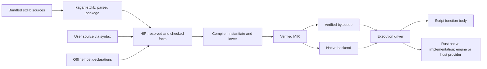

# Standard Library and HIR Integration Plan

Status: active; ST00-ST04 implementation scope complete. Whole checked programs
now retain their dependency closure through portable validation, artifact loading
and engine/host integration. The workspace builds; compiler and VM library suites
and selected embedding integration suites pass. Runtime-owned native continuations
execute all migrated Option/Result algorithms through the shared frame/session
driver, preserving the original logical charge schedule and error provenance.
Twenty iterator terminals also execute natively with selected static protocol
witnesses, including search, reduction, callback comparisons, Ord extrema, join
and numeric/user-defined aggregation. Checked scalar implementations also own
direct Iterable-based Sum/Product entrypoints through the same native traversal.
All six List queries execute natively across storage, selected script
implementations and declared dynamic views with checked multi-method witnesses
and selected primitive, nominal or core composed equality. Native storage and
static/dynamic Map snapshots execute through checked runtime traversal and result
construction. ArrayList per-index initialization executes through rooted native
callbacks and checked append operations. ArrayList source construction, FromIterator,
copy and extension execute through selected native source traversal and atomic
final storage helpers. Array interval copying/removal also execute through checked
static RangeBounds witnesses and prepared native storage updates. ArrayList, Map
and Set retention execute rooted native predicate traversal with one token-preserving
storage commit. ArrayList sorting and adjacent deduplication execute native
preparation with selected Ord/PartialEq witnesses, stable merging, once-only key
extraction and atomic final storage commit. Native Map/Set key queries and
mutations also own selected Hash/Eq bucket traversal; Map factories/transforms
execute under their callback guard before checked insertion. LinkedHashMap/Set
source and FromIterator construction use selected native traversal and the same
key lookup implementation. Set relations and algebra execute native dual guarded
traversal with selected membership policies and ordered shallow results. Remaining ST05
iterator/collection migration and ST06 encoded fixtures/final acceptance remain pending.

This plan defines the next standard-library architecture migration. It follows
the completed [crate refactor](mir-architecture-refactor.md) and is indexed by
the [implementation roadmap](implementation-roadmap.md). Current behavior remains
defined by the language specifications until the corresponding migration phase
updates the implementation and documentation together.

## Objective

Introduce `kagari-stdlib` as the owner of the bundled standard-library source
package. It parses and prepares that package for HIR. HIR resolves declarations,
checks implementations and retains enough metadata for compilation and tooling.
After this boundary, compilation consumes checked HIR facts and execution consumes
the portable contracts derived from those facts.

Keep standard-library implementations in Rust where they are already native.
This migration does not rewrite Rust algorithms in Kagari. Script implementations
use the ordinary script compilation path; native implementations use a checked
native binding and its provider's Rust implementation. Engine standard functions
and user-registered host functions share this semantic model while retaining
distinct authority, representation and resource contracts.

"Information comes from HIR" describes its semantic origin. It does not authorize
runtime, bytecode, MIR or native backends to depend on HIR or query it at execution
time. Artifact-only execution must remain independent of source processing.

## Current problem and migration inputs

At the ST00 baseline, the implementation shared a syntax parser but had a separate
standard declaration interpretation path. The ledger records migration away from it:

```text
stdlib/*.kgr
  -> ABI build script + declaration parser
  -> generated ApiType / ApiTrait / ApiFunction / standard tables
  -> HIR-specific interpretation and special standard call targets
  -> compiler-specific expansion, bytecode validation and runtime lookups
```

The following are concrete migration inputs, not target boundaries:

| Current owner | Current behavior | Required change |
| --- | --- | --- |
| Former ABI `build/{main,api,implementations}.rs` (removed in ST01) | Parsed SDK files; interpreted selected generic bounds, receiver shapes and implementations; emitted source/API tables | [Installed package preparation](../crates/kagari-stdlib/src/package.rs) owns sources; ordinary HIR owns semantics |
| Former ABI `standard/declarations.rs` and generated surface tables (removed in ST01) | Mixed docs, source locations, type expressions, default-method classification and execution identities | Separate source input from checked semantic facts and native execution contracts |
| Former HIR `builtin/declarations.rs` (removed during ST01) | Converted generated descriptors into types, declarations and candidates | [Checked implementation selection](../crates/kagari-hir/src/aggregates/native.rs) consumes ordinary HIR facts and installed provenance |
| [HIR call facts](../crates/kagari-hir/src/typeck/table.rs) | Distinguish `StandardIntrinsic` from ordinary function targets | Record resolved callable identity, implementation and checked application facts |
| [Compiler standard lowering](../crates/kagari-compiler/src/source/lower/expr/standard.rs) and neighboring collection/iterator modules | Implement some library algorithms by expanding calls into MIR control flow | Replace library-specific expansions with native calls and explicit callback contracts |
| [Runtime standard dispatch](../crates/kagari-runtime/src/builtin/standard.rs) | Execute some methods in Rust; reject others because they require compiler expansion | Own all native library behavior, including resumable callback operations |
| [Bytecode verifier](../crates/kagari-bytecode/src/verifier.rs) and portable type proofs | Consult standard declaration catalogs | Validate carried executable facts against trusted engine contracts without source catalogs |

This is larger than relocating a build script. For example, sorting, prepared
retention and several iterator/Option/Result operations currently contain behavior
in compiler lowering. Calling all of them native methods requires moving that
behavior to the native execution side without changing observable semantics.

## Scope and non-goals

This track owns the new crate, standard declaration import, checked HIR metadata,
portable native-call contracts, native dispatch and removal of downstream source
catalog dependencies. It preserves all existing standard-library capabilities.

It does not redesign every ABI module, split `kagari-common`, replace GC, eliminate
all `Rc`/`RefCell`, expand Cranelift coverage or change the public language to expose
arbitrary native binding attributes. Existing host registration and typed-path
authority remain intact. HIR/native-call metadata must accommodate both engine
and host providers; a new Rust registration macro, generated host declaration
documents and LSP transport are later integrations. No extra placeholder crates
are introduced.

## Target ownership and dependencies

| Owner | Responsibility | Excluded responsibility |
| --- | --- | --- |
| `kagari-stdlib` | Bundled sources, package manifest, syntax parsing, structural declaration index and source provenance | Name/type resolution, trait solving, executable layouts, runtime state or Rust function dispatch |
| `kagari-hir` | Unified declarations, resolved signatures, trait/impl facts, implementation classification, checked call applications and tool metadata | Runtime addresses or execution state |
| Compiler source frontend | Consume checked HIR, instantiate generics, materialize witnesses and lower resolved calls/types | Reopen SDK declarations or implement public standard methods by name |
| ABI | Portable native binding IDs, physical call contracts, execution type/layout contracts and version rules | SDK source text, docs, `ApiType` trees or public standard API catalogs |
| MIR and bytecode | Carry and verify lowered call targets, signatures, witnesses, effects and logical charges | Resolve source spellings or reinterpret standard declarations |
| Runtime | Engine/host binding resolution, existing Rust implementations, callback continuations, provider-specific authority and GC/root/budget integration | Parse SDK sources, query HIR or solve source types |
| VM and native backends | Drive verified calls using the shared execution contracts | Select behavior by standard method names |



Arrows above are processing handoffs. The important Cargo constraints are:

- `stdlib -> syntax, common`; it does not depend on HIR, compiler or runtime.
- `hir -> stdlib`; HIR may still use narrowly scoped ABI binding/representation
  identities while the unrelated ABI reorganization remains deferred.
- Compiler with `source` enabled reaches stdlib through HIR. Compiler without
  `source`, MIR, bytecode, ABI, runtime, VM and native backends must not reach
  stdlib, syntax or HIR through production dependencies.
- ABI has no stdlib parsing build script and no build dependency on syntax.
- Runtime Rust implementations remain in runtime modules, not in the source
  package crate. This prevents a runtime-to-frontend dependency cycle.

The exit workspace has fourteen crates. Update dependency audits to include
`kagari-stdlib` among source-processing crates and distinguish normal, build and
test edges. A build-only source dependency must not conceal a new ABI generator.

## Standard-library package boundary

The initial design bundles exact source text and a deterministic file manifest,
then lets `kagari-stdlib` parse the installed package on demand for source analysis.
The result is an immutable parsed package retained by the analysis owner and
reused across compatible snapshots. Cancellation or invalid installation never
publishes a partial successful package. No user import triggers filesystem
discovery of replacement standard modules.

This avoids maintaining a second generated type-expression language. Existing
Rust source generation is an implementation detail, not a required contract: it
may bundle text/manifest data, but must not reproduce resolution, generic-bound
interpretation or method-selection logic. Build-time checking of the package can
use the same preparation entrypoint. A future preprocessed cache must preserve
this boundary and is outside the initial migration.

The proposed `ParsedStdlibPackage` contains:

- Package identity and content fingerprint, exact files and source locations.
- Parse trees and diagnostics, with declaration/body locations indexed for HIR.
- Explicit native declaration markers and their written binding names.
- Source implementation bodies where present, retained through the same syntax
  representation rather than translated into another expression language.

Structural preparation can reject malformed or duplicate binding annotations and
invalid package structure. It cannot decide whether `T: Hash`, an associated
projection or a method application is valid. Those are HIR responsibilities.

Trust comes from the installed package path selected by the engine, not its URI,
extension, module spelling or an attribute supplied by user code. Parsing a
native marker alone grants no permission to bind an engine operation.

## Shared native model for standard and host functions

The [existing host API](../crates/kagari-runtime/src/host.rs) already separates
declaration from implementation: `HostFunction::new(declaration, callback)` binds
a `HostFunctionDeclaration` to Rust code. The same declaration can enter an offline
`HostInterface` and [HIR host input](../crates/kagari-hir/src/host.rs)
without constructing a runtime or invoking the callback. Reuse this separation;
do not make user registration depend on the bundled standard source package.

Standard and host inputs have different origins but converge on the same HIR
callable model:

```text
stdlib .kgr declarations -> syntax/package importer --+
                                                     +-> HIR callable facts
host registration metadata -> offline interface -----+
```

A Native implementation records provider kind (Engine or Host), declaration and
binding identity, signature, effects and applicable resource/authority contracts.
Provider is explicit metadata, never inferred from a `std` prefix or a generated
document URI. HIR checking and subsequent lowering share the callable machinery;
provider-specific linking and invocation adapters preserve the actual guarantees.

| Shared contract | Provider-specific requirement |
| --- | --- |
| Declaration identity, parameter/result types and callable selection | Engine bindings use a closed operation registry; host bindings resolve within the installed host registry |
| Effects, resource obligations and failure propagation | Host capability requirements, call accounting and candidate-initialization restrictions remain enforced |
| Argument/result validation and retained values | Host passing styles, opaque nominal handles, scoped leases and no-escape rules remain enforced |
| Callback/reentry integration with the execution session | Existing synchronous host callbacks retain their call scope; engine resumable methods may use runtime-owned continuation state |

Sharing this model does not require identical Rust callback signatures or grant
host code access to engine internals. It does not make arbitrary Rust types,
lifetimes, generics or async functions automatically script-callable. Registration
adapters must express supported representations explicitly and validate them.

HIR exposes the shared checked signature through
[`CallableSignature`](../crates/kagari-hir/src/callable.rs). Source functions retain
their parameter arena IDs and generic bounds. Installed
[`HostCallable`](../crates/kagari-hir/src/host/callable.rs) views pair imported HIR
types with the immutable provider contract; they do not fabricate source bindings.
Call checking and signature queries consume this same interface. Host types are
converted during interface installation, including methods expanded from host
type declarations. `NativeBinding::Host` identifies that installation and is not
a portable runtime registry slot; ST03 owns the executable binding contract.

### Later declaration documents and LSP integration

One registration description should supply runtime binding, offline checking and
tooling metadata. A later export/macro facility can produce a readonly Kagari
declaration document from that description, including names, signatures, docs and
stable declaration IDs. The document is a view of the same contract, not another
handwritten source of signatures. Generated text alone cannot grant binding
authority or encode away passing styles, capabilities and other non-syntax facts.

HIR accepts optional declaration origins through
[`HostInput`](../crates/kagari-hir/src/host/origin.rs): a virtual declaration URI and
half-open UTF-8 byte range, plus an optional Rust source location supplied by
registration tooling. Origins are keyed by an installed function, type, field or
method identity. `HostDeclarations::new` and the source SDK's `set_host_interface`
accept this input or a plain `HostInterface` without origins. `HostCallable::origin`
and `FileAnalysis::host_origin_at` expose snapshot-owned metadata; `preferred`
selects the declaration location before the Rust location.

Installation validates identity membership and lexical locations without opening
documents. Locations do not pin external document versions; a navigation client
must check the range against the document it opens. They are not serialized into
execution contracts or included in binding fingerprints, and their URI cannot
grant native authority. Rust source locations cannot be recovered from an
arbitrary function pointer; signature introspection is not provided by ordinary
runtime registration either. Declaration export and LSP transport remain later
integrations.

Offline tooling reads exported interface data without invoking application
callbacks or starting host services. If generated text is parsed for presentation,
associate it with the same declaration IDs rather than importing duplicate
definitions. Cache invalidation follows declaration revisions; documentation and
navigation changes remain separate from executable contract compatibility.
Missing or incompatible runtime bindings still fail at link time even when the
editor has a valid offline declaration.

## HIR as the semantic boundary

The standard importer produces ordinary HIR declarations before resolution and
checking. It must not publish a second `StandardApiType` solver or retain global
standard tables as a fallback when regular resolution fails. Standard items retain
their installed origin, but use the same identity, scope, generic, trait and
visibility mechanisms as other declarations.

Use existing HIR facilities where possible; the following describe required facts,
not mandatory new Rust type names:

| HIR fact | Required information |
| --- | --- |
| Declaration identity and provenance | Package/module/member identity, source file/revision/span, docs, installed origin and optional host declaration/Rust origins |
| Resolved signature | Receiver, ordered parameters, result, method/owner binders, visibility and access constraints |
| Type and protocol facts | Nominal identity, representation category where engine-defined, enum variants, parents, associated types/constants, resolved bounds and equalities |
| Implementation selection | Script body identity or checked native binding with Engine/Host provider; abstract trait requirements are declarations awaiting implementation |
| Trait implementation | Impl identity, applied arguments, associated outputs, selected/default method targets and override policy |
| Resolved call | Selected callable, receiver evaluation order, substitutions, result type, required implementation witnesses and callback signatures |
| Execution obligations | Provider contract reference, conservative effects, native callback capability, required roots/permissions, host passing styles and logical charging policy |

Every executable method ultimately selects one of two implementation kinds:

```text
Script { body identity }
Native { provider: Engine | Host, binding identity, checked contract application }
```

Each resolved ordinary call retains an `AppliedCallSignature`: ordered declared
parameter types (including a method receiver) and the result after call-site
substitution. Enclosing generic parameters remain until compiler specialization.
The argument expressions do not define this signature: readonly/interface
coercions and Never arguments preserve the selected declaration's contract.
Incomplete or terminating calls may lack an application; executable lowering
requires one before emitting an ordinary call. Tool signature queries combine
these retained types with declaration-owned names, without redoing substitution.

Trait declarations may have no implementation; calls to them select an impl
statically or use a checked interface slot dynamically. They are not a third
executable implementation kind. Host providers continue to enforce the existing
checked host-import boundary within the shared native-call model. "Native" means
a Rust implementation, not JIT-compiled script code; a script method remains
Script even if JIT executes it.

HIR retains generic facts until compiler instantiation makes them concrete.
Existing implicit behavior such as associated-output selection, collection
weakening, built-in enum recognition, native defaults and non-overridable standard
operations must become explicit checked facts. Public API signatures and trait
semantics are not reconstructed from binding names during lowering.

Source locations and documentation remain available to snapshots and tooling.
Only needed source/debug provenance crosses into execution products. Packaging
metadata is not a mandatory runtime source catalog.

## Portable handoff and native binding safety

The compiler lowers each checked callable application into an ordinary script
target or a provider-qualified native target with a concrete executable signature.
Generic native operations receive the required concrete type/layout references and
resolved callable witnesses. For example, a generic collection operation must
receive its selected hash/equality or iterator method targets; runtime must not
resolve those protocols from standard source descriptions.

Public native type declarations carry `TypeAbiKind::Native` and a closed
[`NativeTypeConstructor`](../crates/kagari-abi/src/types/native.rs). HIR supplies
the constructor, binders, bounds and enum payload facts; compiler lowering does
not select a representation by the written type name. Native declarations remain
distinct from nominal struct/enum layout templates. Executable validation checks
constructor arity and, for native enums, exact discriminant count and generic
payload slots against the engine representation contract.

Standard-library source declarations are the sole source of public signature
metadata. HIR retains ordered parameter types and the result after substitution;
the executable contract carries their lowered forms. Operand counts are derived
from those parameters, never maintained in a separate operation-count table.
The existing `StandardIntrinsic::operand_count` implementation is rejected
migration debt and must be removed with its dependent call-validation path, not
renamed, moved, or replaced with another manually maintained signature catalog.
Integer operations use a shared
[`IntegerMethodContract`](../crates/kagari-abi/src/numeric/method.rs) for receiver
validity, RHS type and scalar/Option/tuple result shape. Runtime reads the same RHS
contract without constructing semantic result types on each invocation. HIR still
owns public signatures and generic call applications.

The portable native import record must carry provider and binding identity/version,
concrete parameter/result contracts, witness requirements and necessary type references.
Effects, root behavior and logical charges are constrained by the trusted engine
contract, not freely asserted by the artifact. Bindings are resolved to process
functions during runtime linking; raw Rust addresses are never serialized.

Trait declarations and applied ancestry also travel through their defining
executable modules. A recognized standard trait ID does not supply an implicit
global declaration or allow a consumer to substitute its own module as the owner.
Each `FunctionAbi` retains its Required/Script/Native implementation beside its
signature, including provider-qualified native binding identity. Trait methods
use this same record; there is no separate default-slot catalog. Script defaults
must be materialized into implementation tables; only a retained native default
may omit that script entry.
This metadata still requires provider validation and grants no engine authority
by itself.

Two different contracts remain necessary:

- The public generic API is defined by `.kgr` and checked by HIR.
- The low-level native operation has a trusted implementation contract: accepted
  representations, required witnesses, effects, permissions and result behavior.
  It lives with the narrow ABI/native boundary and runtime implementation, without
  documentation, source-name resolution or another copy of the public API catalog.

For host providers, the public declaration and binding contract originate in the
offline host interface/registration pair. Reuse its full contract comparison,
including passing styles, effects, capabilities and costs. A shared native target
must not let an artifact substitute an Engine provider for a Host provider or
resolve a same-named function from a different registry.

HIR checks that an installed declaration can bind to that native contract.
MIR/bytecode verification checks the lowered application and portable type facts.
Runtime linking checks the binding and engine version against its registry.
Runtime entry keeps value, heap owner/generation and authority checks.

Serialized "checked" flags, claimed package names and arbitrary declaration IDs
are not trust proofs. Unknown bindings, mismatched signatures, forged native
implementations, missing witnesses and weakened effect/permission claims must be
rejected before entry. Portable validators may check carried type constraints;
they may not recover source semantics by consulting the SDK declaration catalog.

Primitive language operations, such as checked arithmetic and field access, can
retain dedicated instructions. A public library method must not select a hidden
compiler-side algorithm through its SDK name or `NativeDefaultMethod` table.

## Native methods that invoke script code

Straight-line Rust helpers can keep their existing implementations behind the new
binding interface. Callback-bearing methods need an explicit suspension protocol,
because a native implementation may call a script closure, a user trait method,
or another selected callable and then continue its own algorithm.

The target is a runtime-owned native invocation state with bounded steps:

```text
enter native method
  -> finish with value or failure
  -> or request a checked callable invocation and retain continuation state
driver executes the requested call on the shared execution stack
  -> resume the native continuation with its outcome
```

The execution driver handles invocation and resumption generically. Sorting,
iterator traversal and collection-specific policy remain in focused runtime
native modules. Do not move an enormous standard-method switch into the generic
VM instruction loop or recursively create a new VM for every callback.

Continuation state must explicitly retain values, temporary roots, mutation and
iteration guards, pinned module versions and required resource accounting. Release
all mutable heap/frame/table borrows before invoking external script or host code.
Resume only through validated session/frame ownership. Cleanup on trap,
cancellation, budget exhaustion and quarantine must release the native suffix
without invoking arbitrary user code or consuming script fuel.

Preserve left-to-right once-only argument evaluation, short-circuit behavior,
stable ordering, original Result error traces, already-completed side effects and
prepare-before-commit guarantees. Native loops must charge and poll at documented
logical work points; moving a loop out of MIR must not create unbudgeted work.
Record current logical charges and callback-visible failure points before moving
each family. Preserve them in this migration rather than silently charging one
unit for an entire previously budgeted traversal.

Lazy iterator state can outlive an individual call. Its captures, witnesses and
versions must remain traceable and pinned, and early closure/resumption must retain
the existing guard behavior. This track does not remove runtime ownership checks
or promise that unrelated shared-mutable-state problems have been solved.

## Migration phases

Implementation is authorized. Work proceeds through the ordered phases below.
The user requires complete migration paths rather than transitional models and
small implementation commits. Keep coupled changes together in the worktree until
the affected phase outcome is reviewable; existing history is not rewritten.

### ST00 — Baseline and behavior inventory

- [x] Run the full acceptance commands below on the starting revision.
- [x] Measure source-analysis startup, clean/warm build costs and representative
  native/callback execution workloads; record toolchain, machine, profile,
  features, parallelism and cache state separately from test execution time.
- [x] Inventory every standard function/default/constructor and classify its
  current behavior: direct Rust helper, compiler-expanded algorithm, lazy state
  machine, or core language primitive. Record its target owner in this plan.
- [x] Record current guards, logical charges, callback order, diagnostic identity,
  type constraints and version retention for the families being migrated.
- [x] Map all `standard::{surface,declarations,application,implementation}` consumers,
  including portable proof/validation code and tooling, to replacement facts.

Exit: a clean baseline and an exhaustive ownership/behavior map. Existing failures
must be resolved before migration; historical test counts are not a fresh baseline.

### ST01 — Package ownership and HIR import

- [x] Add the functional `kagari-stdlib` crate and package preparation API.
- [x] Cache installed parses in the analysis owner and retain opaque type
  declarations, their generic syntax and source provenance in ordinary HIR.
- [x] Move source/package ownership from ABI, preserving paths, source text,
  declaration locations and deterministic identities.
- [x] Import standard declarations and bodies into HIR; map native markers only
  for engine-installed provenance. Reuse ordinary resolution and signature checks.
- [x] Delete ABI source generation and its syntax build dependency.
- [x] Migrate tool source/docs access to the HIR-owned standard package.

Exit: ABI no longer owns or builds source descriptors; standard input has one
import path. Downstream users of removed catalogs may remain broken until ST02/ST03.

### ST02 — Complete checked HIR facts

- [x] Unify standard function/method/trait/impl participation with ordinary HIR
  declarations; preserve builtin representation hooks as explicit semantic facts.
- [x] Record Script/Native implementation, explicit Engine/Host provider, generic
  applications, witnesses, defaults/overrides and all required call metadata.
- [x] Import existing offline host declarations into this shared callable model,
  retaining provider contracts and optional declaration origin metadata.
- [x] Migrate name resolution, inference, completion, definition navigation and
  documentation queries from generated-table lookups to semantic identities.
- [x] Test mixed native and script methods, associated outputs, native defaults,
  ordinary overrides, shadowing and invalid native provenance/signatures.

Exit: compiler source lowering can obtain every required standard fact from
checked HIR. There is no fallback standard signature or trait solver.

### ST03 — Portable call contracts and validation

- [x] Introduce the checked provider-qualified native call/import representation
  in ABI, MIR and bytecode; lower it from HIR and link it against runtime bindings.
- [x] Replace source-catalog queries in executable validators with carried type,
  layout and witness facts plus trusted native contract validation.
- [x] Preserve ordinary script, closure, interface and host-call integration;
  reject provider substitution and missing/mismatched host contracts.
- [x] Version affected bytecode/artifact, portable MIR, runtime and helper contracts
  as required; reject superseded products without compatibility readers.
- [x] Pass forged-artifact rejection tests and a vertical direct-native-call test.

Exit: direct Rust helpers work on source and serialized-artifact paths; runtime
requires no source catalog. Callback-heavy families remain owned by ST04/ST05.

### ST04 — Resumable native invocation

- [x] Add runtime-owned native continuation state and generic driver integration.
- [x] Integrate GC roots, frame/session cleanup, budgets, debugger origins,
  synchronous host reentry and generation-pinned callable witnesses.
- [x] Migrate a representative callback method through success, nested calls,
  ordinary trap, cancellation and budget failure before expanding coverage.

Exit: a native method can call Script or Native targets and resume without
holding dynamic borrows across the call or growing an unbounded Rust call chain.

### ST05 — Migrate all standard execution families

- [x] Migrate Option/Result combinators and preserve original error provenance.
- [x] Migrate basic iterator terminals (`count`, `fold`, `for_each`, `find`, `any`,
  `all`, `last`) with checked static receiver witnesses and shared frame execution.
- [x] Migrate iterator search/reduction (`find_map`, `position`, `nth`, `reduce`)
  and callback comparisons (`min_by`, `max_by`) with typed outputs and static `next`.
- [x] Migrate Ord extrema (`min`, `max`, `min_by_key`, `max_by_key`) with selected
  item/key witnesses, concrete comparison targets and once-only key callbacks.
- [x] Migrate iterator string joining, including the traversal used by custom and
  dynamic List joining, with selected `next`, rooted accumulation and exact charges.
- [x] Migrate Iterator `sum`/`product` defaults with checked numeric behavior and
  concrete generic/user destination methods on shared frames.
- [x] Migrate direct numeric Sum/Product providers for all scalar types, including
  static/dynamic Iterable conversion, generic sources and checked error categories.
- [x] Migrate List positional queries (`first`, `last`, `binary_search`) with selected
  List/Iterable/Ord witnesses across storage, script implementations and dynamic views.
- [x] Migrate List equality queries (`contains`, `starts_with`, `ends_with`) with
  selected equality composition, dual guards and storage/script/dynamic traversal.
- [x] Migrate Map keys/values/entries snapshots across native storage, generic/user
  traversal and dynamic views, with checked readonly result construction.
- [x] Migrate ArrayList `from_fn` per-index initialization with typed callbacks,
  once-only construction, exact logical charges and failure cleanup.
- [x] Migrate ArrayList source construction and FromIterator, plus copy/extension,
  with checked traversal witnesses, rooted snapshots and atomic final storage updates.
- [x] Migrate ArrayList interval copying/removal with selected RangeBounds methods,
  rooted prepared storage and checked readonly result construction before commit.
- [x] Migrate ArrayList/LinkedHashMap/LinkedHashSet retention with typed predicates,
  rooted native traversal, callback guards and token-preserving atomic storage commit.
- [x] Migrate ArrayList sorting (`sort`, `sort_by`, `sort_by_key`) and adjacent
  `dedup` with selected comparisons, stable ordering, once-only keys and atomic commit.
- [x] Migrate native Map/Set key queries and mutations with checked Hash/PartialEq
  witnesses, stable bucket candidates, identity keys and guarded storage commits.
- [x] Migrate Map `get_or_insert_with` and `update` with once-only typed callbacks,
  both selected lookups, failure effects and atomic checked insertion.
- [x] Migrate LinkedHashMap/LinkedHashSet source construction and FromIterator with
  checked traversal, shared key lookup, duplicate policy and rooted final publication.
- [x] Migrate Set relations and algebra with dual guarded traversal, selected
  membership, unhashed custom relations and ordered shallow result construction.
- [ ] Migrate remaining iterator defaults, terminal operations, custom destinations and
  lazy adapters, including generic/user protocol witnesses.
- [ ] Migrate remaining collection/set operations, plus lazy
  windows/chunks with their existing observable contracts.
- [ ] Remove corresponding compiler algorithm expansions and standard source
  lookups from MIR, bytecode, VM and runtime.
- [ ] Reuse existing Rust helpers; translate compiler-owned behavior into focused
  Rust native implementations without adding Kagari copies of those algorithms.

Exit: every ST00 entry has its final implementation owner. There is no residual
"requires static lowering" route for a public engine-native method.
Core language primitives are documented separately from public library behavior.

### ST06 — Integration, documentation and final acceptance

- [ ] Complete the feature/behavior matrix and all acceptance commands below.
- [ ] Update dependency audits, feature consumers and encoded artifact fixtures.
- [ ] Update current architecture, syntax/stdlib docs, standard declaration and
  execution specifications; remove obsolete descriptor APIs and parallel dispatch.
- [ ] Audit module ownership, public surface, imports and effective LOC. Record
  any narrowly justified exception under the existing structure policy.
- [ ] Measure source startup/build and representative execution effects under
  the same toolchain/profile/workload conditions as ST00; make no unmeasured claims.

Exit: all errors are resolved, source-free execution passes, and this plan's final
ownership/behavior map describes the actual implementation.

## Intermediate build and commit policy

ST00 must pass before code migration. ST01–ST05 may have explicitly recorded
intermediate build failures while obsolete cross-crate types are removed. This
does not authorize compatibility aliases, forwarding crates, duplicate semantic
paths, disabled checks or fake successful results to maintain compilation.

Do not introduce temporary replacement tables, adapters or fallback models to
reduce the intermediate error count. Complete the intended producer-to-consumer
handoff directly, including validation. Commit cohesive phase outcomes instead
of individual table removals, metadata additions or build-error reductions. This
supersedes the finer-grained checkpoint cadence in the historical ledger below.

At every checkpoint, run applicable focused tests, structure checks and
`git diff --check`. Record a failing command, representative diagnostic, cause
and owning follow-up phase in the ledger. Do not repeatedly run an unchanged
known failure before its owner phase. ST06 cannot close with carried errors.

Use Conventional Commits with `Stdlib-Step: STxx` trailers on implementation
checkpoints. Mark breaking API/format changes with `!` and describe their impact.
Keep this plan's checklist and ledger current; do not create parallel progress
queues. This proposal does not amend or reopen completed historical phase ledgers.

## Acceptance matrix

| Boundary | Required behavioral evidence |
| --- | --- |
| Package → HIR | Exact sources/spans/docs; cancellation; invalid declarations; deterministic identity; normal shadowing and visibility |
| Host declaration → HIR/linker | Offline checks without callbacks; shared callable facts; missing bindings and provider substitution rejected; passing styles, capabilities and costs preserved |
| HIR → compiler | Generic methods, associated outputs, trait inheritance/defaults/overrides, native/script implementations and cross-module calls use checked facts |
| Compiler → executable contracts | No SDK `ApiType`/surface access; complete signature/layout/witness metadata; no public-method algorithm expansion |
| Artifact → runtime | Source-free load/execute; reject forged native IDs, signatures, representations, authority, witnesses and versions |
| Native → script → native | Once-only order, explicit roots, bounded stack/budget behavior, same-session reentry, complete cleanup |
| Collections and lazy state | Atomic commit guarantees, stable ordering, alias guards, early closure/resumption and GC at allocation threshold one |
| Errors and reload | Original error traces, preserved completed effects, sticky cancellation, pinned old dependencies and callable versions |
| Tooling | Definitions, completions, signatures and docs derive from HIR metadata for both native and script declarations |
| Backend/feature routes | Source, encoded artifacts, JIT-enabled fallback and existing supported direct JIT cases; all SDK feature combinations |

Reuse relevant existing suites, including `standard_declarations`,
`standard_traits`, `collection_interfaces`, `iteration_traits`, `lazy_iterators`,
`prepared_collections`, `callable_traits`, `error_traces`, runtime sessions/scopes,
and artifact/native integration tests. Add focused tests for genuinely new
boundaries rather than mirroring new struct layouts.

Final acceptance commands:

```text
uv run --locked scripts/check_structure.py
cargo fmt --all -- --check
cargo clippy --workspace --all-targets -- -D warnings
cargo test --workspace
cargo test -p kagari-cli --features jit
uv run python scripts/check_features.py
git diff --check
```

Extend `check_features.py` so artifact-only/native-only consumers exclude stdlib,
syntax and HIR, while source consumers include the new crate. Also audit ABI build
edges; the CLI retains `jit` as its native-feature spelling. Use workspace
profiles, default Cargo parallelism and the default target
directory; store temporary logs and measurement output under ignored `target/`.

## ST00 ownership and behavior inventory

Snapshot: revision `402e089`, before migration, with the artifact fixture correction
recorded below. The generated surface contains 316 function entries, 281 receiver
method entries (alternate syntax for those functions), 116 trait methods including
56 native defaults, 38 explicit native impl blocks, 13 type constructors and seven
enum declarations. The enumeration below covers the public entries; internal
lowering helpers are tracked separately. No entry is implicitly deferred.

Classification: **D** = direct Rust helper; **E** = compiler-expanded algorithm or
protocol dispatch; **L** = lazy state machine (currently split between compiler
adapters and runtime iterator storage); **C** = core language representation or
operation. D/E denotes the primitive/custom-key split. All D entries stay in
runtime engine bindings; E entries move to runtime native implementations with
checked witnesses and resumable calls where required; L entries move to runtime
lazy native state. C retains generic MIR/runtime machinery fed by HIR facts.
The declaration/typechecking/tooling owner for every row becomes HIR.

### Functions and receiver methods

Each name is relative to its explicit owner. Receiver forms share the same row
and implementation binding; they are not an additional algorithm.

| Owner | Current class | Complete member set |
| --- | --- | --- |
| `std::array::ArrayList` | E | `remove_range`, `retain`, `sort`, `sort_by`, `sort_by_key`, `dedup`, `extend`, `from_fn`, `from`, `copy_from`, `copy_within` |
| `std::array::ArrayList` | D | `swap`, `reverse`, `truncate`, `swap_remove`, `len`, `is_empty`, `get`, `new`, `push`, `pop`, `insert`, `remove`, `clear`, `fill`, `join`, `with_capacity`, `capacity`, `reserve` |
| `std::map::LinkedHashMap` | E | `retain`, `get_or_insert_with`, `update`, `keys`, `values`, `entries`, `from` |
| `std::map::LinkedHashMap` | D | `len`, `is_empty`, `new`, `clear`, `with_capacity`, `capacity`, `reserve` |
| `std::map::LinkedHashMap` | D/E | `contains_key`, `get`, `insert`, `remove` |
| `std::set::LinkedHashSet` | E | `retain`, `from` |
| `std::set::LinkedHashSet` | D | `len`, `is_empty`, `to_array`, `new`, `clear`, `with_capacity`, `capacity`, `reserve` |
| `std::set::LinkedHashSet` | D/E | `contains`, `insert`, `remove` |
| `std::string::String` | E | `parse` |
| `std::string::String` | D | `replace`, `replacen`, `repeat`, `is_ascii`, `eq_ignore_ascii_case`, `to_ascii_lowercase`, `to_ascii_uppercase`, `to_lowercase`, `to_uppercase`, `is_char_boundary`, `split_once`, `rsplit_once`, `trim`, `trim_start`, `trim_end`, `find`, `rfind`, `strip_prefix`, `strip_suffix`, `len_bytes`, `len_chars`, `is_empty`, `concat`, `contains`, `starts_with`, `ends_with`, `slice` |
| `std::string::String` | L | `bytes`, `char_indices`, `split`, `splitn`, `split_whitespace`, `lines` |
| `std::option::Option` | E | `unwrap_or_else`, `or_else`, `map_or`, `map_or_else`, `filter`, `is_some_and`, `zip`, `map`, `and_then`, `ok_or`, `ok_or_else`, `flatten`, `transpose` |
| `std::option::Option` | D | `is_some`, `is_none`, `unwrap_or` |
| `std::result::Result` | E | `unwrap_or_else`, `or_else`, `map_or`, `map_or_else`, `ok`, `err`, `is_ok_and`, `is_err_and`, `map`, `map_err`, `and_then`, `flatten`, `transpose` |
| `std::result::Result` | D | `is_ok`, `is_err`, `unwrap_or` |
| `std::math` | D | `min`, `max`, `clamp`, `abs`, `floor`, `ceil`, `round`, `sqrt`, `sin`, `cos`, `tan` |
| `std::debug` | D | `print`, `assert`, `panic` |
| `std::debug` | E | `assert_eq` |

The remaining 175 function entries belong to `std::numeric`:

- Each of `i8`, `i16`, `i32`, `i64`, `isize`, `u8`, `u16`, `u32`, `u64`, `usize`
  has `wrapping_add`, `wrapping_sub`, `wrapping_mul`, `checked_add`, `checked_sub`,
  `checked_mul`, `checked_div`, `checked_rem`, `overflowing_add`, `overflowing_sub`,
  `overflowing_mul`, `saturating_add`, `saturating_sub`, `saturating_mul`,
  `rotate_left`, `rotate_right`, `from_str_radix`.
- Each unsigned type additionally has `wrapping_add_signed`.
- All are D, owned by runtime numeric/parsing helpers; `from_str_radix` is an
  associated function and the other 165 entries also have receiver forms.

### Trait methods and implementations

The following covers all 116 declared methods. Required methods have no default
algorithm: HIR must select their explicit script/native/host implementation.
Native defaults are E unless marked L below, and become runtime native bindings.

| Trait | Native defaults | Required methods |
| --- | --- | --- |
| `List` | `windows`, `chunks`, `first`, `last`, `contains`, `starts_with`, `ends_with`, `binary_search`, `join` | `len`, `is_empty`, `get` |
| `MutableList` | — | `swap`, `reverse`, `truncate`, `extend`, `push`, `pop`, `insert`, `remove`, `clear`, `set` |
| `Map` | `keys`, `values`, `entries` | `len`, `is_empty`, `contains_key`, `get` |
| `MutableMap` | — | `get_or_insert_with`, `update`, `insert`, `remove`, `clear` |
| `Set` | `union`, `intersection`, `difference`, `symmetric_difference`, `is_subset`, `is_superset`, `is_disjoint` | `len`, `is_empty`, `contains` |
| `MutableSet` | — | `insert`, `remove`, `clear` |
| `FromStr` | — | `from_str` |
| `Iterator` | `join`, `collect`, `map`, `filter`, `filter_map`, `take`, `skip`, `enumerate`, `zip`, `chain`, `find`, `any`, `all`, `count`, `fold`, `for_each`, `partition`, `group_by`, `take_while`, `skip_while`, `inspect`, `fuse`, `find_map`, `position`, `nth`, `last`, `reduce`, `min_by`, `max_by`, `min`, `max`, `min_by_key`, `max_by_key`, `flat_map`, `flatten`, `sum`, `product` | `next` |
| `Iterable` | — | `iter` |
| `FromIterator` | — | `from_iter` |
| `Sum` | — | `sum` |
| `Product` | — | `product` |
| `PartialEq` | — | `eq` |
| `PartialOrd` | — | `partial_cmp` |
| `Ord` | — | `cmp` |
| `Hash` | — | `hash` |
| `Debug` | — | `debug` |
| `Display` | — | `display` |
| `Add` | — | `add` |
| `Sub` | — | `sub` |
| `Mul` | — | `mul` |
| `Div` | — | `div` |
| `Rem` | — | `rem` |
| `Neg` | — | `neg` |
| `Not` | — | `not` |
| `Index` | — | `index` |
| `BitAnd` | — | `bitand` |
| `BitOr` | — | `bitor` |
| `BitXor` | — | `bitxor` |
| `Shl` | — | `shl` |
| `Shr` | — | `shr` |
| `RangeBounds` | — | `start_bound`, `end_bound` |
| `Fn` | — | `call` |
| `From` | — | `from` |
| `Into` | — | `into` |
| `TryFrom` | — | `try_from` |
| `TryInto` | — | `try_into` |

L defaults: `List::{windows,chunks}` and
`Iterator::{map,filter,filter_map,take,skip,enumerate,zip,chain,take_while,skip_while,
inspect,fuse,flat_map,flatten}`. Their creation and each resumption are distinct
operations. Map views are eager snapshots and set algebra constructs fresh sets;
these are E. E terminal defaults include protocol delegation (`collect`, `sum`,
`product`), not only traversal loops.

All 38 source-declared native impl blocks are covered by this map:

| Implemented for | Traits and methods | Current class / target |
| --- | --- | --- |
| `ArrayList<T>` | `Iterable::iter`, `FromIterator::from_iter`, `List::{len,is_empty,get}`, `MutableList::{swap,reverse,truncate,extend,push,pop,insert,remove,clear,set}` | L traversal, E construction/extend, D storage; runtime bindings/state |
| `LinkedHashMap<K,V>` | `Iterable::iter`, `FromIterator::from_iter`, `Map::{len,is_empty,contains_key,get}`, `MutableMap::{get_or_insert_with,update,insert,remove,clear}` | L traversal, E construction/update/custom keys, D primitive keys/storage; runtime bindings/state |
| `LinkedHashSet<T>` | `Iterable::iter`, `FromIterator::from_iter`, `Set::{len,is_empty,contains}`, `MutableSet::{insert,remove,clear}` | L traversal, E construction/custom keys, D primitive keys/storage; runtime bindings/state |
| `String` | `Iterable::iter` | L Unicode scalar traversal; runtime state |
| Ten integer types, `f32`, `f64`, `bool` | `FromStr::from_str` (13 impls) | D numeric/bool parsing; runtime helpers |
| `Option<C>`, `Result<C,E>` | `FromIterator::from_iter` (two impls) | E short-circuit collection and destination dispatch; runtime continuations |
| `Iter<T>` | `Iterator::next` | L native or compiler-generated closure resumption; runtime state |
| `Range<T>`, `RangeInclusive<T>`, `RangeFrom<T>` | `Iterable::iter` (three impls) | L checked integer traversal; runtime state |
| `Range<T>`, `RangeInclusive<T>`, `RangeFrom<T>`, `RangeTo<T>`, `RangeToInclusive<T>`, `RangeFull` | `RangeBounds::{start_bound,end_bound}` (six impls) | C range field interpretation; runtime primitive adapters |

Implicit built-in implementations currently supplied by the standard trait
catalog include scalar/operators, equality/order/hash/format, callable values,
conversion blankets and numeric sum/product. Their signatures, bounds and
selection become ordinary HIR checked impl facts; primitive arithmetic, numeric
conversion and closure invocation remain C. Public aggregate sum/product and
formatting entrypoints remain native library bindings, not compiler algorithms.

### Constructors and core hooks

All 13 type constructors are `ArrayList`, `LinkedHashMap`, `LinkedHashSet`, `Iter`,
`Option`, `Result`, `Bound`, `Range`, `RangeInclusive`, `RangeFrom`, `RangeTo`,
`RangeToInclusive`, `RangeFull`. HIR owns their identity, parameters and builtin
representation hook; portable contracts carry the resolved representation.
Associated `new`, `from`, `from_fn`, `with_capacity` functions are included above.

The seven enum declarations and all value constructors are:
`Option::{Some,None}`, `Result::{Ok,Err}`, `Ordering::{Less,Equal,Greater}`,
`Bound::{Included,Excluded,Unbounded}`,
`ParseError::{Empty,InvalidDigit,OutOfRange,InvalidRadix,InvalidSyntax}`,
`TryFromIntError::OutOfRange`, and uninhabited `Infallible`. Enum creation/testing,
field access and `?` propagation are C; native contracts must validate their
checked layouts without recovering declaration syntax at runtime.

Internal `CollectionMutationBegin/End`, prepared-storage commits, key lookup
phases, `IterResume`, enum operations and runtime allocation/helpers are not
public standard functions. Their guards and representations remain runtime
primitives; public algorithms must stop exposing a dependency on compiler
expansion through these helpers.

### Observable behavior to preserve

| Family | Existing contract and migration obligation |
| --- | --- |
| Every call | Evaluate receiver then arguments once, left to right. Dispatch after HIR selection, with invariant generic types and checked bounds. Preserve source call origin and native diagnostic identity. |
| Option/Result | Invoke only the selected callback branch; preserve eager argument evaluation. `map_err`, transpose/flatten, propagation and fallible collect keep the original error provenance. No callback or allocation on an unselected branch. |
| Iterators and terminals | Consume shared iterator progress in order, stop at the existing decisive element, retain state on partial consumption, and release/reopen structural guards under the existing revision checks. Custom Iterable/Iterator/destination calls use their selected witnesses. |
| Lazy adapters/windows | Creation retains captures without eagerly visiting items. `next` publishes each result before another safepoint. Windows/chunks copy shallow slots at yield time; guards last until closure/exhaustion. Captured values and source module generations stay pinned. |
| Prepared sort/retain/dedup | Hold mutation guards while preparing; stable merge ordering, once-per-element key extraction, adjacent dedup and visit order remain unchanged. Commit only after preparation succeeds. Callback side effects already completed survive later failure. |
| Map/set custom keys and updates | Keep Eq/Hash requirements, lookup guards, collision visit order and selected hash/equality calls. Lazy initializers run only when required; failed preparation does not partially publish a collection update. |
| Direct helpers | Preserve checked widths/overflow, UTF-8 boundaries, insertion order, allocation limits and native error context; retain existing internal work charges. |
| Host provider | Preserve passing styles, capability checks, typed paths, call costs, nominal ownership, scoped borrows, cancellation and synchronous same-session reentry. Engine provenance must not grant host authority or vice versa. |
| All suspended execution | Root temporary/captured values, retain exact callable/dependency generations, release dynamic borrows before callbacks, and unwind only the current session suffix on trap/cancellation/budget failure. |

Current logical budget rule: `kagari-mir/src/verify/analysis.rs` assigns one Step
before each MIR instruction and terminator; VM execution consumes it before the
operation. Compiler-expanded loop setup, branch, payload read, callback dispatch,
update, backedge and teardown each contribute their emitted steps. Callback
bodies additionally consume their own steps. Runtime helpers may add work units
(e.g. `gc/iter.rs::resume_iter` charges each visited dependency). A public native
call cannot replace this schedule with one undifferentiated charge. ST04/ST05
must preserve the per-family event sequence, including failing budget positions,
using the starting revision's lowering as the reference. The benchmark below
records total charges for four fixed execution paths; totals alone do not prove
failure-order equivalence.

Reference implementations for event order are compiler `expr/{calls,standard,
enum_extensions,iterators,terminals,adapters,prepared_collections,map_updates,
keys,list_queries,list_windows,set_queries,collections,operators}.rs`; lifetime
and cleanup references are runtime `frame.rs`, `session.rs`, `gc/{iter,string_iter}.rs`
and VM `executor/{mod,dispatch}.rs`. Existing tests named in the acceptance matrix
exercise these boundaries; phase-specific tests must add suspension/provider
rejection and preserve existing assertions rather than replace them with totals.

### Source-catalog consumer replacement map

| Existing consumers | Replacement facts / phase |
| --- | --- |
| ABI `build/{main,api,implementations}.rs`, `standard/{surface,declarations}.rs` | Installed parsed stdlib package and ordinary HIR import; ST01 removes generator/source descriptors |
| HIR `builtin/{surface,traits}`, `resolver`, `imports`, `aggregates`, `typeck` | Unified declarations, resolved types/bounds, checked implementations and call applications; ST01/ST02; former descriptor conversion module removed |
| HIR `analysis/{method_queries,signature_queries,declaration_queries,body_queries}`, declaration/docs/completion/navigation consumers | HIR identities and retained package provenance, same source metadata as checking; ST02 |
| Compiler `source/lower/{abi,instances,function,stmt,expr}` and `expr/*` standard/protocol lowering | Checked HIR signatures, implementation/provider, substitutions and witness choices; ST02/ST03; algorithms removed ST05 |
| ABI `standard/{application,implementation,resolve,contracts,traits,native}`, `contracts`, `host`, `types/{verify,proofs/*,wire}`, `layout`, `operations`, `numeric` | Carried portable declarations/layouts/witnesses plus trusted closed native operation contracts; ST03. General primitive classification may remain source-free. |
| MIR instruction effects and verifier/analysis, bytecode `verifier` and `verifier/*`, `trait_bounds`, `access` | Explicit call/effect/layout/proof facts, checked against executable native contracts; ST03 |
| Runtime `builtin/{mod,standard}`, `gc`, `objects`, `error_trace`, value/ABI matching and frame invocation | Provider bindings, trusted physical representations, carried origins and continuations; ST03–ST05 |
| VM `executor/{dispatch,aggregate_ops}`, codegen and Cranelift call/operation consumers | Verified executable calls and generic driver operations; ST03/ST04 |
| Embed/CLI source tools and offline host interfaces | HIR query facade for analysis; portable metadata for artifact-only execution; ST02/ST06 |
| Declaration/proof/compiler/runtime integration tests and SDK feature consumers | Update semantic fixtures and maintain rejection/behavior assertions; owning phase and ST06 |

This map includes transitive consumers: importing `StandardTrait`, `StandardEnum`
or an ABI proof helper currently reaches the source catalog even without spelling
`standard::surface`. Dependency audits therefore check crate graphs as well as
textual references; renaming an import is not removal of the dependency.

## Progress ledger

- ST05 native Set relations/algebra checkpoint (2026-10-01): completes all seven
  sealed defaults (`union`, `intersection`, `difference`, `symmetric_difference`,
  `is_subset`, `is_superset`, `is_disjoint`). Removed the compiler Set algorithm
  module and its now-unused query-guard helpers. The checked producer carries
  both Set/Iterable selections and their Iterator output, together with selected
  Hash/PartialEq only when native key lookup or result insertion consumes them.
  Relation queries on user/dynamic Set implementations retain no Eq/Hash requirement.
- Set state remains private to the native key family. Left conversion and guard
  acquisition precede right conversion/acquisition, both sources stay protected
  through membership and result construction, and right closes before left.
  Relations short-circuit through the queried source's membership policy; superset
  reverses the traversal. Algebra inserts shallow accepted elements through the
  existing native key lookup/token helpers, preserving left-first order, original
  identity and deduplication. Union avoids membership callbacks; symmetric difference
  traverses both sources in order. No second Hash/Eq or membership algorithm was added.
  Shared List/Set dynamic required-method dispatch resolves carried declaration
  ordinals and validated linked functions, without source-catalog interpretation.
- Recorded 325 cases at a6a3413: all seven defaults, direct native and user storage,
  generic/dynamic routes, scalar/custom keys, empty/subset/overlap/disjoint/self-alias
  inputs and unhashed float relations. All 87,175 instruction limits pass source
  and decoded KBC with exact effects/counters and no bulk-charge holes. All 726
  forged source/iterator/membership/key/witness/authority/instantiation contracts
  reject in memory and encoded loading. Boundary coverage passes successful and
  failed synchronous host reentry, cancellation at every callback, every allocation
  limit, forced collection, both-source alias writes and conversion/next/membership
  traps. Source tokens/handles and completed effects survive failures; subsequent
  writes succeed and roots/guards/frames release. Foreign generic defaults pin
  private traversal, membership and key methods, including unhashed float relations;
  removing their dependency rejects verification and loading in both artifact routes.
- Validation: all eight affected library suites pass (963 tests), together with
  92 affected embedding tests (1055 total). Workspace/all-target Clippy with denied
  warnings, format, diff and structure checks pass (741 Rust files, zero violations
  or documented exceptions). Manual review confirms explicit imports, ordinary
  module ownership, private key-family state, reused lookup policy, exact dual-guard
  charging, once-only evaluation and generation-pinned source-free callbacks.
  No build/test errors or structural debt are carried. Runtime ABI is v125;
  binding v2, KBC v109, KMIR v7 and helper ABI v6 retain their schemas. Remaining
  ST05 families and ST06 acceptance remain pending.

- ST05 native Map/Set construction checkpoint (2026-10-01): completes the source
  and FromIterator construction family for LinkedHashMap/LinkedHashSet. Removed
  compiler collection factory handling and the entire native collection-building
  loop. Selected native FromIterator implementations now consume their checked
  declarations directly; fallible collection composition remains owned by its
  pending iterator family. Generalized the existing checked source-witness handoff
  to collection sources, with no forwarding module or source-derived runtime facts.
- The rooted key family owns construction, ordinary lookup and Map callback states
  behind its private enum. Construction uses selected Iterable/Iterator conversions
  and the existing key lookup/token insertion implementation for every element;
  it does not duplicate Hash/Eq bucket traversal. Native Iter sources retain their
  iteration guard and close before publication; custom iterator implementations
  retain their own protocol behavior. Map pair extraction preserves both index
  constants and reads. Equal map keys replace only the payload, equal set members
  are discarded, and first insertion identities/order remain stable. Fresh storage,
  current items, iterator results and collision candidates stay rooted while shared
  frames execute selected source/key methods. Completed payload effects survive
  traps; unpublished partial construction is discarded with all guards and roots.
- Recorded 200 cases at 9c09890 before editing production: Map/Set, `from` and
  FromIterator, scalar/nominal/tuple/Option/identity keys, empty/duplicate inputs,
  generic/dynamic List sources, identity Iterable, native Iter and private custom
  iterator sources. Each of 48,040 instruction limits passes source and decoded
  KBC with exact counters/effect positions and no bulk-charge holes. Boundary
  tests cover forced GC, cancellation at every callback, successful/failed host
  reentry, every allocation limit, source alias writes and Hash/Eq overflow;
  original source slots and completed key effects are verified after failure,
  subsequent source mutation succeeds and cleanup collects all objects.
- Foreign generic builders pin caller-private traversal, key methods and heap
  payloads; removed private executable dependencies reject verification/loading.
  All 960 source/storage/authority/binding/witness/instantiation corruptions reject
  both in-memory and encoded loading, including forged composed Hash/equality.
  Runtime ABI is v124; binding v2, KBC v109, KMIR v7 and helper ABI v6 retain
  their schemas. Updated the old embedding assertion about compiler-expanded key
  loops to check retired bare operations, native import resolution and selected
  Hash/PartialEq witnesses; its source/decoded/JIT-fallback execution passes.
- Checkpoint validation passes all eight library suites: ABI 46, bytecode 27,
  compiler 183, HIR 414, MIR 1, runtime 71, stdlib 7 and VM 209 (958 total).
  Ten affected embedding suites pass 113 tests, including the corrected full
  standard-trait suite, for 1,071 checkpoint tests. Workspace/all-target Clippy
  with denied warnings, formatting, structure (716 Rust files, zero violations/
  exceptions) and diff checks pass. Manual review confirms private key-family
  state ownership, explicit imports, normal modules, no widened lookup visibility,
  bounded traversal charges, rooted pair/candidate storage, selected protocol
  signatures and guard/session cleanup. No carried build or test errors.
  Remaining ST05 families and all ST06 integration/measurement/final acceptance
  work remain pending.

- ST05 native key lookup and Map callbacks checkpoint (2026-09-30): completes
  two family checklists covering Map `get`, `contains_key`, `insert`, `remove`,
  Set `contains`, `insert`, `remove`, and Map `get_or_insert_with`/`update`.
  Removed the entire compiler bucket traversal and Map callback expansion.
  Generic/dynamic storage adapters use the selected checked native implementation;
  pending construction/grouping producers call actual checked inherent declarations
  instead of emitting another key algorithm. Runtime reuses the existing Rust
  candidate, token lookup, insertion and removal helpers. Primitive/identity keys
  keep their single helper operation; custom keys hash once per lookup and compare
  same-hash candidates in stored insertion-token order. Existing-key replacement
  preserves the original key identity and token.
- Imports carry the exact physical Map/Set category, key/value/result types and
  mutation authority, plus selected Eq/Hash/PartialEq witnesses. Eq remains a bound
  proof; Hash/PartialEq carry concrete methods or validated core composition.
  Derived Tuple/Option/user-enum Hash uses the existing language primitive helper,
  alongside derived equality; it is not a second standard-library algorithm.
  Readonly collection view keys retain their underlying identity equality/hash.
  Bare public key operations are now rejected, including primitive-key calls;
  native signatures are validated independently of those retired bare contracts.
  The existing positive bytecode helper fixture now executes a checked encoded
  program and preserves its storage/query/snapshot assertions.
- Rooted native lookup guards reject all target writes during Hash/Eq and release
  immediately before the existing commit helper. Map callbacks retain the callback
  mutation guard across the initial lookup and the selected factory/transform.
  Factories skip present entries; transforms receive Option<V> once. The guard
  ends before the insertion lookup, preserving the original second Hash/Eq calls,
  callback effects and failure ordering. Values, key candidates and callbacks stay
  rooted on shared frames with pinned defining modules. Entry and resumed actions
  use the same generic frame publication handler, permitting primitive operations
  to complete on their already charged entry without an extra logical step.
- Recorded 270 cases at 5f5365f: all nine operations, primitive/custom/tuple/Option/
  user-enum/identity keys, empty/present/absent collision buckets and direct, generic
  and dynamic interface routes. Each of 53,187 instruction limits passes source
  and decoded KBC, with exact receiver/query/payload/callback/Hash/Eq/factory/
  transform/commit event positions, counters and cleanup at GC threshold one.
  Boundary tests cover successful/failed nested host reentry, cancellation at every
  Hash/Eq/factory/transform occurrence, all allocation limits, callback overflow,
  alias replacement/removal/clear and independent active iteration. Original
  tokens/slots remain uncommitted on failure while completed payload effects survive,
  and subsequent calls remain usable. Foreign generic wrappers pin caller-private
  key methods and heap payload callbacks; removing their executable dependency
  rejects both verification and loading. All 376 storage/authority/signature/bound/
  callback/witness/helper/instantiation/bare-call corruptions reject in memory and
  encoded loading, including bypassed composed hashing and equality.
- Runtime ABI is v123 for the native key and Map callback bindings; binding v2,
  KBC v109, KMIR v7 and helper ABI v6 retain their schemas. All eight library suites
  pass: ABI 46, bytecode 27, compiler 182, HIR 414, MIR 1, runtime 71, stdlib 7 and
  VM 205 (953 total). Eight affected embedding suites pass 84 tests, for 1,037
  checkpoint tests. Workspace/all-target Clippy with denied warnings, formatting,
  structure (689 Rust files, zero violations/exceptions) and diff checks pass.
  Manual structural review confirms explicit production imports, normal modules,
  checked physical receiver and selected method ownership, bounded rooted lookup
  state, once-only callback arguments and shared frame publication/cleanup. No
  carried build or test errors. Remaining ST05 families and ST06 fixture
  regeneration, documentation, measurements and final acceptance remain pending.

- ST05 ArrayList sorting/dedup checkpoint (2026-09-30): completes one family
  checklist covering `sort`, `sort_by`, `sort_by_key` and `dedup`. Removed their
  entire compiler expansion and prepared-collection module. Only windows/chunks
  retain their own pending compiler helpers. Runtime owns stable bottom-up merging,
  once-per-element key decoration in original order and adjacent deduplication
  against the last retained element. Existing `ArrayReplaceStorage` and
  `CollectionRetainStorage` helpers perform the final atomic update after successful
  preparation. Shared object identity, first retained equal element and completed
  callback effects remain observable; no public-operation static fallback, source
  algorithm copy or second execution driver remains.
- Native contracts carry the selected Ord/PartialEq applications and concrete
  method targets, including derived Tuple/Option/user-enum equality. Callback
  signatures retain exact item/key types and the mutable physical ArrayList
  receiver. Primitive and collection identity comparisons preserve their existing
  paths. All callback execution uses shared frames, generation-pinned modules and
  rooted arguments, intermediate values, key tuples, buffers and results. Mutation
  and iteration guards retain their original charge positions and lifetimes;
  independent active iteration rejects the structural commit, while callback
  cancellation, traps and allocation limits leave original slots uncommitted.
- Whole-program specialization now reuses the root's existing checked dependency
  catalog to select caller-private implementations and normalize associated key
  types in foreign generic bodies. Emitted calls and native witnesses pin their
  actual defining-module edges, including non-invoked Eq/Hash bound tables. This
  does not resolve source syntax again, widen source visibility or fabricate
  execution of bound methods. The existing foreign retention regression exposed
  the missing non-invoked dependency; it is resolved. Sorting and retention graph
  corruptions removing the private implementation edge reject in memory and decoded
  loading, including the bound witnesses whose method lists are empty.
- Recorded 82 cases at 490fe39: all four operations, scalar and generic nominal
  comparisons, empty/single/three/five-element arrays, direct/generic calls,
  ascending/descending order, duplicate-key stability and composed adjacent equality.
  All 23,436 distinct instruction limits pass both source and decoded KBC,
  retaining 168 original bulk-charge rejection cutpoints. Receiver/callback/key/
  comparison/equality/commit event positions, counters, ordering and cleanup match
  the original implementation with forced collection at threshold one. Boundary
  tests cover nested successful/failed host reentry, cancellation at each callback,
  every allocation limit, callback overflow, alias replacement/push/pop/clear,
  recursive mutation, independent active iteration, shared heap payloads and foreign
  generic/private associated-key applications. All 315 native storage/callback/
  signature/witness/instantiation/bare-call corruptions reject in memory and encoded
  loading. Failure cleanup permits subsequent successful execution.
- Runtime ABI is v122 for the newly executable sorting/dedup bindings; binding v2,
  KBC v109, KMIR v7 and helper ABI v6 retain their schemas. ABI 46, bytecode 27,
  compiler 180, HIR 414, MIR 1, runtime 71, stdlib 7 and VM 199 library tests pass
  (945 cumulative). Embedding array_operations, collection_interfaces, error_traces,
  iteration_traits, lazy_iterators, list_mutations, list_windows and
  prepared_collections pass 84 tests (1,029 combined), across their supported source,
  decoded and JIT/fallback routes. Workspace all-target Clippy with warnings denied,
  formatting, structure and diff checks pass. Structure covers 671 Rust files with
  zero violations/exceptions. Manual review covered imports, module ownership,
  exact witness/callback signatures, dependency pinning, rooted preparation, guards,
  logical charges, stable merging, key evaluation and final commit/cleanup. No build
  or test error is carried; other ST05 families and ST06 fixture regeneration,
  documentation, measurements and final acceptance remain pending.

- ST05 prepared retention checkpoint (2026-09-30): completes one family checklist
  covering ArrayList, LinkedHashMap and LinkedHashSet `retain`. Removed their
  entire compiler predicate/mask expansion and routing branch; the remaining
  compiler prepared-array handler owns only sort/dedup. Native execution roots
  arguments before acquiring the callback mutation guard, traverses physical
  storage in original order, invokes the checked predicate once per element and
  prepares a rooted boolean mask. Array/Set predicates receive one argument even
  for Tuple elements; Map predicates receive the separate key and value.
- The final storage update reuses the existing Rust `CollectionRetainStorage`
  helper after releasing the preparation guards. Existing Map/Set key tokens,
  insertion order and shared payload identities survive without Hash/Eq replay.
  Written key bounds remain checked; retention introduces no selected equality,
  hashing or user traversal execution. Structural aliases cannot mutate during
  callbacks, and an independently active iterator rejects structural commit.
  Already-completed payload/external effects survive traps, cancellation and
  resource exhaustion while original slots/order remain uncommitted. All
  callbacks use shared frames and pinned modules; no synthetic execution path,
  source algorithm copy or public-operation static fallback remains.
- Recorded 189 cases at df30702 across seven scalar/heap/collision-key shapes,
  empty/single/three-element storage, all/none/even masks and direct, generic and
  named-function predicate calls. Each of 27,423 distinct instruction limits
  passes for both source and decoded KBC, including 252 existing bulk-charge
  rejection cutpoints. Exact counters, receiver/predicate/Hash/Eq/commit event
  positions, result order and GC/session cleanup match the original implementation.
  Boundary tests cover nested successful/failed host reentry, cancellation at
  each predicate occurrence, all allocation limits, callback overflow, alias
  insertion/replacement/removal/clear, recursive retention, independently active iteration,
  nested Tuple payloads/captures and foreign generic predicate wrappers invoking
  caller-private implementations. Collection threshold one forces root coverage;
  subsequent calls remain usable after failure. All 192 predicate/storage/bound/
  instantiation/bare-call corruptions reject in memory and encoded loading.
- Runtime ABI is v121 for the newly executable retention bindings; binding v2,
  KBC v109, KMIR v7 and helper ABI v6 retain their schemas. Array and Set imports
  now require their exact mutable physical receiver instead of accepting each
  other's storage kind. ABI 46, bytecode 27, compiler 178, HIR 414, MIR 1,
  runtime 71, stdlib 7 and VM 193 library tests pass (937 cumulative).
  Embedding array_operations, collection_interfaces, error_traces,
  iteration_traits, lazy_iterators, list_mutations, list_windows and
  prepared_collections pass 84 tests (1,021 combined), across their supported
  source, decoded and JIT/fallback routes. Workspace all-target Clippy with
  warnings denied, formatting, structure and diff checks pass. Structure covers
  656 Rust files with zero violations/exceptions. Manual review covered imports,
  module ownership, exact callback arity/receiver permissions, guard lifetime,
  roots, each logical charge, key tokens and final commit/cleanup. No build/test
  error is carried; remaining ST05 families and ST06 fixture regeneration,
  documentation, measurements and final acceptance remain pending.

- ST05 ArrayList interval checkpoint (2026-09-30): completes one family checklist
  covering `copy_within` and `remove_range`, including six native range forms and
  concrete/generic custom RangeBounds implementations. Removed their entire
  compiler algorithm/routing branch. Runtime evaluates the selected start/end
  methods once in order, then reuses the existing Rust interval validation,
  overlap-safe snapshot copy, removal preparation and final storage helpers.
  RangeBounds retains its specified static-only interface policy. No script
  algorithm, forwarding route or public-operation static expansion remains.
- Native imports carry both exact physical Bound<usize> methods, canonical
  defining-module applications and the ArrayList-to-readonly-List result factory
  for removal. Portable validation checks both required methods, their signatures,
  selected script targets or exact native range providers, empty method generics,
  instantiated receiver and usize endpoint type. It rejects missing/substituted
  witnesses, reversed method targets, altered instantiations, write-authority
  forgeries and bare public-binding calls without consulting source catalogs.
  The readonly result constructor now has one native owner shared with Map
  snapshots; both retain their validated pinned concrete table and existing charges.
- Arguments and bound/prepared/result values are rooted before the already
  charged first bound operation. Script methods use shared callback frames;
  native ranges retain primitive field interpretation and enum allocation.
  Removal owns the mutation guard, retained/removed buffers and checked readonly
  interface until the result is fully prepared, releases its preparation guard
  and performs the final storage commit. Cleanup on callback traps, cancellation,
  budgets and allocation failure drops partial roots and guards. Copying preserves
  overlap and active iteration; removal keeps structural mutation checks. Boundary
  effects remain visible on failure, and bounds resolve against current storage
  after both methods have returned.
- Recorded 144 cases at 199e509: empty/interior/full intervals, all native forms,
  scalar/heap payloads, direct/generic native and custom sources, excluded starts,
  included ends, forward/backward overlap and independent readonly removal slots.
  All 28,496 source/decoded budget cuts preserve results, argument/start/end/
  committed/done positions, exact counters and GC/session cleanup at threshold one.
  The baseline retains 536 bulk-charge rejection cutpoints from existing storage
  helpers. Additional tests cover nested successful/failed host reentry,
  cancellation at each bound callback, all allocation limits through publication,
  bound traps, arithmetic overflow, reversed/outside intervals, invalid destination,
  live iteration guards, alias shrink effects, shared result payloads, foreign
  generic methods with caller-defined private elements and subsequent clean calls.
  All 128 import/witness/result/signature/instantiation/bare-call corruptions reject
  in memory and encoded loading.
- Runtime ABI is v120 for the newly executable interval bindings; binding v2,
  KBC v109, KMIR v7 and helper ABI v6 retain their schemas. ABI 46, bytecode 27,
  compiler 177, HIR 414, MIR 1, runtime 71, stdlib 7 and VM 187 library tests pass
  (930 cumulative). Embedding array_operations, collection_interfaces,
  error_traces, iteration_traits, lazy_iterators, list_mutations, list_windows and
  prepared_collections pass 84 tests (1,014 combined), across their supported
  source, decoded and JIT/fallback routes. The existing range-primitive forgery
  fixture now explicitly calls start_bound instead of depending on copy_within's
  deleted expansion; all six range-shape and four bound corruptions still reject.
  Workspace all-target Clippy with warnings denied, formatting, structure and diff
  checks pass. Structure covers 643 Rust files with zero violations/exceptions.
  Manual review covered explicit imports, module ownership, both physical bound
  signatures, exact providers, charges, roots, guards, result permissions, commit
  and cleanup. No new build or test error is carried; other ST05 families and
  ST06 fixture regeneration, documentation, measurements and final acceptance
  remain pending.

- ST05 ArrayList source construction/copy checkpoint (2026-09-30): completes one
  family checklist covering `ArrayList::from`, the ArrayList FromIterator provider,
  `copy_from` and `extend`, including selected generic and dynamic MutableList
  implementations. Removed the array copy loop and source-factory interception;
  ArrayList collection lowering now calls the selected checked FromIterator
  implementation. Set/Map construction, generic Collect dispatch, fallible
  collection and lazy adapter algorithms remain owned by their pending families.
  Runtime owns conversion, empty snapshot allocation, guarded next/test/read/append,
  close/end and final publication or atomic copy/extension. Existing Rust storage
  helpers retain their charging and commit guarantees; no source algorithm copy,
  forwarding implementation or alternate public-array expansion remains.
- Intrinsic contracts carry exact List, inherited Iterable and selected Iterator
  witnesses. FromIterator carries its written Iterable requirement and concrete
  Iterator application. Portable linking validates physical method signatures,
  concrete targets, source Item/Iter outputs and mutable destination/result storage
  without consulting source catalogs. Arguments, converted iterators, optional
  results, items and the partially constructed snapshot remain rooted before the
  already charged entry operation. Identity Iterable conversion preserves its
  zero-cost entry behavior; script conversion/next calls use the shared frame driver.
- Traversal completes and releases its source guard before destination commit.
  Self-copy/extension snapshots once, shallow slots stay independent and heap
  payloads remain shared. Callback mutations already completed remain observable
  on failure; failed traversal or commit does not publish a partial storage update.
  Equal-length copy under an active destination iterator remains permitted slot
  replacement, while extension retains the structural mutation guard. The foreign
  generic regression exposed a layout lookup limited to the callee's catalog;
  aggregate templates now come from their defining module in the checked program
  closure, including caller-defined private struct and enum generic arguments.
- Recorded 120 cases at 60ffc8e: empty/singleton/multiple inputs, scalar/heap items,
  all four operations, storage/custom/generic/dynamic sources, custom cursors,
  identity conversion and self aliases. All 26,960 source/decoded budget cuts
  preserve results, effects and their exact positions, counters and GC/session
  cleanup. The baseline includes 40 bulk-charge rejection cutpoints from the old
  Rust copy/extension helpers, preserving their exact consumed budgets rather than
  assuming every rejection consumes the limit. Additional tests cover nested host
  reentry and callback traps, cancellation at every conversion/next occurrence,
  all allocation limits through commit, guard failures, completed source effects,
  foreign generic method targets and subsequent clean execution. All 224 witness,
  signature, write-authority, instantiation and bare-binding corruptions reject
  in memory and encoded loading.
- Runtime ABI is v119 for the newly executable snapshot bindings; binding v2,
  KBC v109, KMIR v7 and helper ABI v6 retain their schemas. ABI 46, bytecode 27,
  compiler 176, HIR 414, MIR 1, runtime 71, stdlib 7 and VM 182 library tests pass
  (924 cumulative). Embedding array_operations, collection_interfaces,
  error_traces, iteration_traits, lazy_iterators, list_windows and
  prepared_collections pass 82 tests (1,006 combined), across their supported
  source, decoded and JIT/fallback routes. Workspace all-target Clippy with
  warnings denied, formatting, structure and diff checks pass. Structure covers
  631 Rust files with zero violations/exceptions. Manual review covered explicit
  imports, module ownership, selected method signatures, logical charges, root
  registration, guards, shared payloads, commit and failure cleanup. No new build
  or test error is carried; other ST05 families and ST06 fixture regeneration,
  documentation, measurements and final acceptance remain pending.

- ST05 per-index ArrayList initialization checkpoint (2026-09-30): removes the
  complete `ArrayList::from_fn` compiler loop and its intrinsic routing branch.
  The checked declaration now selects a resumable runtime construction binding.
  The runtime owns initial empty-array allocation, index comparison/branch,
  typed callback invocation, append and increment/jump. It reuses the existing
  Rust storage helpers and generic callback frame driver, without a Kagari
  algorithm copy, forwarding function or alternate static execution path.
- Initializer signatures require exactly one usize parameter and an output
  matching the mutable ArrayList element type. Portable linking checks the
  selected declaration/application; runtime callback resolution validates the
  actual callable and results before append. Arguments, partially constructed
  storage, captures and returned heap payloads stay rooted. Root registration
  precedes the already charged entry allocation, preserving resource failures.
  Zero length invokes no callbacks, ordinary arguments evaluate once in order,
  and later failure preserves completed initializer effects without publishing
  the incomplete result. Even usize::MAX performs bounded, charged iteration
  rather than eagerly allocating the requested length.
- Recorded 20 cases at ee8fddc: counts 0/1/3/5, scalar indices, independent heap
  objects, explicitly shared objects, nested tuple/array payloads, generic helpers
  and closures calling named functions. All 4,408 source/decoded budget cuts
  preserve totals, argument/initializer/created/done positions, output values,
  call depth, GC roots and session cleanup at allocation threshold one. Additional
  tests cover successful/failed synchronous host reentry, cancellation at each
  callback occurrence, original overflow frames, maximum-count budget failure,
  every allocation limit through complete publication, subsequent clean execution
  and foreign generic trait implementations returning/capturing typed closures.
  All 30 signature/callback/storage/bare-call corruptions reject both in memory
  and encoded loading. Existing embedding array_operations/prepared_collections/
  collection_interfaces/error_traces tests pass 43 cases across their supported
  source, encoded and JIT/fallback routes.
- Runtime ABI is v118 for the newly executable initializer binding; binding v2,
  KBC v109, KMIR v7 and helper ABI v6 retain their schemas. ABI 46, bytecode 27,
  compiler 175, HIR 414, MIR 1, runtime 71, stdlib 7 and VM 177 library tests pass
  (918 cumulative; 961 with the embedding suites). Workspace all-target Clippy
  with warnings denied, formatting, structure and diff checks pass. Structure
  covers 619 Rust files with zero violations/exceptions. Manual review covered
  imports, module ownership, logical charges, callback typing, root registration,
  publication and failure cleanup. No build or test error is carried. Other collection
  construction, lazy adapters, mutations and custom-key families remain in ST05;
  ST06 retains encoded fixtures, current documentation and final acceptance.

- ST05 Map snapshot checkpoint (2026-09-30): completes one checklist covering
  keys, values and entries on concrete native maps and on generic/static/dynamic
  Map implementations. Deleted both compiler snapshot lowering functions and
  their routing branches. Concrete maps retain the existing direct Rust snapshot
  helpers; traversal defaults own their array construction, Iterable conversion,
  guarded next/read/projection/append loop, close and List construction in runtime.
  Native defaults do not impose Eq/Hash on custom Map interfaces.
- Imports carry the selected source Map/Iterable/Iterator applications and a
  checked ArrayList-to-List result construction witness. The factory reuses the
  ordinary native interface table already required by language coercions. It
  carries canonical concrete required-method targets, without a new compatibility
  model, forwarding layer or second snapshot algorithm. Portable validation checks
  its exact mutable ArrayList storage and readonly List interface, native bridge
  ownership, empty instantiation arguments, callable signatures and linked table.
  Map/List witnesses validate all required physical signatures and exact Iterable
  parent Item/Iter outputs. Altered or missing factories cannot grant writable
  script access or construct an unvalidated interface.
- Runtime resolves result tables in the pinned dependency closure and publishes
  independent shallow slots in the selected iteration order. Key/value objects
  remain shared. Construction registers argument/scratch roots before the already
  charged allocation; initialization failures are carried through the generic
  entry action. A focused resource test exposed the earlier ordering's incorrect
  ModuleValidation error after allocation failure; it now preserves the original
  ResourceLimitExceeded category, two entry steps, trace and cleanup. Readonly
  snapshot rejection tests retain their assertions, and the former raw-binding
  test now rejects bypass of the complete native contract.
- Recorded 108 cases at 6eaf7e3: empty/singleton/multiple maps, all three projections,
  concrete storage, generic native/custom sources, native/custom dynamic views,
  selected custom-key protocols, heap payloads and non-hashable floating keys on
  custom maps. All 28,480 source/decoded budget cuts preserve totals, iter/next/
  hash/eq/snapshot/done positions, results and GC/session cleanup. Additional tests
  cover nested successful/failed host reentry, cancellation at every callback
  occurrence, source conversion/traversal traps, structural alias mutation,
  foreign generic methods and result tables, subsequent clean execution and every
  direct snapshot allocation limit through successful publication at GC threshold 1.
  All 192 selected import corruptions reject in memory and encoded loading.
- Runtime ABI is v117 for the newly executable Map bindings and result-construction
  contract; binding v2, KBC v109, KMIR v7 and helper ABI v6 keep their schemas.
- ABI 46, bytecode 27, compiler 174, HIR 414, MIR 1, runtime 71, stdlib 7 and
  VM 172 library tests pass (912 cumulative). Embedding collection_interfaces/
  default_methods/error_traces/iteration_traits/lazy_iterators/numeric_operations
  pass 91 tests (1003 combined). The final focused Map budget/boundary suite and
  compiler forgery suite also pass after the obligation-policy module extraction.
  Workspace all-target Clippy with warnings denied, formatting, structure and
  diff checks pass. Structure covers 614 Rust files with zero violations/exceptions.
  Manual review covered module ownership, imports, canonical method targets,
  mutable storage versus readonly exposure, pinned result construction, root
  registration and cleanup. No build or test error is carried by this checkpoint.
  Corrected the preceding equality-checkpoint test total's arithmetic to 906
  library and 997 combined tests; its individual crate counts and results are
  unchanged.
  Remaining destinations/adapters, set/custom-key operations and prepared collection
  mutations stay in ST05. ST06 still owns encoded fixtures, current specifications,
  source-free feature/behavior acceptance and measurements.

- ST05 List equality-query checkpoint (2026-09-30): completes contains,
  starts_with and ends_with as one native family. Deleted their compiler control
  flow expansion. Runtime owns traversal, both List/Iterable conversions, lengths,
  selected get calls, equality, prefix/suffix offsets and guard/iterator teardown,
  preserving the original logical operation schedule and shared payload semantics.
- Portable equality witnesses distinguish primitive identity/structural equality,
  selected nominal PartialEq methods, collection-view identity and core derived
  tuple/enum composition. The existing core language equality function remains
  the same implementation used by ordinary `==`; it is not a second List
  algorithm or a compatibility adapter. Derived witnesses carry its canonical
  concrete function identity and receiver argument. Source lowering materializes
  it normally; program demand collection requests only unmaterialized targets,
  including selected foreign generic methods in their defining modules.
- Source-free validation checks the required composition from carried enum layouts
  and implementation tables, with cancellation and bounded recursive traversal.
  Identity containers stop payload traversal. It rejects primitive bypass of a
  selected custom leaf, unnecessary derived composition, altered core identities,
  receiver applications and missing targets. Required physical parameter/result
  contracts and all List/Iterable shapes remain checked before execution. Runtime
  resolves the carried core target in the pinned program generation and invokes
  it on ordinary shared frames; there is no artificial native query frame.
- Recorded 312 cases at 56bf0bd across scalar/custom leaf/tuple/Option/user enum/
  nested composition, native/custom storage and dynamic views, matches/misses,
  empty inputs and longer needles. All 66,800 source/decoded budget cuts preserve
  exact totals, iter/len/get/eq/done positions, results and GC/session cleanup.
  Additional tests cover successful and failed host reentry, cancellation at each
  callback occurrence, core and selected-method trap frames, both source/needle
  alias-mutation guards, inconsistent get payload failures, foreign generic
  composition and subsequent clean execution at GC threshold 1. All 189 selected
  equality import corruptions reject in memory and encoded loading. ABI tests
  cover recursive carried layouts, identity boundaries, missing layouts, bounded
  depth and cancellation.
- Embedding checks preserve nested callbacks, inherited MutableList dispatch,
  aliased source/needle guards, subsequent mutation, container/view identity,
  primitive composition, strings and IEEE NaN equality on source, decoded and
  supported JIT/fallback routes. Runtime ABI is v116, engine binding v2, KBC v109
  and KMIR v7 for the explicit derived-witness schema; helper ABI remains v6.
  Previous formats/bindings are rejected rather than read through an old model.
- ABI 46, bytecode 27, compiler 173, HIR 414, MIR 1, runtime 71, stdlib 7
  and VM 167 library tests pass (906 cumulative, including the final ABI suite).
  Embedding collection_interfaces/default_methods/error_traces/iteration_traits/
  lazy_iterators/numeric_operations pass 91 tests (997 cumulative). Workspace
  all-target Clippy with warnings denied, formatting, structure and diff checks
  pass. Structure covers 603 Rust files with zero violations/exceptions. Manual
  review covered core/native ownership, canonical applications, required-method
  dispatch, pinned callbacks, import scopes, effective LOC and root/guard/budget
  teardown. Initial derived-witness exhaustiveness and test fixture construction
  errors were corrected; no carried build/test error or structural debt remains
  at this checkpoint. Remaining iterator destinations/adapters, custom keys and mutation algorithms
  stay in ST05. ST06 owns encoded fixture regeneration and whole workspace,
  source-free feature/behavior and measurement acceptance.

- ST05 List positional-query checkpoint (2026-09-30): completes first, last and
  binary_search as one native execution family. Removed their compiler algorithm
  branches and the binary-search expansion. Runtime owns the full original
  constant/call/branch/read/update/close charge schedule; first remains unguarded,
  while last and binary_search retain the source's structural guard through all
  selected len/get/comparison callbacks. Returned object payloads remain shared.
- Native defaults carry the complete selected List requirement set. The linker
  validates all three required method signatures and canonical script applications,
  or the exact native ArrayLen/ArrayIsEmpty/ArrayGet storage bindings. It checks
  dynamic requirement shapes and the exact Iterable Item/Iter parent outputs too.
  Iterable conversion is derived independently
  from the carried List parent contract and consumes exactly the selected witness.
  Runtime resolves required ordinals from that contract, invokes native storage
  directly and enters script/dynamic methods through the ordinary shared stack.
  Static foreign generic List and Ord applications are materialized in their
  defining modules; dynamic and inherited MutableList views retain their own
  rooted method metadata and execution generations.
- Recorded 144 cases at 9a9dc93: empty/singleton/multiple inputs; first/last; search
  matches, missing values and insertion positions; native storage, user List,
  dynamic user/native views and custom Ord. All 19,888 source/decoded budget cuts
  preserve totals, iter/len/get/cmp/done positions, results and GC/session cleanup.
  Additional checks cover heap results and nested native callbacks, duplicates,
  string/enum ordering, guard release before subsequent mutation, failed alias
  mutation, conversion/access/comparison traps and script trace origins. Successful
  and failed host reentry and cancellation at each dynamic protocol callback pass
  at GC threshold 1, including clean subsequent execution.
- Inconsistent user List len/get implementations retain the original payload
  TypeMismatch cause and trace. The generic continuation driver carries that error
  category without List policy or an artificial native frame. Native storage
  failures retain their builtin category. A test initially attempted to pass a
  dynamic List into a generic List parameter, which the existing HIR rejects;
  explicit dynamic calls now test the same required methods and result assertions.
  Initial test source spacing and a trait identity accessor were corrected; no
  production fallback or weaker behavioral assertion was introduced.
- All 152 selected List import/declaration corruptions reject missing/duplicate
  witnesses, altered item/receiver/result/application types, reordered or extra script
  targets, forged primitive selections and substituted bindings, in memory and
  decoded artifacts, including altered required signatures and parent outputs.
  Runtime ABI is v115 for the newly executable List family; binding v1, KBC v108, KMIR v6 and helper ABI v6 retain their schemas. ABI 45,
  bytecode 27, compiler 171, HIR 414, MIR 1, runtime 71, stdlib 7 and VM 161 library
  tests pass (897), followed by the new inherited-view and carried-declaration
  rejection tests (899 cumulative). Embedding collection_interfaces/default_methods/error_traces/iteration_traits/
  lazy_iterators/numeric_operations pass 90 tests (989 cumulative), including
  source, decoded and supported JIT/fallback execution of this family.
- Workspace all-target Clippy with warnings denied, formatting, structure and
  diff checks pass. Structure covers 590 Rust files with zero violations/exceptions.
  Manual review covered native table ownership, canonical multi-method selections,
  exact parent outputs, script/interface generation pinning, scoped imports,
  effective LOC, budget phases and guard/root cleanup; no new structural debt or
  carried integration errors remain. Remaining List equality queries, iterator
  destinations/adapters, custom keys and mutation algorithms stay in ST05; ST06 still owns encoded
  fixture regeneration and the final workspace/feature/behavior acceptance.

- ST05 direct numeric aggregation checkpoint (2026-09-30): completes the numeric
  provider checklist for all 12 scalar types and both Sum/Product constructors.
  Installed stdlib declarations now select ordinary checked native impls; HIR and
  ABI no longer synthesize numeric aggregation eligibility or its item equality.
  HIR infers those facts from implementation signatures and bounds. Removed
  `numeric_aggregation_item`, its inference shortcut, `lower_numeric_aggregate`
  and the corresponding compiler delegation route. This resolves the direct
  numeric-provider scope retained by the previous aggregation checkpoint.
- Native implementation calls encode their checked function applications and
  Iterable obligations. The producer selects the associated iterator's witness;
  the linker independently derives that exact Iterator/Item obligation from the
  carried Iterable contract, rejecting extra or mismatched witnesses. User iter
  and next applications remain materialized in their defining modules. Engine
  providers consume their validated table bindings directly, without synthesizing
  script methods or queuing native bodies. Public Iterator sum/product use the
  same selected scalar providers and existing Rust aggregation state machine.
- Runtime conversion supports storage-backed and readonly sources, identity
  Iterator sources, user Iterable methods and declared dynamic Iterable/List
  views. Conversion invokes iter once, roots the resulting iterator separately
  from the source and preserves the original begin/next/arithmetic/close sequence.
  Dynamic callbacks use the ordinary rooted interface method entry, retaining
  its generation and argument/result validation. The generic driver gains only
  that callback target, without library policy, synthetic frames or extra charges.
  Callback state boxes the large rooted interface metadata; traversal retains a
  checked witness index instead of copying an ABI type into every continuation.
- Recorded 120 direct-provider cases at `136ec59`: all numeric scalar types,
  empty/singleton/multiple inputs, native/custom/lazy Iterator identity, native
  storage, readonly views, custom native/user iterator outputs and dynamic
  Iterable/List conversion. All 12,308 source/decoded budget cuts preserve exact
  totals and iter/next/lazy/done effect positions. The previous 108 cases and
  11,396 public-default cuts also pass, together with every cut of 18 overflow
  cases and explicit builtin/arithmetic error category/message assertions.
  Foreign generic conversion/next, successful/failed host reentry during dynamic
  conversion, cancellation, conversion failure traces and readonly-source mutable
  alias rejection pass at GC threshold 1 with cleanup and subsequent execution.
- Seventy-two numeric import corruptions reject deleted/duplicate conversion or
  traversal witnesses, altered iterator/item/result types, forged implementation
  kinds and method applications, removed obligations/arguments and substituted
  provider bindings, in memory and decoded artifacts. New HIR/ABI tests prove
  that numeric aggregation requires installed/carried impls and rejects bool or
  mismatched input types. Initial test assumptions about host error category,
  innermost-first trace order and mutation error category were corrected to their
  existing contracts; the native behavior and assertions remain intact. Native
  method documentation now covers every newly declared scalar impl.
- Runtime ABI is v114 for the newly selected numeric providers and removal of
  implicit primitive proofs. Binding v1, KBC v108, KMIR v6 and helper ABI v6 retain
  their schemas. ABI 45, bytecode 27, compiler 170, HIR 414, MIR 1, runtime 71,
  stdlib 7 and VM 154 library tests pass (889). Embedding `iteration_traits`,
  `collection_interfaces`, `lazy_iterators`, `default_methods`, `error_traces` and
  `numeric_operations` pass 89 tests (978 total), including a new constructor
  test across source, decoded and supported JIT/fallback routes. Workspace
  all-target Clippy with warnings denied, formatting, structure and diff checks
  pass. Structure covers 583 Rust files with zero violations/exceptions. Native
  table ownership, scoped applications, callback pinning, imports, effective LOC
  and cleanup were manually reviewed; no new structural debt or carried
  integration errors remain.
  ST05 still owns remaining destinations, adapters and collection families;
  ST06 owns fixture regeneration and final workspace/matrix acceptance.

- ST05 iterator aggregation checkpoint (2026-09-30): completes the Iterator
  `sum`/`product` checklist. Public defaults now enter runtime-owned native
  aggregation instead of compiler delegation. Primitive numeric destinations use
  existing Rust arithmetic, preserve zero/one identities and narrow integer range
  assertions, and retain the original logical charge sequence. User destinations
  invoke their selected `Sum::sum<I>` or `Product::product<I>` application directly
  on the ordinary frame stack; entry and return add no synthetic frame or charge.
  Direct primitive `Sum`/`Product` trait entrypoints accepting arbitrary Iterable
  sources still use `lower_numeric_aggregate` and remain ST05 numeric-provider
  work. No claim of completing that provider migration is made.
- Native witnesses carry selected concrete required-method identities, including
  both impl and method arguments. The linker substitutes receiver, trait and
  method parameters in their separate scopes, proves carried method obligations
  and validates the exact materialized callable and physical consumer shape.
  Interface-table instantiation substitutes impl arguments while retaining
  method-owned generics and their substituted bounds. Native static witnesses
  demand those applications in their defining modules without requesting a
  dynamic interface instance. Existing ordinary interface demands retain their
  nongeneric targets; method-generic targets require concrete call applications.
  This replaces the earlier interface-demand mechanism for static native calls.
- Recorded 36 native/custom/lazy iterator and user-destination cases at `9825550`,
  plus 72 scalar cases against the unchanged direct numeric trait lowering.
  The 108 cases cover empty, singleton and multiple elements and all 12 numeric
  scalar types. All 11,396 source/decoded budget cuts match results, charges and
  completed next/lazy/entry/combine/done effects. Eighteen narrow/wide integer
  overflow cases compare every cut with direct trait execution, preserving
  upper/lower assertion timing, error category/message and caller trace. Native
  driver failures retain builtin provenance instead of converting assertion
  failures to arithmetic errors. The initial test incorrectly assumed both
  categories were RuntimeError; comparison now checks their actual distinct
  causes. GC threshold 1 checks session cleanup, roots and retained heap objects.
- Additional tests cover foreign generic Iterator and aggregation impls, generic
  destination methods that consume custom sources, successful/failed synchronous
  host reentry, cancellation after completed callback effects and post-failure
  execution. Twenty-four contract corruptions reject deleted/forged/duplicate
  witnesses, method applications and impl arguments, missing required targets,
  obligations and result mismatches, in memory and decoded artifacts. The initial
  foreign-provider failures exposed method-owned generic capture and unnecessary
  dynamic interface materialization; both are resolved by the final boundaries
  above. No compatibility catalog, adapter or duplicate public entrypoint is added.
- Runtime ABI v113, KBC v108 and KMIR v6 require freshly produced artifacts for the
  selected-method witness schema. Native binding v1 and helper ABI v6 are unchanged.
  ST06 owns fixture regeneration and final workspace/matrix acceptance. Validation:
  `cargo test -p kagari-abi -p kagari-bytecode -p kagari-compiler -p kagari-hir
  -p kagari-mir -p kagari-runtime -p kagari-vm --lib` passes 875 tests (44 ABI,
  27 bytecode, 169 compiler, 413 HIR, 1 MIR, 71 runtime and 150 VM). Embedding
  `iteration_traits`, `lazy_iterators`, `default_methods`, `error_traces` and
  `numeric_operations` pass 74 tests (949 total). Workspace all-target Clippy with
  warnings denied, formatting, structure and diff checks pass. Structure covers
  578 Rust files with zero violations/exceptions. Changed native protocol and
  caller-frame responsibilities, public surface, imports, generic scope and
  cleanup were manually reviewed; no new structural debt or carried integration
  errors remain. Remaining destinations, numeric providers, adapters and
  collection algorithms stay pending in ST05; final acceptance stays in ST06.

- ST05 iterator string joining checkpoint (2026-09-30): completes the joining
  checklist and removes join's array construction, traversal, insertion, close
  and final concatenation expansion from `expr/terminals.rs`. The checked native
  import consumes the existing Iterator declaration and selected Self witness.
  Custom and dynamic List joining still obtains its checked Iterable output,
  then calls that native Iterator implementation; its full List default dispatch
  migration remains part of the collection checklist. Native array List joining
  continues to use its existing Rust concatenation helper. No public signatures,
  adapters or compatibility entrypoints were introduced.
- Runtime traversal roots the temporary array, current item and pending callback
  output, appends through the existing Rust array helper and concatenates through
  the existing string helper. Construction, next calls, Option tests/reads,
  branches, appends, jumps, iterator close, guard release and concatenation retain
  their original logical charges. The terminal stops at the first None and starts
  from the receiver's current progress. Selected generic user next methods enter
  the shared frame stack, including providers in retained dependency modules.
- Recorded 15 cases at `b9a33ed` before the replacement: native/custom/lazy
  iterators, custom/dynamic Lists, empty/singleton/multiple strings, Unicode and
  empty string elements. All 1,834 source/decoded budget cuts match exact totals
  and separator/next/lazy callback/Iterable/done effect positions. GC threshold 1
  checks release every retained root and heap object after each owning session.
  Additional tests cover first-None behavior, partially consumed iterators,
  successful and failed synchronous host reentry, cancellation after a completed
  callback effect, and a foreign generic Iterator provider. The lazy callback
  depth assertion accounts for both the generated step frame and map callback;
  the initially incorrect test expectation was corrected to the existing stack.
  Eight join contract corruptions reject missing/forged/duplicate receiver
  witnesses, substituted implementation arguments, wrong Item/separator types
  and missing compiled next targets in memory and encoded artifacts. Existing
  joining tests cover callback traps, mutation guards and infinite-source budgets.
- Runtime ABI is v112 for the additional linked native family; binding v1, KBC
  v107, KMIR v5 and helper ABI v6 retain their schemas. Validation: ABI 43,
  bytecode 27, compiler 168, HIR 413, MIR 1, runtime 71 and VM 146 library tests
  pass (869). Embedding `collection_interfaces`, `string_extensions`,
  `string_interpolation`, `iteration_traits`, `lazy_iterators`, `default_methods`
  and `error_traces` pass 83 tests (952 total), including decoded and supported
  JIT/fallback routes. Workspace all-target Clippy with warnings denied, formatting,
  structure and diff checks pass. Structure covers 574 Rust files with zero
  violations/exceptions. Changed ownership, imports, callback dispatch and cleanup
  were manually reviewed; no new structural debt or carried integration errors.
  GroupBy remains coupled to custom-key execution: explicit and nested composite
  PartialEq/Hash must preserve collision callbacks and key-lookup guards together.
  ST05 owns that migration and remaining destinations/adapters/collection defaults;
  ST06 still owns fixture regeneration and full workspace/matrix acceptance.

- ST05 Ord extrema checkpoint (2026-09-30): completes one checklist with `min`,
  `max`, `min_by_key` and `max_by_key`. Their four compiler algorithms, separate
  key accumulator setup and old terminal selectors are removed. The checked
  native-default producer now selects witnesses for written trait obligations as
  well as implicit Self, deduplicates them and records concrete implementation
  instances. Local required methods are queued locally; foreign generic methods
  are materialized by the existing whole-program interface demand mechanism in
  their defining module. A two-module generic Rank test verifies that boundary
  through source and decoded products. Remaining destinations, adapters, collection
  terminals and mutation/query algorithms stay pending in ST05.
- Protocol target signatures are instantiated from the carried checked trait
  declaration, receiver and arguments before MIR/bytecode linking checks the exact
  materialized callable. The native consumer also guards the physical next/compare
  operand and result shapes it actually consumes; these checks grant no source
  signature or provider selection. Selected user `cmp` enters the shared frame
  stack on the retained program graph. Primitive Ord uses the existing Rust
  comparison helper. Host operator eligibility and static-only Ord/Iterator
  boundaries remain as specified; no dynamic adapter or public signature catalog
  was added.
- Runtime terminal state roots the previous and current keys independently from
  yielded items and callback/comparison results. Each key callback runs once per
  yielded item, including the first. Key Option construction, reads, result tests,
  comparison calls, branches, moves and jumps preserve original logical charges.
  Equal minima keep the first item and equal maxima select the last, preserving
  aliases. Existing close/iteration guards release on completion and suffix
  cleanup. Comparison callback state survives successful and failed scoped host
  reentry; cancellation remains sticky only within its owning execution session.
- Recorded 48 cases at `d3bfe82` before replacing the algorithms: native/custom
  iteration, primitive/custom generic Ord, empty/singleton/multiple items and
  equal keys. All 9,600 source/decoded budget cuts match exact charges and next,
  key and cmp host-effect positions, with GC threshold 1 and complete cleanup.
  Further coverage checks heap keys with nested native callbacks, aliases, string
  and Ordering comparison, key/comparison traps and original frames, reentry,
  cancellation and foreign generic comparison targets. Nine in-memory and encoded
  corruptions reject missing/forged/duplicate Ord witnesses, substituted impl
  arguments, callback result forgery, deleted obligations and absent cmp targets.
- Expanded ordering integration uncovered `Ordering::*` being incorrectly rejected
  as a non-module glob after ST01. The existing builtins specification and
  `operator_traits` test explicitly require this variant import. Restored that
  specific namespace eligibility from the validated installed native-enum hook;
  its variant names and arena identities still come from ordinary source members.
  Direct and relative type-alias globs, explicit/local shadowing and an uninstalled
  same-named enum are tested. General non-module globs, including Option, retain
  their existing rejection. Syntax wording now records the specified Ordering
  exception. This corrects the ST01 ledger's overly broad non-module-glob claim,
  without restoring the old standard name resolver or weakening the integration
  test. The initially observed integration failure is resolved.
- Runtime ABI is v111 for the additional linked native families; binding v1, KBC
  v107, KMIR v5 and helper ABI v6 retain their schemas. ST06 owns fixture regeneration
  and full workspace/matrix acceptance. Validation: ABI 43, bytecode 27, compiler
  168, HIR 413, MIR 1, runtime 71 and VM 142 library tests pass (865). Embedding
  `default_methods`, `error_traces`, `iteration_traits`, `lazy_iterators`,
  `list_queries`, `never` and `operator_traits` pass 86 tests (951 total), including
  decoded and supported JIT/fallback routes. Workspace all-target Clippy with
  warnings denied, formatting, structure and diff checks pass. Structure covers
  573 Rust files with zero violations/exceptions. Changed imports, ownership,
  foreign specialization, physical callback guards and cleanup were manually
  reviewed; no new structural debt or carried integration errors.

- ST05 iterator search/reduction and callback comparison checkpoint (2026-09-30):
  completes one family checklist with `find_map`, `position`, `nth`, `reduce`,
  `min_by` and `max_by`. All six applications consume the checked trait default
  signature, generic application and static receiver witness through the existing
  native-import producer. Their compiler algorithms and expansion selectors are
  removed, including the separate counter/result setup and callback comparator
  branch. Remaining Ord-based terminals, destinations, collection algorithms and
  adapters remain explicitly pending; this does not mark ST05 or ST06 complete.
- Runtime terminal traversal owns the original search, counter, first-item,
  combine and comparison transitions. A focused decision handler separates their
  local state from shared traversal, next/callback entry and iterator cleanup.
  Logical constant, enum, read, move, branch and jump phases retain the pre-migration
  charges. Position initializes and increments a checked usize counter; nth copies
  its input once and decrements only after a nonmatching item. Find-map returns the
  original callback Option. Reduce skips the callback for its first item and
  wraps subsequent callback results. Min-by keeps the previous item on equality;
  max-by selects the current item. Returned values retain the original aliases.
- Arguments, next/item, callback output, counter and previous accumulator use one
  bounded rooted scratch set. Static script `next` and closure callbacks enter the
  shared stack on their retained program generation. No public signature catalog,
  compatibility fallback or secondary library implementation was introduced.
  Existing enum shape checks, callable validation and native iterator guard/close
  helpers remain authoritative; the generic VM driver needs no new policy.
- Recorded 72 native/custom cases at `e232804` before deleting the algorithms,
  covering empty, singleton, multiple items, hit/miss, zero/nonzero nth and all
  comparison outcomes. Source and decoded products pass all 8,446 budget cuts,
  matching total charges and exact completed host-effect positions. Every case
  asserts a resumable native import and root/depth/heap cleanup with GC threshold
  1. Additional source/decoded coverage checks generic heap outputs, nested native
  callbacks, mutable aliases and ties, a user reduce override, callback trap
  frames, sticky cancellation and successful/failed synchronous host reentry
  during both selected `next` and the pending reduction. All existing basic
  terminal, enum continuation and corrupted-artifact coverage also remains green.
- Runtime ABI is v110 for the additional linked native execution families;
  binding v1, KBC v107, KMIR v5 and helper ABI v6 keep their schemas. ST06 still
  owns encoded fixture regeneration and full workspace/matrix acceptance.
  Validation: ABI 43, bytecode 27, compiler 167, MIR 1, runtime 71 and VM 137
  library tests pass (446). Embedding `default_methods`, `error_traces`,
  `iteration_traits`, `lazy_iterators` and `never` pass 66 tests (512 total),
  including their decoded and supported JIT/fallback routes. Workspace all-target
  Clippy with warnings denied, formatting, structure and diff checks pass.
  Structure covers 572 Rust files with zero violations or exceptions. Changed
  imports, module ownership, initial roots, shared callbacks and cleanup were
  manually reviewed; no new structural debt or carried integration errors.

- ST05 basic iterator terminal checkpoint (2026-09-30): completes the new basic
  terminal checklist with `count`, `fold`, `for_each`, `find`, `any`, `all` and
  `last`. Each checked native default application now emits its native import;
  the seven compiler algorithms and their old expansion selector are removed.
  Remaining terminal/default/adapter/destination algorithms stay explicitly
  pending in ST05. This is one complete producer-to-consumer family checkpoint,
  rather than a temporary protocol adapter or a signature/operand-count catalog.
- Checked trait method signatures supply parameters, result, substitutions and
  written bounds. The import additionally carries the implicit Self obligation's
  selected Iterator implementation and concrete Item. Linking checks that witness
  against the declaring trait and actual impl, and rejects duplicate, missing or
  substituted providers. MIR and bytecode validation also require the selected
  script `next` instance to exist with its exact concrete receiver/Option result
  contract. Engine iterator storage uses its existing closed native implementation;
  it does not require a generated script bridge.
- Runtime `native/iterators.rs` owns terminal traversal and `native/protocols.rs`
  invokes the selected target from the retained executable graph. Ordinary user
  methods enter the shared frame stack alongside closure callbacks; native Iter
  storage and retained lazy adapter steps use their existing runtime contracts.
  Function identity, substitutions, semantic arguments/result and loaded generation
  are checked before callback entry. Generic VM policy remains unchanged: the
  driver advances the requested logical operation and handles ordinary returns.
  A native completion can publish at the last original operation without adding a
  synthetic frame or extra completion charge. Host standard protocol eligibility
  and static-only Iterator dispatch retain their existing language boundaries.
- Arguments, yielded Option/item, accumulator and callback results stay rooted.
  Native structural guards are owned by the continuation and released on completion
  or suffix cleanup; early terminals close the existing iterator tree. Direct-call
  guards from an iterator created before terminal entry still end with the root
  session, including a budget cut before entry. Callbacks preserve completed side
  effects and aliases preserve consumed progress; nested native enum/terminal calls
  run through the same session without recursive Rust VM execution.
- Recorded 28 native/custom, empty/nonempty branch cases at `5f6ca83` before
  replacing their algorithms. Source and decoded products pass 3,106 executions
  at every budget cut, preserving exact host-effect positions and total charges.
  Each case asserts its native import route, zero call depth/quarantine and complete
  root/heap cleanup after ending the session, with collection threshold 1. Added
  generic heap-item receivers, explicit default overrides, nested heap callbacks
  and protocol/callback traps with the original two-frame trace. Eight in-memory
  and encoded corruptions reject receiver/provider/Item/substitution/callback
  forgery, duplicate or missing witnesses and absent compiled protocol targets.
- Runtime ABI is now v109 for native function callback requests and completion.
  Native binding v1, KBC v107, KMIR v5 and helper ABI v6 retain their schemas and
  observable method contracts. ST06 owns fixture regeneration and final audits.
  Validation: ABI 43, bytecode 27, MIR 1, runtime 71, compiler 167 and VM 133 library
  tests pass (442). Embedding `default_methods`, `error_traces`, `iteration_traits`,
  `lazy_iterators` and `never` pass 66 tests, including decoded and supported
  JIT/fallback routes (508 total). Workspace all-target check, Clippy with warnings
  denied, formatting, structure and diff checks pass. Structure covers 571 Rust
  files with zero violations or documented exceptions. Changed imports, module
  ownership, static witness consumption and native frame cleanup were manually
  reviewed; no new structural debt or carried integration errors.

- ST05 Option/Result family checkpoint (2026-09-30): completes the first phase
  checklist as one producer-to-consumer migration. All 26 formerly expanded
  Option/Result methods resolve their checked native import to the runtime enum
  continuation. Source lowering emits the native call; the enum algorithm
  expansions and duplicate synchronous callback implementations are removed.
  Remaining direct predicates and eager unwrap helpers retain their existing Rust
  implementation. No operand-count/signature catalog or compatibility route is
  introduced; declaration applications, callback signatures and imported versions
  still come from the carried checked facts.
- Runtime `native/enums.rs` owns branch selection, payload access, callback
  requests, construction and nested joins. Each original Test, Branch, Read,
  Call, Make, Tuple, Move and Jump retains its individual driver charge and
  safepoint. State roots arguments and intermediate values, and checked callback
  entry validates the exact callable contract and pinned implementation. The
  compiler's surviving generic value-join helper now lives in `expr/branches.rs`;
  its collection callers remain owned by the pending family migration.
- Result passthrough, `map_err`, flatten and transpose reuse the runtime's
  provenance-preserving error mapping. New errors from Option conversion capture
  the original public call location. Native advancement temporarily owns its
  rooted state outside the frame borrow while allocations capture the caller
  stack, then restores it before returning an action or error. This fixes the
  empty error trace exposed by the existing conversion integration test without
  holding a dynamic frame borrow across allocation. Core enum storage operations
  and `MapResultError` remain language primitives for construction/propagation,
  rather than another implementation of the public methods.
- Before replacing the algorithms, recorded 59 branch cases at commit `0257db5`.
  The durable VM matrix checks their exact results, eager argument effects,
  callback selection and host-effect step positions. Source and decoded routes
  pass all 2,716 executions at every budget cut through successful completion,
  with collection threshold 1, zero retained roots/call depth, no quarantine and
  no remaining heap objects after each session. Each case also checks that its
  producer selects the resumable native import. Existing native continuation
  coverage retains nested calls, traps, cancellation, debugger origins, reentry,
  divergent callbacks and generation-pinned execution.
- Removed `BuiltinCallbacks`, `NoBuiltinCallbacks` and the synchronous callback
  entrypoints. Resumable methods require their checked native contract; forged
  low-level standard calls reject rather than bypass it. Runtime ABI is now v108;
  KBC v107, KMIR v5, helper ABI v6 and native binding v1 retain their schemas and
  method contracts. ST06 owns encoded fixture regeneration. The low-level
  error-mapping corruption test now uses actual language propagation. Two lazy
  iterator corruption tests now select the complete program's root by identity,
  preserving their forged-state and retained-callable assertions.
- Validation: ABI 43, bytecode 27, MIR 1, runtime 71, compiler 166 and VM 130
  library tests pass (438). Embedding `enum_combinators`, `error_traces`,
  `result_option`, `callable_traits`, `enum_payloads`, `lazy_iterators` and `never`
  pass 72 tests, including decoded and supported JIT/fallback routes (510 total).
  Workspace all-target check, Clippy with warnings denied, formatting and diff
  checks pass. Structure covers 567 Rust files with zero violations or documented
  exceptions; changed imports, module ownership and public API removals were
  manually reviewed. No new structural debt or carried integration errors.
  This is family acceptance, not the ST06 workspace/matrix exit. Iterator defaults,
  custom protocol destinations, lazy adapters, collections and final audits remain.

- ST04 native continuation checkpoint (2026-09-30): completes all three phase
  checklists with `Option::unwrap_or_else` as the representative method. Checked
  applied signatures now select a linked Direct or Resumable engine entry.
  Unsupported operations still reject; no compatibility resolver or duplicate
  compiler algorithm remains for the migrated method. Portable declaration,
  signature, binder, witness and version validation remain mandatory.
- Runtime owns native state in the calling execution frame, with explicit roots
  for arguments, captured callable and result. A checked callback request enters
  the shared script stack; its return destination resumes that native state.
  Native requests validate the carried function signature and callable generation.
  Focused native modules own library policy; the VM driver only advances one
  logical operation or enters the requested call. Script callbacks can themselves
  call direct or resumable native bindings without recursively constructing a VM.
  Frame borrows end before callbacks, observers and synchronous host reentry.
- Scope validation prevents a host reentry return from consuming an outer
  suspended native callback. Existing suffix cleanup releases roots, call depth
  and guards on ordinary traps, cancellation and budget/depth exhaustion without
  further charges or user callbacks. Rooted closures retain their exact old
  implementation/dependency graph after compatible replacement; the new caller
  invokes that retained generation through the native continuation.
- Recorded the old expansion's schedule before replacing its producer: a
  `Some(7)` fallback program executes 11 logical steps with no callback effect;
  `None` executes 14 with its `host.log` effect at step 9. The native call charges
  the former Test on entry and advances Branch, Read-or-Call, Move and Jump
  separately. Both source and decoded artifacts preserve these observations at
  every budget cut from 0 through 14. Native invocation adds no synthetic script
  call-depth frame. The original public call offset remains the caller's debugger
  and error origin while suspended; ordinary operation failures still emit Trap
  observer events. Diagnostic pause snapshots retain their own roots until dropped.
- Ten focused VM tests cover lazy success, nested native/script/native calls,
  captured mutable cells and heap results under collection threshold 1, direct
  native storage construction from a callback, divergent callbacks, ordinary
  trap/debugger frames, sticky cancellation, all budget cuts, callback-depth
  rejection before effects, synchronous reentry success/trap and old callable
  generation execution. A compiler rejection test additionally corrupts binding
  version, result/callback contracts, declaration arguments and call arity in
  in-memory programs and directly encoded untrusted bytes.
- Runtime ABI is now v107 for resumable invocation/return contracts. KBC v107,
  KMIR v5 and helper ABI v6 retain their schemas. Native binding version remains
  v1 because the method signature and observable contract are preserved. No old
  reader is accepted; ST06 still owns artifact fixture regeneration and audits.
- Validation: ABI 43, bytecode 27, MIR 1, runtime 71, compiler 166 and VM 129
  library tests pass; embedding `enum_combinators`, `result_option` and
  `host_interfaces` pass 24 integration tests, including decoded artifacts and
  supported JIT/fallback paths (461 tests total). Workspace all-target check and
  Clippy with warnings denied, formatting, structure and diff checks pass.
  Structure covers 566 Rust files with zero violations or documented exceptions;
  changed production imports, module boundaries and the explicit driver facade
  were manually reviewed. No new structural debt or carried integration errors.
  This is ST04 acceptance, not the ST06 workspace/matrix exit. ST05 owns remaining
  Option/Result families, generic protocol witnesses, iterators and collections.

- ST03 complete-program validation/integration checkpoint (2026-09-30): closes
  the remaining portable-validation and script/closure/interface/host integration
  checklists. Executable validators use carried declaration, type, layout and
  selected witness facts with the closed native storage contracts introduced in
  the preceding handoff. No SDK source catalog, replacement signature table or
  compatibility model is queried by MIR, bytecode or runtime validation.
- Compiler and VM source test producers now check and lower complete programs.
  Artifact creation, decoding, corruption tests and runtime loading retain every
  checked dependency. Root assertions use the actual root identity/index; nominal
  layout assertions select their declaration owner. Module transformation tests
  replace the edited root in its original checked closure and revalidate the whole
  program before emitting bytecode, preserving optimization, budget and origin
  assertions. MIR-only rejection fixtures remain independent module tests.
- Existing host contract, private/imported trait, provider substitution, malformed
  signature, initializer, invariant storage, GC, cancellation, synchronous reentry
  and JIT-fallback assertions pass through the new consumer path. Reload checks
  compare the exact reclaimed dependency member set and preserve old callable
  generations. Offline facade tests distinguish their own source members within
  the complete installed closure, without discarding standard dependencies.
- Portable MIR version/truncation checks exhaust every prefix of a small explicit
  source-free two-member graph. Full compiled closures retain canonical codec,
  native correspondence, float-bit, origin and forged-control-flow coverage. This
  keeps exhaustive wire truncation coverage bounded as installed metadata grows.
- Validation: `cargo test -p kagari-compiler --lib --no-fail-fast` passes 165 tests;
  `cargo test -p kagari-vm --lib --no-fail-fast` passes 119. Embedding's library
  language-contract test passes; `host_interfaces`, `offline_composite`,
  `offline_functions` and `source_snapshots` pass 27 tests, including source,
  decoded-artifact and supported JIT/fallback routes (312 tests total). The former
  `UnlinkedSourceModules` source-consumer error is resolved, rather than cleared
  or bypassed. These are actual subsystem results, not final workspace acceptance.
- `cargo check --workspace --all-targets`, `cargo clippy --workspace --all-targets
  -- -D warnings`, formatting, whole-repository structure and diff checks pass.
  The structure check covers 562 Rust files with zero violations or documented
  exceptions. No new structural debt or production public surface was introduced.
  ST04 owns runtime continuations; ST05 owns the remaining compiler algorithm
  expansions. ST06 still owns encoded fixture regeneration, feature/dependency
  audits, measurements and the complete acceptance matrix/commands.

- Coupled ST02/ST03 native handoff checkpoint (2026-09-30): completes ST02's
  execution-fact checklist and ST03's representation, version and direct-call
  vertical checklists together. Checked HIR callable applications supply native
  declaration identities, owner-qualified generic arguments, applied signatures
  and selected protocol witnesses. Native imports retain the complete declaration
  application and binding version; `NativeCall` distinguishes Engine and Host in
  MIR and bytecode. Host calls preserve the existing full offline registration
  contract. Runtime resolves direct engine bindings once within the immutable
  loaded program generation, without a source declaration catalog.
- Removed `standard/operands.rs` and every `operand_count` query through this
  complete handoff. HIR now validates installed bindings after ordinary signature
  and bound resolution, using storage/callback/protocol guards at the native ABI
  boundary. Physical low-level instructions validate consumed operands directly.
  These guards compare carried types and their relationships; they provide no
  source names, declaration lookup or replacement public signature catalog.
  Shared checked-type encoding belongs to HIR and is reused by source lowering.
- Portable native declaration validation checks binder ownership, signature
  templates and native storage contracts even for unused declarations. Direct
  imports must exactly match their declaration application and discharged bounds;
  selected primitive/table/host/interface witnesses cannot substitute providers.
  Generic engine implementation tables require the native storage family, each
  method's consumed signature and the correct receiver or static destination.
  Low-level container writes separately retain invariant element/key/value facts.
- Fixed method ABI collection to remove only obligations guaranteed by the
  enclosing declaration. A constraint such as `List<T>::contains where T:
  PartialEq` must survive in its method contract. Complete native declaration
  records retain inherited and method obligations for concrete applications;
  table method records use the enclosing table's guarantees during validation.
- Runtime ABI v106, KBC v107 and KMIR v5 reject superseded schemas; helper ABI
  remains v6 because its contract has not changed. SDK/golden artifact regeneration
  remains owned by ST06 after the full execution migration stabilizes. No old
  reader or compatibility path was introduced.
- Validation at this checkpoint: `cargo check --workspace --all-targets` and
  `cargo clippy --workspace --all-targets -- -D warnings` pass. ABI/bytecode/MIR
  library suites pass 71 tests; HIR/stdlib library suites pass 419; compiler ABI
  collection passes three; VM source-program vertical passes seven (500 total).
  Source and encoded/decoded artifacts execute strings, integer methods, generic
  math, invariant arrays and hash-backed sets; completion releases all roots.
  Forged binding versions, providers, signatures, declaration identities, generic
  obligations, witness providers and low-level element writes reject before entry.
  Full structure checking passes for 562 Rust files without violations or
  exceptions; formatting and diff checks pass.
- Carried integration failure remains explicit: `cargo test -p kagari-compiler
  --lib tests::bytecode::artifacts::builds_versioned_kbc_artifact_metadata` fails
  with `UnlinkedSourceModules` at `tests/common.rs:27`. The old helper lowers only
  the root analysis and then tries to emit standalone bytecode despite its checked
  standard dependency closure. ST03 owns migration of compiler, VM and embedding
  source consumers to whole checked programs, preserving artifact, host and
  rejection assertions. The earlier broad compiler run reported 54 passes and
  110 failures; that historical count is not a current acceptance claim. Avoid
  rerunning unchanged legacy failures until their helper/consumer migration.
  ST03's remaining validator/integration checklists and all ST04-ST06 checklists
  stay open. This is not workspace test or final architecture acceptance.

- ST02 checked declaration/query checkpoint (2026-09-30): completes the ordinary
  declaration, offline-host input, semantic tooling and behavioral-test checklist
  items together. Standard functions, native representations, impls and methods
  use the installed HIR declarations; host callables use the same signature
  interface and retain the full registration contract and optional origins.
  Mixed Required/Script/Native methods, native defaults, ordinary overrides,
  associated outputs, invalid annotations/signatures and provider metadata are
  now exercised by the passing HIR suite. The execution-obligation checklist
  remains open until the native portable handoff removes the operand-count table
  and carries the required provider, effects, witness and resource contracts.
- Source type and callable targets now retain stable `DefinitionId` identities.
  File/revision/local-function identities remain with snapshot-owned declarations
  and imports, where navigation and lowering resolve them. Independent installed
  source universes no longer leak file IDs into reusable semantic call/type facts.
  Fresh user-query comparison shares an immutable installed source universe when
  asserting exact aggregate declaration locations; independent installations
  still verify equivalent semantic type/call facts in the existing reuse suites.
- Ordinary namespace indexing exposes inherent methods under their declaring
  type, including imported type aliases. Export visibility is bounded by both
  owner and method. Qualified lexical values block associated function and
  conversion selection, including `String::from`; no spelling-based escape
  remains in those paths. Collection inference handles known storage shapes with
  unresolved slots and read/write interface views through the existing iterative
  traversal. Native iterator views do not duplicate installed implementations.
- Declaration indexing excludes trailing trivia from name locations; docs queries
  read exact source syntax. Type navigation covers qualified annotation paths,
  while host documentation selects the terminal name. Enum pattern navigation
  uses retained variant identity and lexical terminal-name spans, including
  imported aliases. Pattern identities participate in fresh/reused fact checks.
  Import-graph assertions now include the complete installed manifest and retain
  the exact user dependency closure and cancellation checks. Declaration-dependent
  type tests enter ordinary source analysis instead of isolated checker fixtures.
- Diagnostic consequence of ordinary signatures: `clamp(missing, 7, true)` emits
  the unknown name and `max: i32` versus `bool` mismatch at `true`. The old special
  catalog emitted an additional per-operand numeric-bound error; the single
  inferred declaration parameter `T = i32` satisfies its bound. The regression
  now asserts the exact remaining mismatch and location rather than expecting
  the duplicate special-path diagnostic. Rejection and recovery coverage remain.
- Coupled ST03 proof migration: deleted descriptor-only ABI application,
  implementation and resolve modules instead of adding replacement catalogs.
  Linked proofs discharge carried implementation templates and associated outputs;
  native bridge validation checks the physical storage shape and still requires
  the carried proof, including Eq/Hash obligations. Template matching allows only
  the readonly capability's outer access weakening; nested arguments and mutable
  capabilities remain invariant. Positive key-bound/wrapper and identity-iterator
  tests now supply actual portable implementation templates; missing/forged
  contracts, output members, access and cancellation remain covered.
- Validation: `cargo test -p kagari-abi -p kagari-hir -p kagari-stdlib` passes
  43 ABI, 412 HIR and seven stdlib tests. All-target Clippy for these three crates
  with warnings denied passes. Format, structure and diff checks pass (549 Rust
  files, zero violations/exceptions); affected imports, module ownership and
  visibility were reviewed. No unresolved structural exception was introduced.
- Remaining integration failure: `cargo check --workspace` reports two bytecode
  errors: `E0432` importing deleted `standard::application::StandardArguments`
  and `E0425` querying deleted `standard_function_by_intrinsic` in `access.rs`.
  ST03 owns their replacement by carried concrete native-call signatures and
  trusted physical contracts. The rejected `standard/operands.rs` still exists
  and must be removed through that complete handoff, with input validation
  preserved. No workspace, serialized execution or ST02/ST03 exit acceptance is
  claimed. ST04–ST06 remain required, including the stale artifact fixture and
  final matrix/measurement checks. Logs are under ignored `target/`.

- Machine handoff (2026-09-30): the user requested committing the current work
  before continuing on another machine. This explicitly authorizes one coupled
  ST02/ST03 work-in-progress checkpoint before phase acceptance; it does not
  change the final architecture or authorize transitional implementations.
  Resume from this checkpoint with ST02/ST03 incomplete and ST04–ST06 pending.
  The working state is intentionally not buildable: `cargo check -p kagari-abi`
  reports 10 errors, including `E0432` for removed `standard::declarations` and
  `STANDARD_IMPLEMENTATIONS`, `E0425` for removed surface queries, and derivative
  `E0308`/`E0599` errors. `cargo check -p kagari-abi --tests` reports 15 errors
  including old descriptor-based test fixtures. Logs under `target/` are optional
  local evidence; the commands and causes here are sufficient to reproduce on a
  fresh checkout. Next complete the HIR-to-native callable/witness handoff and
  migrate `standard/{application,implementation,resolve,intrinsic,native}` and
  bytecode access/proof consumers. Remove `standard/operands.rs` through that
  handoff, preserving input validation. Then implement ST04 continuations and
  migrate ST05 algorithms. Regenerate the SDK artifact fixture after compilation
  and schema stabilization; run all ST06 acceptance checks before closing the goal.

- Coupled ST02/ST03 work in progress: removed ABI's standard-trait template
  generator and `standard_trait_contract` global fallback. Interface call typing,
  ancestry, host table matching, bytecode ownership and runtime object linking
  now use declarations carried by the defining module. Missing standard contracts
  fail instead of being fabricated from a well-known ID. MIR program checking
  also validates host trait tables against the carried owner; offline unrelated
  user-trait advertisements retain their existing behavior.
- `FunctionAbi` now carries Required/Script/Native and the provider-qualified
  native binding from checked HIR. Trait methods use the same representation;
  the separate default-slot list is removed. The portable `EngineNativeBinding`
  lives in ABI and is used by HIR installation without duplicating the enum.
  Runtime and interface-table checks use retained implementation facts rather
  than a source-name default lookup. Required methods cannot be executable table
  entries; native declarations are not queued as script bodies. Standard
  declaration tests lower installed HIR, including ancestry, generic counts,
  defaults and Add's associated output. Artifact mutations cover duplicate or
  unmatched methods, native-default forgery and missing materialized script
  defaults. These tests remain unexecuted while integration is broken.
- Linked trait application validation now checks carried owner declarations for
  generic arity, associated member identity and family application arity. MIR
  and bytecode cover public/private declarations, bounds, layouts, semantic
  slots, instance arguments and typed instructions, including unused metadata.
  Local nominal validation checks the encoded type's declaration kind. This
  replaces `types::verify` queries into standard source declarations. Added
  unknown-owner, mismatched arity/member, generic-family, nested unused type,
  cancellation and traversal-limit cases; execution remains blocked by the
  carried ABI consumers below.
- The coupled wire change uses runtime ABI v105, KBC v106 and KMIR v4. Helper ABI
  remains v6. Regenerate the SDK artifact fixture only after source compilation
  and the executable schema stabilize. No compatibility readers were added.
- Fresh `cargo check -p kagari-abi` fails with 10 carried errors in
  `target/stdlib-callable-applications-abi.log`: remaining
  `standard/{application,implementation,resolve}` descriptor consumers,
  `STANDARD_IMPLEMENTATIONS` imports and derivative type errors. Attempting
  `cargo check -p kagari-abi --tests` reports 15 errors with the same cause plus
  old descriptor-based fixtures (`target/stdlib-callable-applications-abi-tests.log`).
  ST03 must migrate implementation proofs and the full native-call handoff,
  including the rejected operand-count table. Standard package publication
  remains rejected until trusted native binding validation replaces the old
  reserved-package boundary. Function metadata alone authenticates no provider;
  linked Engine/Host signature/authority checks remain part of the pending
  callable migration. ST04/ST05 continuation and algorithm migration remain
  pending. These changes are included in the requested machine-handoff checkpoint;
  neither phase exit nor executable acceptance is claimed. Format and diff checks
  pass; structural review checks 552 Rust files with zero violations and no exceptions. No deleted generator
  path or global standard trait-contract lookup remains in production consumers.

- ST02 work in progress after restart: HIR now retains applied signatures for
  source/host functions, inherent and trait methods, function values, operators
  and conversion calls. Body reuse preserves them. Signature help consumes these
  facts; closure/imported-call lowering uses them instead of reconstructing
  signatures from declarations or argument values. Native integer/radix binding
  specialization also consumes the application. Conversion-call arity comes from
  the checked trait declaration. Added generic/native receiver, invalid-call,
  coercion and diverging-argument coverage; tests remain unexecuted behind the
  unchanged carried ABI errors. Structural review passes on 548 Rust files with
  zero violations/exceptions; formatting and diff checks pass. The unchanged ABI
  failure was not rerun. The native portable-call handoff and removal of
  `operand_count` remain pending; this work is included in the coupled handoff
  checkpoint, not a phase exit or an accepted replacement validation path.

- Execution restart (2026-09-30): the user rejected the independent operand-count
  table and transitional implementations, and requested fewer, cohesive commits.
  The replacement goal resumes ST02–ST06 from clean `5074a88`; ST01 scope remains
  complete and integration remains broken. The signature's single origin is the
  installed source declaration (or the offline registration contract for host
  functions), followed by HIR and executable contracts. Runtime implementation,
  representation, authority and resource checks remain required. Remove the
  rejected table through the complete callable handoff; do not merely relocate
  its data. No existing commits are rewritten. No phase acceptance is claimed
  by restarting the goal or updating this policy.

- ST02 engine operand checkpoint: removed source-function descriptor queries from
  ABI physical intrinsic validation. The exhaustive engine operation registry now
  supplies operand counts for public operations and internal helpers. Installed
  direct-native declarations must match those counts before bindings are
  published; trait-default/protocol callable contract migration remains pending.
  Integer verification and runtime RHS validation share a closed contract that
  preserves scalar widths, u32 rotate counts, signed offsets (including isize for
  usize), checked Option results and overflowing tuples. Runtime integer error
  context preserves its prior qualified diagnostic labels without a source table.
- ST02 operand validation: added wrong-arity/representation/binding tests,
  representative zero-through-five-operand calls, numeric shape/boundary checks,
  installed declaration count rejection, and runtime result/error-context/root
  regressions. These tests remain unexecuted behind the carried ABI migration.
  Fresh `cargo check -p kagari-abi` now reports 15 errors, down from 17: both
  `standard_function_by_intrinsic` failures in physical contracts are resolved.
  Remaining errors concern removed trait/application/implementation catalogs and
  their derivative type error; ST03 owns them. Log:
  `target/stdlib-st02-engine-operands-abi.log`. Structure review passes on 548 Rust
  files with zero violations/exceptions; format, documentation links and diff
  checks pass. The stale SDK fixture and complete integration acceptance remain
  pending; no native callback execution migration is claimed here.

- ST02 public native-type handoff: compiler ABI collection now handles checked
  opaque declarations and marks installed native enums with an explicit portable
  representation constructor. Their public names, binders, bounds and variants
  remain HIR-derived. They are no longer omitted by the item match or classified
  as ordinary nominal enum templates. Added source-package coverage for all 18
  installed native type declarations, including Result's distinct payload slots.
- ST02 representation contract: native public type validation checks arity,
  binder ownership, storage/variant shape and exact generic payload references.
  `StandardEnum` now exposes closed wire tags, arity and payload slots; enum
  operations use these runtime facts instead of removed source descriptors.
  Added malformed-template, forged-payload and enum-operation regressions.
  This is the portable encoding needed for ST02's type handoff; ST03 still owns
  native callable contracts, proof migration and full executable validation.
- Breaking contract update: runtime ABI v104, KBC v105 and KMIR v3 reject
  superseded products after the native public-type schema extension. Helper ABI
  remains v6. `crates/kagari-embed/tests/fixtures/feature_artifact.kbc` is now stale;
  regenerate it with the existing documented recipe once source compilation is
  restored in ST03, and retain canonical-byte and execution assertions. No old
  artifact reader or compatibility mode is added.
- ST02 handoff validation: fresh `cargo check -p kagari-abi` fails with 17 carried
  errors (previously 19): removed declaration imports/catalogs in standard
  application/contracts/implementation/resolve/proofs and physical intrinsic
  contracts, plus their derivative type error. The two enum-operation descriptor
  errors are resolved. Full diagnostics are in
  `target/stdlib-st02-native-types-abi.log`; ST03 owns the remaining migration.
  ABI/HIR/compiler regression tests cannot yet run. Structure review checks 545
  Rust files with zero violations/exceptions; formatting, local documentation
  links and diff checks pass. ST02 and full integration acceptance remain open.

- ST02 host origin checkpoint: added optional `HostInput` origin metadata beside
  the existing portable interface. Plain interfaces retain their valid role as
  source-free contracts. Installation admits only known function/type/field/method
  identities and valid lexical URI/range descriptors; expanded host methods share
  their original declaration identity. HIR callable and use-site queries retain
  both declaration and Rust locations, with declaration-first navigation. SDK
  source installation accepts the same input. No runtime/ABI format changes,
  document generation, document reads or binding authority come from origins.
- ST02 origin validation: added absent/malformed/unknown-origin, expanded-method,
  stale-installation, snapshot-retention and standard-URI authority regressions.
  These remain unexecuted with the other HIR tests behind the unchanged ST03-owned
  ABI build failure recorded below. Format, local documentation links and diff
  checks pass; structure review passes on 542 Rust files with zero violations or
  exceptions. ST02 still requires its remaining checked engine metadata and
  consumer audit; HIR/compiler and workspace integration are not yet accepted.

- ST02 shared callable checkpoint: replaced `EngineNative` with explicit
  `Native(Engine | Host)` implementation metadata and migrated checked source,
  compiler selection and SDK consumers. Host installations now retain imported
  HIR parameter/result types once, alongside their original validated contracts.
  `HostCallable` rejects IDs from another installation and retains capabilities,
  effects, cost hints, documentation and passing styles without manufacturing
  source `FunctionId`/`ParamId` values.
- ST02 shared checking: source functions and offline host functions/methods now
  use `CallableSignature` for inference, argument checks and signature help.
  Method arity diagnostics exclude the implicit receiver. The legacy `print`
  runtime helper retains its existing log-contract adapter; it is not an offline
  host declaration or a replacement standard-library solver. Provider-qualified
  executable calls, optional host origins and remaining engine contract metadata
  are still pending; this checkpoint does not close ST02.
- ST02 validation: added contract/installation identity regression coverage and
  extended existing host snapshot/method tests to check retained signatures,
  provider identity, borrow style and receiver omission even on invalid calls.
  These HIR tests remain unexecuted behind the unchanged ST03-owned ABI failure
  from `cargo check -p kagari-abi` (removed declaration catalogs; log
  `target/stdlib-st01-catalog-removal-abi.log`). The unchanged failure was not rerun.
  Structure review passes on 540 Rust files with zero violations/exceptions;
  `cargo fmt --all -- --check`, documentation link and `git diff --check` checks
  pass. HIR/compiler compilation and full acceptance remain outstanding.

- ST01 type-surface closure: deleted unused name-based standard type constructors.
  Option/Result propagation uses the existing native representation arity hook;
  enum diagnostic labels no longer require a source descriptor. Those labels do
  not resolve names or grant native authority. Migrated the remaining generated
  surface metadata test to installed HIR enum/type declarations, module identities,
  checked callable signatures, key bounds and native defaults. Array/string call
  and native annotation tests now install the package through normal analysis.
- ST01 implementation-scope audit: the 17-file manifest and exact source ownership
  reside in `kagari-stdlib`; ABI has no bundled Kagari sources, generator or syntax build
  dependency. The analysis owner retains installation/provenance and parsed source;
  ordinary declaration/import/signature/body machinery and snapshot-owned tooling
  consume it. Searches find no generated declaration table, `Api*` semantic adapter,
  standard name constructor or global stdlib source/semantic cache in HIR. The
  completed ST01 checklist records these implementation boundaries, not a passing
  HIR/compiler build. ST02 owns remaining callable/provider metadata and checked
  consumer integration; ST03 owns the recorded ABI build failure.
- ST01 closure validation: fresh `cargo test -p kagari-stdlib` passes all seven
  package tests (exact sources/spans/identity/docs, immutable preparation, malformed
  inputs, cancellation and fingerprints). Structure review checks 538 Rust files
  with zero violations/exceptions; format, local documentation links and diff
  checks pass. HIR/compiler tests remain unexecuted
  behind unchanged ABI errors; their regression tests and integration acceptance
  remain required. Full workspace acceptance and post-migration measurements are
  still pending ST06.

- ST01 native-implementation checkpoint: collection capabilities, range bounds,
  FromIterator selection and native iteration outputs now consume checked HIR impl
  patterns, bounds and associated types. A native selection requires retained
  installed provenance plus a unique implementation satisfying the current generic
  context; ordinary user impls do not acquire native dispatch from matching trait
  names. Compiler native-interface/collection helpers now receive that HIR catalog.
- Installed receiver matching preserves storage access: readonly views can reuse
  read and iteration capabilities but cannot satisfy mutable capability impls. The
  ordinary implementation search applies this same check. Lifted Option/Result
  collection obligations come from checked impl bounds; recursive searches retain
  their existing budget while projecting those obligations.
- Removed the final descriptor fallback from generic bound inference and deleted
  `builtin/declarations.rs`, including its duplicate `ApiType`, `ApiBound` and
  `ApiImplementation` semantic adapters. No such descriptor consumer remains in
  HIR production or tests. Migrated implementation/source-member and collection
  signature tests to HIR facts, and retained native signature/enum coverage in the
  native aggregate tests. Added absent-installation, readonly-capability, failed
  key-bound and ordinary-script iterator dispatch checks.
- Native-implementation validation: structure review checks 538 Rust files with
  zero violations/exceptions; format, local documentation links and diff checks
  pass. HIR/compiler behavioral tests remain unexecuted
  behind the unchanged ABI catalog-removal build errors, owned by ST03. Resume
  native aggregate, standard query, HIR and compiler suites after that migration.
  Remaining source-type constructor/name helpers still reference removed surface
  APIs; portable contracts, shared host metadata and runtime migration also remain
  open. This checkpoint does not claim ST01/ST02 acceptance or a working build.

- ST01 method-query checkpoint: replaced `standard_method_completions` and its
  `ApiItem` result with `method_completions`/`MethodCompletion`, projecting checked
  declaration IDs and names for both ordinary and native source methods. Receiver
  matching and trait interface enumeration are shared with body checking; removed
  the latter's direct generated collection-implementation fallback. Completion
  applies receiver access checks, known method bounds and source visibility while
  leaving unsupplied method generic arguments open. Explicit overrides navigate
  to their implementation declaration; inherited defaults retain trait origins.
- Deleted the process-global standard source/declaration caches and the old
  intrinsic-to-source-item query. Standard source query tests now live in a
  test-only module; completion tests use semantic identities and retain readonly,
  item-type, ordering, inherited-default, navigation and snapshot assertions.
  Added ordinary source-method, override and generic-bound completion regressions.
  Deeper `ApiType`/`ApiImplementation` solver consumers and their remaining legacy
  tests are still pending; this checkpoint does not claim a catalog-free solver.
- Method-query validation: structure review checks 537 Rust files with zero
  violations/exceptions; format and diff checks pass. Behavioral HIR tests remain unexecuted behind the
  unchanged ABI catalog-removal errors, owned by ST03. Resume HIR method-query,
  standard-query and full type-checking tests after consumer migration. ST01 and
  ST02 remain open; no full integration result is claimed.

- ST01 documentation inventory checkpoint: added snapshot-owned file enumeration
  and migrated SDK standard declaration/example tests away from ABI source tables.
  Receiver-shape metadata assertions inspect checked native function signatures;
  Markdown examples come from HIR declaration documentation. Existing direct and
  serialized execution, expected-trap, root-cleanup and example-coverage assertions
  remain. The coverage floor uses checked intrinsic identities and trait declarations.
- Inventory review found that trait/impl associated types retained semantic types
  and generic parameters but lacked independent entries in the declaration index.
  They now retain owner-specific declaration IDs and exact identifier ranges,
  supporting declaration-site navigation and documentation without checking bodies.
  Added tests for separate trait/impl documentation and complete installed named-site
  coverage, unique/stable identities across analysis owners, exact metadata and
  snapshot lifetime. This replaces the old generated-table location/identity test.
- These HIR/SDK tests remain unexecuted behind the unchanged ABI catalog-removal
  build failure, owned by ST03. Resume documentation query tests and
  `cargo test -p kagari-embed --test standard_declarations` after consumer migration.
  Completion and type/impl catalog consumers remain pending; this checkpoint does
  not claim their removal or ST01 acceptance.
- Documentation inventory validation: structure review checks 534 Rust files with
  zero violations/exceptions; format and diff checks pass. SDK example inventory
  no longer references the removed standard source/signature tables. No executable
  test result is claimed while the carried ABI build errors remain.

- ST01 callable consumer checkpoint: removed `ResolvedName::StandardFunction`,
  HIR `CallTarget::StandardIntrinsic` and the standard function/method catalog
  fallback. Calls now use ordinary checked function signatures, generic inference
  and declaration identities. Primitive associated functions are selected from
  visible checked inherent impl members; lexical bindings retain precedence.
- Compiler direct native calls now consume `FunctionImplementation::EngineNative`
  from the selected local/imported signature. Integer and radix operations retain
  their declared scalar owner. Receiver and argument evaluation remains once-only
  and left-to-right. Existing engine operation expansion moved into a focused
  lowering module; the physical MIR intrinsic target, protocol witness paths and
  callback algorithm expansion remain migration work for ST03 through ST05.
  This handoff does not establish the final portable provider contract.
- Added regressions for aliased native functions, integer methods, primitive
  associated calls, signature navigation and absent installed declarations.
  Updated the standard method test to inspect checked implementation bindings.
  Tests remain unexecuted behind the unchanged ABI catalog-removal build failure
  (`cargo check -p kagari-abi`, owner ST03); resume HIR and compiler tests after
  consumer migration. Structural review checks 534 Rust files with zero violations
  or exceptions; format and diff checks pass. Completion/declaration catalogs,
  remaining type/impl catalog consumers and shared host callable metadata remain
  open, and ST01 is not complete.

- ST01 callable signature checkpoint: `TypedFunction` now carries explicit
  Script/EngineNative/Required implementation facts. Installed binding identities
  are exposed as `EngineNativeBinding`; imported and inherent signatures retain
  them with their ordinary declaration IDs. Trait default classification now
  reads these checked signature facts instead of reopening lowering annotations.
  Signature reuse compares native binding/provenance inputs, preventing identical
  text from transferring installed implementation authority.
- Imported native generics reuse the ordinary function inference/bound machinery;
  the existing public script generic restriction remains. Inherent native calls
  use the checked member path before the residual catalog fallback. Candidate
  selection now requires a receiver parameter and verifies the applied impl owner;
  inference alone does not prove that a same-named method owns the receiver.
- Replaced `StandardSignature`/`standard_signature_at` with `CallSignature`/
  `call_signature_at`. The query reads local/imported signatures, HIR trait
  contracts or offline host declarations, applies recorded substitutions and
  preserves declared parameters for erroneous or incomplete calls. It no longer
  reads the global standard signature table or manufactures parameters from actual
  argument types. Updated the declaration specification and existing query users.
- Added regressions for script/native/required signatures, generic native calls
  and constraints, same-named method ownership, forged native annotations, cache
  authority changes and source/trait/host signature help after argument errors.
  Structure review checks 533 Rust files with zero violations/exceptions; format
  and diff checks pass. HIR/compiler tests remain unexecuted behind the unchanged
  ABI catalog-removal build failure (`cargo check -p kagari-abi`, owner ST03).
  Resume `cargo test -p kagari-hir` and compiler `--lib` after consumer migration.
- Remaining callable work includes removal of the legacy function resolver and
  method/type inference fallback, completion catalogs, shared host implementation
  metadata and executable native call lowering. Source targets now carry engine
  bindings, but compiler source-call consumers still need the ST03 native handoff;
  neither native execution nor ST01/ST02 acceptance is claimed by this checkpoint.

- ST01 enum handoff checkpoint: removed `ResolvedName::StandardModule`,
  `StandardTrait` and `StandardVariant`, including spelling-based module/trait/
  variant resolution and the duplicate native constructor/pattern checker.
  Installed modules, traits and variants now require ordinary declaration/import
  facts. Function/inherent-method catalog fallbacks remain pending ST02.
- Removed the standard constructor/pattern maps and their cache-rebase APIs from
  `TypeTable`. Compiler constructor and pattern lowering now consume ordinary HIR
  enum/variant identities, generic parameters and payload signatures; the installed
  native representation hook selects the existing physical enum instructions.
  Bare imported unit variants follow the same refutable pattern path, and variant
  ownership, argument/payload arity and native representation mismatches fail
  lowering. This completes the enum consumer handoff carried by the earlier source
  variant checkpoint, not ST03 executable contract validation.
- Added resolver coverage for absent installations and HIR/compiler regressions
  combining native aliases, user `Some`/`None` shadowing, generic payloads, unit
  patterns and navigation. Migrated the standard import/call test to an installed
  analysis snapshot and made affected constructor navigation tests select their
  source enum explicitly. These tests remain unexecuted behind the unchanged ABI
  source-catalog removal errors (`cargo check -p kagari-abi`, owner ST03); no green
  HIR/compiler result is claimed. Resume the HIR suite and compiler `--lib` suite
  after that consumer migration.
- Enum handoff structural review: no added production glob imports, deep parent
  paths, re-exports or compatibility APIs; structure checker, formatting and diff
  checks pass. ST01 and the overall migration remain open.

- ST01 compiler trait-handoff checkpoint: compiler protocol method selection now
  reads the supplied HIR aggregate catalog for callable adapters, iteration,
  conversions, range bounds, indexing, collection queries and structural value
  protocols. Missing contracts or method slots return a lowering error rather
  than loading a global signature. Named list/set members use the same checked
  contracts, and custom equality/hash detection propagates lookup failures.
  Existing logical charging and algorithm expansion are unchanged; moving these
  standard algorithms into runtime continuations remains ST04/ST05 work.
- Removed `StandardTraitSemantics::contract`, its process-global trait cache and
  `ApiTraitSemantics`, including the second trait signature/bound/member builder.
  Legacy standard name resolution no longer supplies a global trait declaration.
  Updated metadata/witness tests to obtain their trait contracts from an analysis
  snapshot while preserving their signature and coverage assertions. SDK artifact
  mutation/identity tests compare protocol IDs directly and no longer import HIR
  trait-contract construction just to obtain an identity. Remaining
  `ApiType`/native implementation and function catalogs are still migration inputs,
  not a compatibility implementation of the removed trait contract API.
- Compiler trait-handoff validation: structure review passes for 531 Rust files
  with zero violations/exceptions; format and diff checks pass. HIR/compiler
  tests remain unexecuted behind the carried ABI source-catalog removal failure.
  Resume `cargo test -p kagari-hir` and `cargo test -p kagari-compiler --lib` after
  the owning consumer migration, followed by SDK `operator_traits`,
  `standard_traits` and `enum_payloads` integration targets. All existing integration
  errors remain carried;
  this checkpoint does not complete native callable lowering or ST01 acceptance.

- ST01 trait-surface checkpoint: declaration generic parameters, associated member
  names/arities and inherited trait surfaces now come from local or imported HIR
  declarations. Removed the standard-ID branches that substituted process-global
  trait contracts. Implementation method maps use those same local/imported
  declarations. Interface iteration follows the provided aggregate catalog; an
  absent catalog no longer supplies an implicit global standard inheritance graph.
- Conversion calls and Result propagation take their method identities from the
  checked aggregate trait contract. Protocol identity comparisons use closed
  protocol IDs without loading source contracts. Removed the obsolete
  `TypeTarget::StandardTrait`, declaration-name fallback and standard declaration
  type constructor. Annotation navigation retains ordinary declaration targets.
  This removes direct global trait-contract queries from HIR type checking, but
  remaining legacy intrinsic/implementation solvers still require ST02 replacement.
- HIR now owns recognition of the existing `OrderedNumber` and `SignedNumber`
  sealed language predicates; ABI no longer provides the source-spelling lookup.
  Explicit names and generic binders still shadow them. Ordinary imported traits,
  including installed generic traits, require type arguments just like local
  generic traits; their declaration target remains available on an invalid bound.
- Added regression coverage for declaration metadata whose identity matches a
  standard protocol without installed provenance, imported/native trait argument
  requirements, inherited standard associated members through a user facade and
  numeric predicate shadowing. HIR tests remain unexecuted behind the unchanged
  ABI catalog-removal build errors. Resume with
  `cargo test -p kagari-hir trait_identity_alone` and
  `cargo test -p kagari-hir analysis::trait_reference_tests` after migration of the
  owning consumers. The global trait contract builder remains only for legacy
  name/tooling/compiler consumers and tests; it is not treated as a replacement
  for these source-owned surfaces.
- Trait-surface validation: structure review passes for 531 Rust files with zero
  violations/exceptions; format and diff checks pass. No blocked build/test was
  rerun and no historical HIR results are claimed as current validation. All
  carried integration errors remain; ST01/ST02 and later phases are still open.

- ST01 default-contract checkpoint: `MethodSignature` now retains an optional
  `MethodDefault::Script` or `MethodDefault::Native` with the installed binding
  and override policy. Required methods have no default. Aggregate collection
  reads installed native function metadata; contract comparison includes the
  default kind and policy. Implementation selection/materialization only creates
  script default bodies for script defaults. Missing-method and override checks
  consume these checked method facts instead of reopening ABI declarations.
  Compiler default selection and interface bridge construction now read the same
  HIR facts; their source-catalog default lookups are removed. Existing compiler
  algorithm expansion remains ST05 work, and executable contract migration remains
  ST03 work.
  The existing non-overridable traversal set is preserved. This is method-default
  metadata, not completion of the ST02 provider-qualified callable contract.
- Removed the implicit global standard-trait population from
  `AggregateCatalog::default`. Source modules and their reachable imports now
  populate the catalog, including installed standard declarations with snapshot
  locations. Removed native type-navigation fallback through the process-global
  API table; annotation navigation uses retained declaration targets.
- The public `analyze_source` convenience entrypoint now uses `AnalysisDatabase`
  and the installed package path instead of constructing an isolated second
  declaration/signature pipeline. `SourceSnapshot::single_file` preserves an
  existing file's identity, revision and module binding. No global parse cache or
  alternate standard signature interpreter was added. Low-level test fixtures
  that assemble a catalog without installed inputs must supply their actual
  declaration dependencies when migrated under ST02; no implicit standard
  catalog is retained for those callers.
- Added tests for source-owned native/script/required default metadata, native
  override policy/rejection, explicit script overrides, omission of synthetic script bodies
  for native defaults, default changes across snapshots and the single-source
  entrypoint's identity/native-declaration handoff. These HIR tests remain
  unexecuted behind the carried ABI build failure. Resume with
  `cargo test -p kagari-hir analysis::trait_catalog_tests` and
  `cargo test -p kagari-hir single_source_analysis`. Also corrected an unexecuted
  earlier alias-inference test to use the owned `TypeTable::expr_type` result.
- Default-contract validation: all 23 common tests and all-target common Clippy
  with warnings denied pass, including single-file snapshot revision/span checks.
  Structure review passes for 531 Rust files with zero violations/exceptions;
  format and diff checks pass. The
  previously recorded ABI, HIR navigation and compiler export integration errors
  remain carried. Remaining global standard call/trait/query catalogs still need
  migration; neither ST01 nor whole-workspace acceptance is complete.

- ST01 type-resolution checkpoint: named and applied standard types now resolve
  through ordinary local/imported declarations and their installed representation
  hooks. Removed type-checker fallbacks that constructed enums, ranges, traits or
  collection types from standard spellings. `String` resolves to its source
  declaration while primitive scalar spellings remain engine types. Native
  collection `from_iter` inference reads the resolved declaration's hook instead
  of the deleted ABI constructor and namespace tables.
- Qualified type resolution follows the ordinary bound module namespace, including
  re-exported modules and aliases. Imported type facts are indexed directly by
  resolved targets; internal namespaces no longer share facts through empty alias
  strings. Exact ambiguous/unresolved imports and non-namespace bindings block
  fallback. Existing host type resolution uses the same name lookup with its
  existing offline host fallback.
- Added annotation identity, native collection alias inference, standard type/root
  shadowing and nested same-name module type tests. Extended empty-application
  rejection to native declarations, including non-generic `String`/`RangeFull`.
  These HIR tests remain
  **unexecuted** behind the unchanged ABI source-catalog removal failure; resume
  with `cargo test -p kagari-hir analysis::type_application_tests` after its owning
  consumer migration. Legacy `builtin/declarations` descriptor conversion and
  other standard call/trait solvers still require ST01/ST02 replacement. This
  checkpoint does not restore the workspace build or complete ST01.
- Type-resolution validation: structure review passes for 531 Rust files with zero
  violations/exceptions; format and diff checks pass. The known ABI build failure,
  earlier HIR navigation failure and compiler opaque-export match failure remain
  carried under their existing owners. No unchanged blocked build was rerun and
  no previous passing HIR test count is claimed as current validation.

- ST01 enum-member checkpoint: source import targets now include arena-qualified
  enum variants. Associated paths and module globs use source member identities;
  Option/Result explicitly re-export their variants and the prelude imports
  Some/None/Ok/Err through those declarations. Enum aliases and module re-exports
  retain associated members. Module globs do not accidentally expose qualified
  members as unqualified names. Non-module glob targets remain invalid as required
  by the syntax specification.
- Imported variants retain ordinary declaration metadata. Native and script enum
  constructors consume the same checked payload signatures and generic arguments;
  `EnumSignature` carries the installed representation hook and includes it in
  cache contract comparison. Result types preserve native storage while constructor
  and pattern facts identify the actual enum/variant declarations. Pattern name
  resolution recognizes imported unit variants without creating local bindings;
  payload substitution is shared with ordinary enum pattern checking. Native unit
  variants still reject function-call parentheses.
- Added import identity/glob/prelude checks and a mixed native/script constructor
  and pattern test. HIR execution remains pending behind the unchanged ABI build
  failure. Resume with `cargo test -p kagari-hir enum_variants` and
  `cargo test -p kagari-hir native_and_script_variants` after consumer migration.
  Legacy standard-name fallbacks and constructor/pattern tables remain to be
  removed as ST02 consumers converge; ST03 must lower native enum representation
  from the ordinary HIR facts. No duplicate legacy constructor fact is emitted
  merely to satisfy the old compiler path. All carried integration errors remain.
- Enum-member validation: all seven stdlib tests and all-target stdlib Clippy with
  warnings denied pass; structure review passes for 531 Rust files with zero
  violations/exceptions. Format and diff checks pass. This is a source/HIR API
  checkpoint with unexecuted HIR tests, not a passing compiler or runtime claim.

- ST01 namespace checkpoint: added `stdlib/std.kgr` and `stdlib/prelude.kgr` to the
  installed manifest (now 17 files). Public namespaces and default type/protocol
  imports are ordinary source re-exports. HIR installs the `std` alias only when
  the graph contains the trusted installed root, and resolves its imports through
  the existing source graph, visibility, alias, glob and re-export machinery.
  Local declarations and existing explicit/glob bindings take precedence, including
  ambiguous imports that must not recover through the prelude.
- Removed all four standard-specific `ImportTarget` variants and their ABI catalog
  lookups. Standard imports now retain ordinary file/revision/item identities,
  including native functions, opaque types and traits. Native capability remains
  attached to installed HIR declarations; the namespace does not grant capability
  based on a URI or package spelling. Root and prelude re-exports do not introduce
  a second signature/type model.
- Added import-graph tests for qualified paths, aliases, globs, ordinary native
  type/trait targets, default imports, shadowing, ambiguity and counterfeit package
  identities. HIR tests remain unexecuted behind the unchanged ABI catalog-consumer
  compilation failure. Resume with `cargo test -p kagari-hir imports::stdlib`.
  Ordinary enum variant imports/prelude constructors, inherent member imports,
  removal of legacy `ResolvedName` standard classifications and checked native call
  typing remain ST01/ST02 work. Standard calls now arriving as source targets still
  need the Script/Native implementation handoff; no empty script body is supplied.
- Namespace checkpoint validation: all seven stdlib tests and all-target stdlib
  Clippy with warnings denied pass, including parsing the two new source modules.
  Structure checks pass for 529 Rust files with zero violations/exceptions; format
  and diff checks pass. ABI/HIR/workspace acceptance remains pending for the
  previously recorded consumer failures; dependency or syntax checks alone do not
  prove the new import-graph behavioral tests pass.

- ST01 source-query checkpoint: replaced `FileAnalysis::standard_api_at` with
  `AnalysisSnapshot::documentation_at` and the declaration-only
  `DeclarationSnapshot::documentation` query. Both use snapshot-owned declaration
  identities, source revisions and syntax; installed declarations read the prepared
  package's source metadata. Ordinary and standard source share the public query.
  Removed process-global source/declaration fallbacks from `AnalysisSnapshot`.
  No compatibility alias or alternate type interpretation was introduced.
- Migrated existing documentation/navigation assertions to the new query, including
  explicit verification that a user declaration with a standard-looking name keeps
  its own source identity. Added coverage for CRLF/Unicode/Markdown, unchanged old
  snapshots after edits, same-named declarations in inline modules, native types,
  variants and methods. These HIR tests are pending execution: the unchanged ABI
  catalog-consumer errors recorded below prevent compiling HIR. No new passing
  behavioral result is claimed. Resume with
  `cargo test -p kagari-hir analysis::documentation_queries` after consumer migration.
- Source-query structural validation: 527 Rust files, zero violations/exceptions;
  format and diff checks pass. The old standard signature, completion, type-navigation
  and trait consumers still depend on removed catalogs and remain ST01/ST02 work;
  their global caches are not treated as a valid source-query fallback. ST01's exit
  gate remains open, as do all carried ABI/compiler integration failures.

- ST01 source-catalog removal checkpoint: deleted ABI's three-file build generator,
  `Api*` declaration descriptors and generated source/signature/module/implementation
  tables. Removed the syntax build dependency and lockfile edge. Closed engine
  operation tags, scalar representation facts and native enum discriminants remain
  in ABI; no replacement source descriptor model or compatibility facade was added.
- Standard package preparation now retains declaration Markdown and exact written
  syntax alongside source/name/body spans. Tests cover Unicode, CRLF, fenced
  examples, variant and method documentation, and unresolved native signatures.
  The bundled documentation check replaces the deleted generator's documentation
  assertions. Semantic tool queries still require migration to analysis-owned
  declarations; these source records do not resolve or instantiate types.
- Carried build failure: `cargo check -p kagari-abi` reports 19 errors after catalog
  removal. Representative diagnostics are E0432 for removed `standard::declarations`
  and `STANDARD_IMPLEMENTATIONS`, E0425 for removed signature/enum/range lookups,
  and E0599 for `StandardEnum::spec` and `StandardTrait::declaration`. ABI application,
  implementation, native contract and type verification consumers must use checked
  executable facts and closed representation contracts (ST03). Their HIR source
  consumers migrate under ST01/ST02. Validation code and behavioral tests have not
  been disabled or replaced with permissive fallbacks. The earlier HIR navigation
  failure and compiler opaque-item export failure remain unresolved and are now
  masked by the ABI compilation failure.
- Validation for this checkpoint: all seven stdlib and 80 syntax tests pass;
  `cargo clippy -p kagari-stdlib -p kagari-syntax --all-targets -- -D warnings`
  passes. Structure review passes for 525 Rust files with zero violations or
  exceptions; format, local documentation link targets and diff checks pass.
  Eight production dependency graphs and the new ABI normal-plus-build graph check
  pass (run `check_crate_boundaries()` from `scripts.check_features` independently
  of its execution tests). Full feature execution and workspace acceptance
  remain unavailable until the carried ABI errors are resolved; historical green
  results below are not current acceptance. ST01 remains open for namespace and
  tool source ownership integration; ST02–ST06 remain required.

- ST01 native installation checkpoint: HIR maps installed function annotations
  to closed intrinsic, integer, radix-parser, protocol-implementation and
  trait-default operation identities. Unknown/misplaced bindings, a native
  declaration with a script body, and non-trait functions with neither a body
  nor a binding are rejected before the installation is published. Trait
  requirements retain no implementation; installed native defaults are recorded
  as defaults without fabricating a script block. Only successfully installed
  annotation spans are recognized by semantic attribute validation.
- Native enum declarations now retain ordinary enum identities while carrying
  explicit representation hooks for the seven engine enum families. Installation
  validates generic arity, variant order/names and payload slots. Local and
  imported type resolution apply the checked representation hook rather than
  constructing a second type-expression language.
- Ordinary constraint resolution now uses the function's trait/impl context for
  `Self` and `Self::Item` bounds. The trait's spelled name remains a type, not a
  substitute for its `Self` parameter. Installed engine ownership is retained in
  implementation facts so native storage can implement its protocols, while user
  code still needs a type it owns and host restrictions remain enforced. Native
  generic declarations are distinguished from unsupported generic script exports;
  user native-looking annotations cannot claim that exemption.
- Moved `NativeDefaultMethod` out of the generated declaration-descriptor module
  into the source-free `standard::bindings` operation-identity module, alongside
  the nine previously generator-specific protocol operation tags. Updated all
  consumers directly, with no compatibility re-export. These tags are not yet
  the provider-qualified executable import/contract; numeric receiver application,
  unified checked callables and native contract/link validation remain ST02/ST03.
- The native installation checkpoint resolves the two previously carried import
  signature test failures without changing their assertions. The remaining HIR
  integration failure is standard navigation comparing old process-global file
  locations with the analysis-owned installed package. ST02 still owns removal of
  that metadata path. The carried compiler `Item::OpaqueType` ABI export error is
  unchanged and remains owned by ST03. ABI source generation and legacy standard
  namespace/signature/trait catalogs are still active and must be removed; ST01
  is not complete.
- Native installation validation: `cargo test -p kagari-abi -p kagari-hir -p
  kagari-stdlib -p kagari-syntax --no-fail-fast` passes 38 ABI, 367 HIR, five
  stdlib and 80 syntax tests; the one HIR navigation failure above remains.
  Eight new tests cover native requirements/defaults, body conflicts, closed
  operation names, enum discriminants, forged attributes/URIs, and contextual
  `Self` bounds. Clippy/all-targets with warnings denied passes for all four
  crates. Structure checking passes for 529 Rust files with no violations or
  exceptions; format and diff checks pass. Workspace checking still reports the
  single existing compiler E0004 for `Item::OpaqueType`; workspace-wide test/JIT/
  feature acceptance remains pending rather than reusing earlier green results.
- Source API changes at this checkpoint move the native default operation type
  to `standard::bindings` and attach private engine-ownership provenance to
  implementation signatures. The new operation tags do not yet participate in
  executable serialization; no executable format change is claimed here.

- ST01 ordinary declaration import checkpoint: declaration-mode top-level `type`
  nodes now enter AST items and HIR as opaque declarations. Normal declaration
  collection retains visibility, exports, generic identities, bounds, optional
  alias syntax and exact source spans. Installed storage hooks validate the
  native binding and parameter count, then supply type representation facts to
  local/imported type resolution. Ordinary lowering, including a matching
  `kagari://std` URI and native-looking annotation, cannot install those hooks.
- The analysis database prepares the installed package once per compatible parser
  configuration and shares its immutable parse trees/lowered modules across user
  revisions and snapshots. All installed files enter the ordinary module graph
  and declaration/signature queries. The package object remains attached as
  installation provenance. Failed/cancelled preparation publishes neither a
  package nor a declaration snapshot; changing parser limits invalidates the
  package cache. Query errors now distinguish cancellation from an invalid
  installed package, and the SDK preserves that distinction.
- This is an intermediate integration checkpoint, not ST01 completion. Native
  callable binding/signature validation, ordinary `std` namespace/prelude
  resolution, enum representation hooks and removal of generated ABI catalogs
  remain open. Existing generated catalogs are still active in those consumers;
  no additional compatibility resolver was introduced.
- Carried workspace build error: `cargo check --workspace` reports E0004 in
  `crates/kagari-compiler/src/source/lower/abi.rs` because `Item::OpaqueType` has
  no portable public type contract yet. ST03 owns this export contract and its
  executable representation/version validation. Opaque names are explicitly
  rejected as local/value expressions; the ABI collector is intentionally not
  given an empty arm or a fabricated layout to conceal the missing contract.
- HIR integration failures at the ordinary import checkpoint: `cargo test -p kagari-hir` exposes the old
  process-global declaration locations conflicting with the new package-owned
  locations in `native_calls_types_and_variants_navigate_to_documented_source`.
  ST02 owns removal of that alternate metadata path. At that checkpoint the tests
  `imported_nominal_signatures_distinguish_same_named_types` and
  `exported_signatures_use_imported_types_before_callers_are_checked` now also
  observe standard-module diagnostics: `PublicGenericFunction`, native
  `UnknownAttribute`, and unresolved `Self` bounds, followed by further ordinary
  signature/implementation checks. ST01 native installation and ST02 checked
  callable/trait integration own these errors. Their assertions remain intact;
  diagnostics have not been filtered from snapshots to hide the failures.
- Ordinary import validation: `cargo test -p kagari-hir` passes 357 tests and
  fails the three recorded integration tests. The six declaration-query tests
  and four native-installation tests pass, including six new tests for metadata,
  provenance, storage arity, shared snapshots, cancellation and invalid package
  preparation. `cargo test -p kagari-stdlib -p kagari-syntax` passes 85 tests.
  Clippy/all-targets with warnings denied passes for HIR, stdlib and syntax.
  Structure review passes for 526 Rust files with zero violations/exceptions;
  format and diff checks pass. Workspace Clippy/test, CLI JIT and feature audits
  cannot provide a passing integration result until the recorded compiler
  export error is resolved; the prior green checkpoint is not current acceptance.
- Breaking source API at this checkpoint: AST/HIR/resolution item enums include
  opaque declarations; analysis database queries return `AnalysisError` rather
  than only `Cancelled`. The executable format has not changed yet. The SDK's
  changed error mapping is source-reviewed but remains downstream of the carried
  compiler build failure.

- ST01 HIR groundwork validation: workspace Clippy/all-targets with warnings
  denied, all 1,448 workspace tests, format and structure checks pass (522 Rust
  files, zero violations/exceptions). The optional-body API intentionally changes
  source-analysis consumers; examples/tests were migrated rather than keeping an
  empty-body compatibility path. No executable format version changes are needed
  for this checkpoint, and canonical artifact fixture tests still pass. All four
  standalone SDK feature combinations pass with the new stdlib dependency
  assertions. No carried build/test failures; ST01 semantic import is still open.

- ST01 HIR groundwork: `Function.body` now records absence explicitly instead of
  allocating an empty script block for a declaration. Body resolution, checking,
  body queries and signature/body cache projection skip declarations without a
  body; compiler script lowering rejects such a target. Updated SDK and HIR
  consumers preserve their existing assertions; a focused test distinguishes
  required/native declarations from an explicitly empty script implementation.
- ST01 source ownership: HIR source queries now read the stdlib manifest; removed
  `STANDARD_SOURCES` emission from ABI. The SDK feature audit excludes stdlib on
  artifact-only/native-only production paths and requires it on source paths.
  The remaining generated `Api*` catalogs and process-global semantic/source
  caches have not yet been replaced; installed-package import, analysis-owned
  caching and the ordinary declaration/signature integration remain ST01 work.

- Resolved ST01 groundwork gap: declaration mode represents top-level opaque
  `type` nodes as syntax `AssociatedType`; the ordinary item collector previously
  omitted them. The ordinary declaration import checkpoint above closes that gap
  without reconstructing generic syntax in an `ApiType` replacement. Native
  authority follows the installed package object, not a source URI or a
  `kagari-std` spelling.
- ST01 package checkpoint: added the functional `kagari-stdlib` crate with an
  explicit 15-file manifest, exact bundled text, stable package/module identities,
  content fingerprint, immutable parse trees and structural declaration/body/
  annotation coordinates. Preparation accepts only the installed manifest through
  its public API, rejects malformed/duplicate/conflicting native annotations, and
  returns no package on cancellation or syntax failure. It deliberately retains
  unresolved types and binding names for HIR. Sources remain at `stdlib/*.kgr`.
- ST01 package validation: five focused tests and crate/all-target Clippy with
  warnings denied pass; format, structure and diff checks pass. HIR import,
  analysis-owner caching, tool migration and deletion of the ABI generator are
  still pending in ST01; the old ABI catalog remains the active semantic path
  until that replacement. This checkpoint does not claim the phase exit gate.

- ST00: completed the fresh baseline and inventory above. Initial workspace tests
  failed in `portable_fixture_matches_source_emission`: the checked-in artifact
  described a 25-byte source while the current LF fixture has 24 bytes. Decoding
  the regenerated and checked-in MIR isolated the difference to `SourceOrigin.byte_len`
  (plus derived fingerprints). Regenerated the fixture from its exact current
  source; retained canonical-byte and interpreter/native execution assertions.
- ST00 acceptance after correction: structure and format pass, workspace Clippy
  with warnings denied passes, all 1,442 workspace tests pass, CLI `jit` tests pass
  (five tests), and all four standalone SDK feature routes pass. Structure checks
  also include the new baseline example: 517 Rust files, zero violations or
  documented exceptions. No carried build/test failures.
- ST00 measurements: Rust 1.98.1 (`48a229cea`, LLVM 22.1.8), Cargo 1.98.1,
  aarch64-apple-darwin, Apple M1 Max, 32 GiB RAM, ten logical CPUs, macOS 26.6.2;
  repository lockfile, O1 dev/test profiles, default Cargo parallelism and `target/`.
  Acceptance used existing caches; its wall times were structure 3.126 s, fmt
  1.426 s, Clippy 0.426 s, workspace tests 157.719 s, CLI JIT 2.586 s and feature
  audit 78.169 s. These are check wall times, not compile or runtime benchmarks.
- ST00 build measurement deliberately cleared the entire dev-profile build cache
  once with `cargo clean --profile dev` (26.900 s). Package download caches stayed
  warm. `cargo build --workspace --all-targets` then took 98.260 s; an identical
  no-change warm invocation took 0.235 s. Both include workspace default features,
  test/example targets and dependency compilation; neither is a source-analysis
  latency measurement. Ignored measurement files outside `target/debug` survived.
- ST00 repeatable runtime workload is
  [`stdlib_baseline.rs`](../crates/kagari-embed/examples/stdlib_baseline.rs).
  Build separately, then run `target/debug/examples/stdlib_baseline`: one warmup,
  21 fresh-engine source-to-artifact samples and 101 interpreter execution samples
  per workload. Process tables/pages are warm, compilation includes artifact
  disposal, execution uses one loaded program and includes ordinary call/session
  teardown; every result equals 42 and roots return to zero. SDK source/native
  features are compiled, but these four workloads execute in the interpreter.
  No JIT coverage or speedup is inferred from them.

  | Workload | Compile median (ns) | Execute median (ns) | Logical steps/call | Encoded bytes |
  | --- | ---: | ---: | ---: | ---: |
  | Direct string/math helpers | 1,838,791 | 4,500 | 12 | 5,654 |
  | Option callback | 3,555,709 | 5,334 | 17 | 8,497 |
  | Lazy map/filter/take/fold | 20,452,958 | 52,917 | 186 | 33,368 |
  | Prepared sort/retain | 10,842,625 | 81,250 | 400 | 33,513 |

- ST00 existing examples also ran after compilation. `foundation_baseline`:
  fresh-engine 33-function compilation median 3,877 µs; edit analysis 1,559 µs
  (one body checked, 32 reused); internal-call workload 1,861 ns mean across
  10,000 calls. `architecture_baseline`: fresh-engine scalar source-to-artifact
  median 3,034,291 ns; MIR verification 1,708 ns; decode/native verification
  67,375 ns; link 4,083 ns; native compile 99,583 ns; cached installation 1,791 ns;
  interpreter/native entry 1,583/2,000 ns. Workloads, sample counts and memory
  accounting remain as documented in [performance baseline](performance-baseline.md).
  These are starting observations, not comparisons with historical machines.
- Reproduction logs, environment, generated inventory and JSON timings are under
  ignored `target/stdlib-st00/`; this ledger and the inventory retain the durable
  results. ST01 is the next owner of migration changes.

- Execution started from clean revision `402e089`. ST00 is in progress; migration
  code changes wait for its clean baseline and behavior inventory exit gate.
- Proposal prepared from clean revision `6fafe34`. No implementation phase started.
- Inspected the ABI generator/descriptors, HIR standard catalogs and call facts,
  compiler standard expansions, runtime helpers, executable validation and SDK
  feature audits. Confirmed that callback-heavy library behavior currently spans
  both compiler and runtime; ST04/ST05 are required work, not optional cleanup.
- Selected a parsed source-package boundary instead of relocating the generated
  `ApiType` semantic model unchanged. Existing Rust implementations remain Rust.
- Refined the proposal after host-integration review: Script/Native is the common
  implementation model, with Engine/Host provider contracts retained explicitly.
  Existing `HostFunctionDeclaration`/`HostInterface` supplies offline host input;
  declaration-document export, Rust registration macros and LSP transport remain
  later work. ST02/ST03 cover shared facts and binding validation now.
- Proposal validation: local documentation links, content review and diff checks.
  No new workspace test or performance baseline is claimed; ST00 owns those runs.
